---
---

# Підготовка до екзамену / Przygotowanie do egzaminu

Цей документ містить питання до екзамену та пояснення до них двома мовами: українською та польською.
Niniejszy dokument zawiera pytania egzaminacyjne wraz z wyjaśnieniami w dwóch językach: ukraińskim i polskim.

## План / Spis treści

### Питання по керунку / Pytania kierunkowe

- [Питання 1: Co to jest polimorfizm dynamiczny. Podaj przykład i omów w jaki sposób w języku C++ ten rodzaj polimorfizmu jest realizowany.](#питання-1)
- [Питання 2: Jakie można wyróżnić modele procesu tworzenia oprogramowania. Scharakteryzuj niektóre z nich.](#питання-2)
- [Питання 3: Jakie są najprostsze algorytmy generacji liczb losowych z zadanym rozkładem prawdopodobieństwa?](#питання-3)
- [Питання 4: Na wybranych przykładach scharakteryzuj podstawowe typy, struktury i organizacje danych.](#питання-4)
- [Питання 5: Opisz cechy i składowe języka SQL, podaj jego wady i zalety.](#питання-5)
- [Питання 6: Omów pojęcie semaforów i przedstaw przykłady ich zastosowania.](#питання-6)
- [Питання 7: Omów przetwarzanie potokowe we współczesnych systemach komputerowych.](#питання-7)
- [Питання 8: Omów/Opisz różnice pomiędzy aproksymacją i interpolacją w kontekście wizualizacji danych.](#питання-8)
- [Питання 9: Proszę omówić budowę i uczenie sztucznej sieci neuronowej wielowarstwowej.](#питання-9)
- [Питання 10: Proszę omówić model referencyjny sieci komputerowej OSI/ISO.](#питання-10)
- [Питання 11: Proszę omówić translację adresów NAT oraz portów PAT w sieciach TCP/IP.](#питання-11)
- [Питання 12: Przedstaw sposób definicji typu strukturalnego w języku C++ oraz sposób definicji i korzystania ze zmiennej strukturalnej.](#питання-12)
- [Питання 13: Scharakteryzuj maszynę Turinga, omów jej złożoność oraz podaj różnice i podobieństwa pomiędzy deterministycznym a niedeterministycznym jej wariantem.](#питання-13)
- [Питання 14: Scharakteryzuj diagram klas notacji UML.](#питання-14)
- [Питання 15: Wymień i omów struktury systemów operacyjnych.](#питання-15)
- [Питання 16: Opisz różnicę pomiędzy algorytmami zachłannymi i dynamicznymi.](#питання-16)

### Питання по спеціальності / Pytania zakresowe

- [Питання 1](#питання-1--pytanie-1)
- [Питання 2](#питання-2--pytanie-2)
- [Питання 3](#питання-3--pytanie-3)
- [Питання 4](#питання-4--pytanie-4)
- [Питання 5](#питання-5--pytanie-5)
- [Питання 6](#питання-6--pytanie-6)
- [Питання 7](#питання-7--pytanie-7)
- [Питання 8](#питання-8--pytanie-8)
- [Питання 9](#питання-9--pytanie-9)
- [Питання 10](#питання-10--pytanie-10)
- [Питання 11](#питання-11--pytanie-11)
- [Питання 12](#питання-12--pytanie-12)
- [Питання 13](#питання-13--pytanie-13)
- [Питання 14](#питання-14--pytanie-14)
- [Питання 15](#питання-15--pytanie-15)
- [Питання 16](#питання-16--pytanie-16)
- [Питання 17](#питання-17--pytanie-17)
- [Питання 18](#питання-18--pytanie-18)
- [Питання 19](#питання-19--pytanie-19)
- [Питання 20](#питання-20--pytanie-20)
- [Питання 21](#питання-21--pytanie-21)
- [Питання 22](#питання-22--pytanie-22)
- [Питання 23](#питання-23--pytanie-23)
- [Питання 24](#питання-24--pytanie-24)
- [Питання 25](#питання-25--pytanie-25)
- [Питання 26](#питання-26--pytanie-26)
- [Питання 27](#питання-27--pytanie-27)
- [Питання 28](#питання-28--pytanie-28)
- [Питання 29](#питання-29--pytanie-29)
- [Питання 30](#питання-30--pytanie-30)
- [Питання 31](#питання-31--pytanie-31)
- [Питання 32](#питання-32--pytanie-32)
- [Питання 33](#питання-33--pytanie-33)

---

# Питання по керунку / Pytania kierunkowe

## Питання 1

**PL:** Co to jest polimorfizm dynamiczny. Podaj przykład i omów w jaki sposób w języku C++ ten rodzaj polimorfizmu jest realizowany.

**UA:** Що таке динамічний поліморфізм? Наведіть приклад і обговоріть, як цей вид поліморфізму реалізований у мові C++.

### Пояснення / Wyjaśnienie

**UA:**
Для того щоб відповісти на це питання, необхідно пригадати, що таке поліморфізм - це здатність сутності приймати різні форми залежно від контексту.
В ООП розрізняють 2 види поліморфізму, статичний та динамічний. Статичний поліморфізм надає змогу використання одного й того ж імені функції/метода для багатьох функцій, які мають різні списки параметрів і/або різні типи повернення. До статичного поліморфізму також відносять шаблони (т.з. дженерики), які дають змогу писати універсальний код, де типи спеціалізує компілятор під час компіляції. При статичному поліморфізмі типи визначаються під час компіляції, отже вибір конкретного варіанта функції або метода залежать від контексту.

**При динамічному поліморфізмі, вибір варіанта метода - визначається підчас виконання програми**, а не компіляції. Це дає змогу об'єктам класів однієї ієрархії реагувати на один й теж виклик метода по різному.
Як це працює абстрактно : 
- Базовий клас визначає метод
- Його дочірні класи його перевизначають (override)
- При виклику метода його реалізація - залежить від об'єкта

**Реалізація в C++ (Таблиця віртуальних методів):**
Технічно C++ реалізує це через **vtable** (таблицю віртуальних функцій). Кожен клас, що має віртуальні методи, має свою приховану статичну таблицю вказівників на ці методи. Кожен об'єкт такого класу містить прихований вказівник **vptr** на цю таблицю. Коли ми викликаємо віртуальний метод через вказівник на базовий клас, програма дивиться в vptr об'єкта, знаходить vtable і викликає правильну функцію.

В С++ методи, які можна перевизначити, позначають ключовим словом **virtual**, а перевизначені методи позначають словом **override**, якщо метод вже має базову поведінку. 

Ось прикладовий код:
```cpp
#include <iostream>

// базовий клас Тварина
class Animal {
public:
    virtual ~Animal() {} // Важливо: віртуальний деструктор

    // базовий метод
    virtual void speak() {
        std::cout << "Базовий звук" << std::endl;
    }
    // чисто віртуальний метод (тварина не вміє какати абстрактно, це робить клас абстрактним)
    virtual void poop() = 0;
};

// нащадок
class Dog : public Animal {
public:
    // override
    void speak() override {
        std::cout << "Гав гав" << std::endl;
    }
    // ключове слово override опціональне, але рекомендоване для уникнення помилок
    void poop() override {
        std::cout << "Как як пук пук" << std::endl;
    }
};

int main() {
    // Поліморфізм працює через вказівники або посилання на базовий клас
    Animal* myPet = new Dog();
    
    // Виклик методу визначається в runtime (vtable lookup)
    myPet->speak(); // Виведе: "Гав гав" (хоча вказівник типу Animal*, об'єкт типу Dog)
    
    delete myPet;
    return 0;
}
```

**Важливе зауваження про деструктори:**
Якщо клас призначений для поліморфного використання (має віртуальні методи), його деструктор **обов'язково** має бути віртуальним (`virtual ~ClassName()`).
Це необхідно для того, щоб при видаленні об'єкта похідного класу через вказівник на базовий клас (`delete myPet;`), викликався деструктор саме похідного класу (`Dog`), а потім базового (`Animal`). Без `virtual` буде викликаний лише деструктор базового класу, що призведе до часткового видалення об'єкта (витік ресурсів) або невизначеної поведінки (undefined behavior).

Узагальнюючи, динамічний поліморфізм, дає змогу писати більш гнучкий та універсальний код, працюючий з ієрархією классів, використовуюючи віртуальні методи.

##### Коротка версія (для заучування, 40–60 сек)

- Динамічний поліморфізм — це коли реалізація методу вибирається **під час виконання** (runtime), а не компіляції.
- В C++ це робиться через `virtual` методи: виклик через вказівник/посилання на базовий клас попаде в реалізацію похідного об’єкта.
- Технічно: `vptr` в об’єкті → `vtable` класу → потрібна функція.
- Важливо: якщо клас використовується поліморфно, деструктор базового класу має бути `virtual`, інакше `delete` через базовий вказівник може зламати звільнення ресурсів.
- Приклад: `Animal* a = new Dog(); a->speak();` викликає `Dog::speak()`.

**PL:**
Aby odpowiedzieć na to pytanie, trzeba przypomnieć, czym jest polimorfizm: jest to zdolność bytów (np. obiektów) do przyjmowania różnych „form”/zachowań w zależności od kontekstu.
W OOP wyróżnia się dwa rodzaje polimorfizmu: statyczny i dynamiczny. Polimorfizm statyczny pozwala używać tej samej nazwy funkcji/metody dla wielu funkcji o różnych listach parametrów i/lub różnych typach zwracanych. Do polimorfizmu statycznego zalicza się także szablony (tzw. generyki), które umożliwiają pisanie kodu uniwersalnego, a typy są specjalizowane przez kompilator podczas kompilacji. Przy polimorfizmie statycznym wybór konkretnej wersji funkcji/metody zależy od kontekstu i jest rozstrzygany na etapie kompilacji.

**W polimorfizmie dynamicznym wybór wariantu metody jest podejmowany w czasie działania programu**, a nie podczas kompilacji. Dzięki temu obiekty klas w tej samej hierarchii mogą reagować inaczej na to samo wywołanie metody.
Jak to działa w skrócie:
- klasa bazowa definiuje metodę,
- klasy pochodne ją nadpisują (override),
- przy wywołaniu metody jej implementacja zależy od rzeczywistego typu obiektu.

**Realizacja w C++ (tablica metod wirtualnych):**
Technicznie C++ realizuje to przez **vtable** (tablicę funkcji wirtualnych). Każda klasa, która ma metody wirtualne, posiada ukrytą statyczną tablicę wskaźników do tych metod. Każdy obiekt takiej klasy zawiera ukryty wskaźnik **vptr** na tę tablicę. Gdy wywołujemy metodę wirtualną przez wskaźnik do klasy bazowej, program korzysta z vptr obiektu, znajduje odpowiedni wpis w vtable i wywołuje właściwą funkcję.

W C++ metody, które mogą być nadpisywane, oznacza się słowem kluczowym **virtual**, a nadpisane metody często oznacza się słowem **override** (zalecane, żeby uniknąć błędów).

Przykładowy kod:
```cpp
#include <iostream>

// klasa bazowa Animal
class Animal {
public:
    virtual ~Animal() {} // Ważne: destruktor wirtualny

    // metoda bazowa
    virtual void speak() {
        std::cout << "Dźwięk bazowy" << std::endl;
    }

    // czysto wirtualna metoda (brak ogólnej implementacji — klasa staje się abstrakcyjna)
    virtual void poop() = 0;
};

// klasa pochodna
class Dog : public Animal {
public:
    void speak() override {
        std::cout << "Hau hau" << std::endl;
    }

    void poop() override {
        std::cout << "(zachowanie specyficzne dla psa)" << std::endl;
    }
};

int main() {
    // Polimorfizm działa przez wskaźniki lub referencje do klasy bazowej
    Animal* myPet = new Dog();

    // Wywołanie metody jest rozstrzygane w runtime (lookup w vtable)
    myPet->speak(); // wypisze: "Hau hau" (wskaźnik Animal*, obiekt Dog)

    delete myPet;
    return 0;
}
```

**Ważna uwaga o destruktorach:**
Jeśli klasa jest przeznaczona do użycia polimorficznego (ma metody wirtualne), to jej destruktor **musi** być wirtualny (`virtual ~ClassName()`).
To konieczne, żeby przy usuwaniu obiektu klasy pochodnej przez wskaźnik do klasy bazowej (`delete myPet;`) wywołał się destruktor klasy pochodnej (`Dog`), a potem bazowej (`Animal`). Bez `virtual` zwykle wywoła się tylko destruktor klasy bazowej, co może prowadzić do niepełnego zwolnienia zasobów (wyciek) lub niezdefiniowanego zachowania (undefined behavior).

Podsumowując: polimorfizm dynamiczny pozwala pisać bardziej elastyczny i uniwersalny kod pracujący na hierarchii klas dzięki metodom wirtualnym.

##### Wersja krótka (do nauczenia, 40–60 s)

- Polimorfizm dynamiczny: wybór implementacji metody odbywa się **w runtime**, a nie w kompilacji.
- W C++ realizacja przez metody `virtual` i wywołania przez wskaźnik/referencję do klasy bazowej.
- Mechanizm: `vptr` w obiekcie → `vtable` klasy → właściwa funkcja.
- Ważne: w klasach polimorficznych destruktor bazowy powinien być `virtual`, aby `delete` przez wskaźnik bazowy wywołał też destruktor klasy pochodnej.
- Przykład: `Animal* a = new Dog(); a->speak();` wywoła `Dog::speak()`.


---

## Питання 2

**PL:** Jakie można wyróżnić modele procesu tworzenia oprogramowania. Scharakteryzuj niektóre z nich.

**UA:** Які можна виділити моделі процесу створення програмного забезпечення? Охарактеризуйте деякі з них.

### Пояснення / Wyjaśnienie

**UA:**
Моделі процесу створення програмного забезпечення — це формалізовані підходи, які описують, як саме організований життєвий цикл ПЗ: від ідеї та вимог до розробки, тестування і підтримки.
Існує багато моделей процесу створення ПЗ (програмного забезпечення), основні:
1. Каскадна модель (Waterfall)
    * 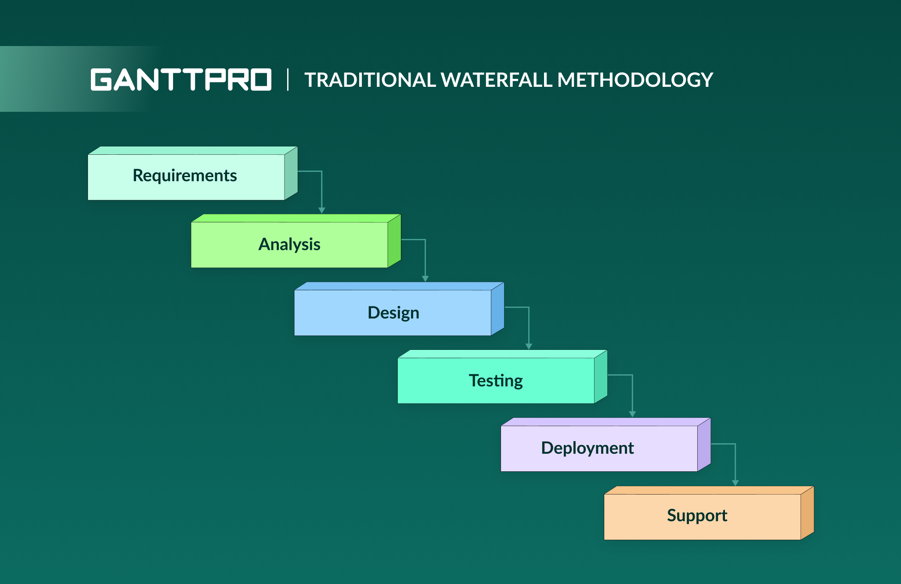
    * Класична модель
    * Етапи йдуть тільки по черзі:
      1. Аналіз вимог
      2. Проєктування
      3. Реалізація
      4. Тестування
      5. Впровадження
      6. Підтримка
    * Перехід на наступний етап можливий лише після закінчення попереднього 
    * Зміни на пізніх етапах — це дуже дорого і складно
    * Проста, зрозуміла, але не гнучка і не підходить до складних і динамічних проєктів
    * Коли підходить: коли вимоги стабільні й добре описані на старті (наприклад, типові корпоративні проєкти або регламентовані домени з великою кількістю документації)
    * Плюси: зрозуміле планування, прозорі “контрольні точки”, зручна документація і передбачуваність процесу
    * Мінуси/ризики: пізній фідбек (користувач бачить продукт наприкінці), висока ціна помилок у вимогах, складно реагувати на зміни
2. V-модель
    * 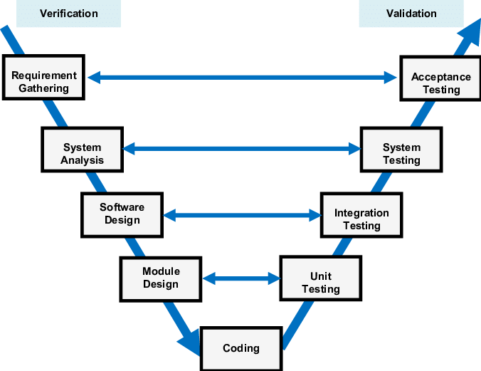
    * Розширення каскадної моделі, але орієнтована на тестування
    * Кожному етапу розробки відповідає етап тестування
    * Завдяки тестуванню дає змогу підвищити якість ПЗ, але так само як і в каскадній моделі — складно вносити зміни
    * Ключова ідея: верифікація/валідація плануються паралельно — для кожного артефакту (вимоги, дизайн) одразу визначаються відповідні тести
    * Плюси: висока трасованість “вимога → тест”, раннє планування тестування, зменшення ризику пропустити критичні сценарії
    * Коли підходить: системи з високими вимогами до якості та сертифікації (медицина, автомобільна/авіа індустрія тощо)
3. Ітеративна модель
    * 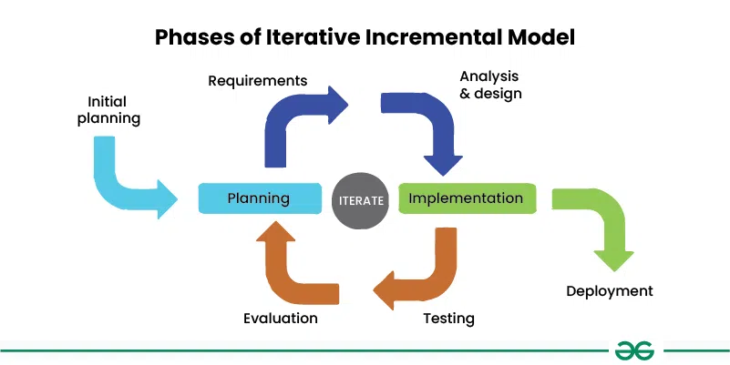
    * Продукт створюється ітеративно (частинами)
    * Кожна ітерація включає:
      * Аналіз
      * Проєктування
      * Реалізація
      * Тестування
    * Але після кожного циклу - **робоча версія**
    * Переваги: легше вносити зміни і є ранній фідбек. Недоліки: потрібні чітке планування та контроль архітектури, інакше модель складна в підтримці
    * Ключова ідея: ми багаторазово “уточнюємо” продукт, покращуючи існуюче рішення в кожній ітерації (навіть якщо функцій додається небагато)
    * Плюси: раннє виявлення помилок/неправильних припущень, адаптація до змін, поступове уточнення вимог
    * Мінуси/ризики: ризик техборгу без дисципліни, складніше оцінювати кінцевий обсяг робіт, потрібен контроль архітектури й якості
4. Інкрементна модель
    * 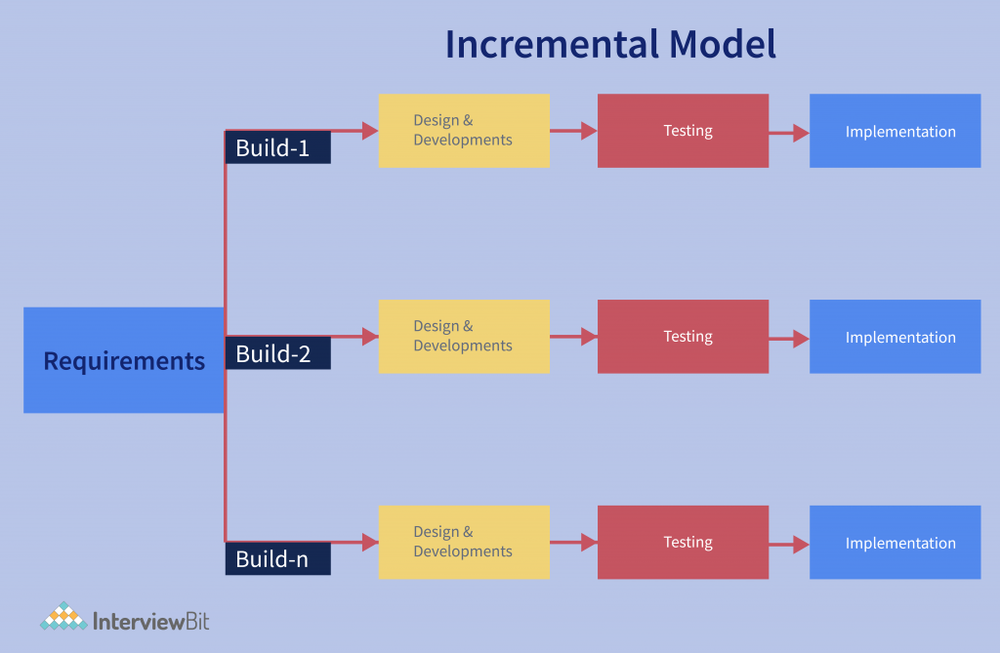
    * В цій моделі функціональність додається поступово, інкрементами
    * Кожен інкремент - нова частина системи, яка додається поверх існуючої
    * Цінність отримується швидко, але знову ж потрібна продумана архітектура
    * Різниця з ітеративною: інкременти здебільшого додають нову функціональність, тоді як ітерації можуть суттєво переробляти/уточнювати вже зроблене
    * Плюси: швидке постачання цінності, пріоритизація функцій, зручніше керувати релізами
    * Мінуси/ризики: проблеми інтеграції між інкрементами, ризик “поганої архітектури”, якщо не закладати фундамент наперед
5. Спіральна модель
    * 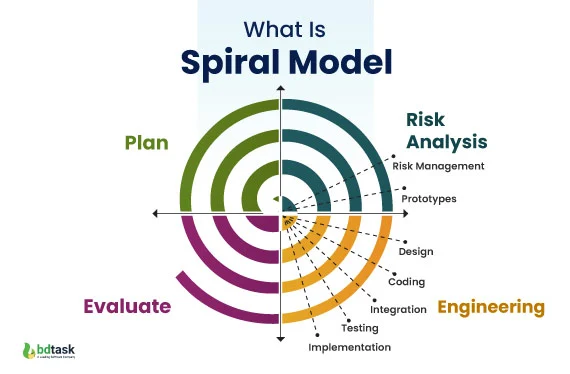
    * Є підвидом ітеративної моделі, що фокусується на виявленні ризиків завчасно
    * Кожен виток спіралі супроводжується:
        1. Планування
        2. Аналіз ризиків
        3. Реалізація (Програмування тощо)
        4. Оцінка результату
    * Підходить для складних систем, де помилки коштують дорого і потрібно мінімізувати ризики, але модель складна і дорога 
    * Ключова ідея: кожний виток починається з аналізу ризиків (технічних, бізнесових, безпекових), часто через прототипування/дослідження
    * Плюси: сильне управління ризиками, краще для високої невизначеності, можна рано відсікати невдалі рішення
    * Мінуси/ризики: висока вартість процесу, потребує досвідченої команди й хорошої культури аналізу ризиків
6. Agile (Scrum, Kanban тощо)
    * 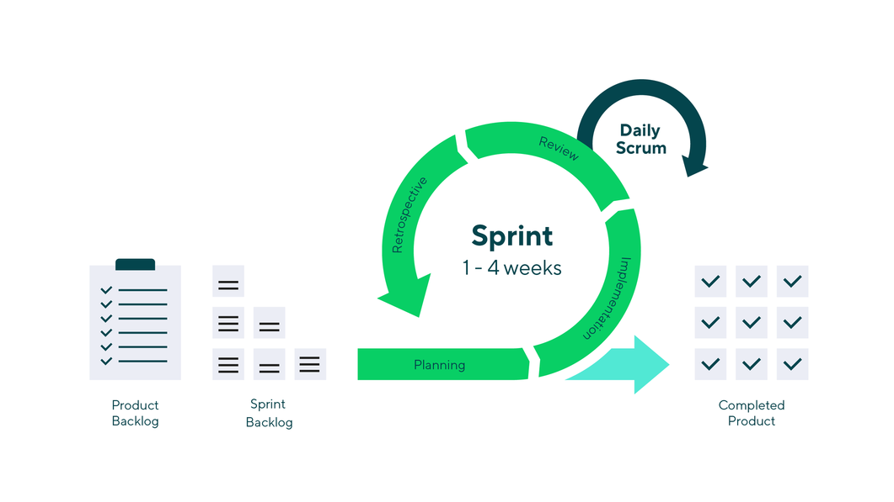
    * Найпопулярніша наразі модель
    * Основна ідея в коротких "спрінтах" (від кількох днів до тижнів), постійному фідбеці від замовника/бізнесу та гнучкості до змін
    * Максимально адаптивна, але складніше точно оцінювати терміни 
    * Ключова ідея: інкрементальна поставка + регулярний зворотний зв’язок (планування, демо, ретроспектива) і пріоритизація задач у беклозі
    * Scrum: фіксовані спринти з визначеною метою; Kanban: без спринтів, фокус на потоці роботи та WIP-лімітах
    * Ризики: без дисципліни легко отримати хаос (часті зміни без контролю, накопичення техборгу), тому потрібні визначення “готово”, якість і прозорі метрики

##### Коротка версія (для заучування, 40–60 сек)

- Модель процесу розробки — це спосіб організації життєвого циклу ПЗ від вимог до підтримки.
- **Waterfall:** етапи послідовні, добре коли вимоги стабільні; мінус — дорогі зміни.
- **V-model:** як Waterfall, але з сильним акцентом на тестування і трасованість “вимога → тест”.
- **Iterative/Incremental:** розробка частинами з раннім фідбеком (ітерації уточнюють, інкременти додають функції).
- **Spiral:** ітерації з фокусом на ризики; **Agile:** короткі спринти/потік, частий фідбек, гнучкість.

**PL:**
Modele procesu tworzenia oprogramowania to sformalizowane podejścia opisujące sposób organizacji cyklu życia oprogramowania: od pomysłu i wymagań, przez rozwój, testowanie, aż po utrzymanie.
Istnieje wiele modeli procesu tworzenia oprogramowania, główne z nich to:
1. Model kaskadowy (Waterfall)
    * 
    * Klasyczny model ("oldschoolowy")
    * Etapy następują po sobie sekwencyjnie:
      1. Analiza wymagań
      2. Projektowanie
      3. Implementacja
      4. Testowanie
      5. Wdrożenie
      6. Utrzymanie
    * Przejście do kolejnego etapu możliwe jest tylko po zakończeniu poprzedniego
    * Zmiany na późnych etapach są bardzo kosztowne i trudne
    * Prosty i zrozumiały, ale mało elastyczny i nieodpowiedni dla złożonych, dynamicznych projektów
    * Kiedy się sprawdza: gdy wymagania są stabilne i dobrze zdefiniowane na początku (dużo dokumentacji, mało zmian)
    * Zalety: łatwe planowanie i kontrola postępu, jasne kamienie milowe, dobra dokumentacja
    * Wady/ryzyka: późny feedback od użytkownika, wysoki koszt zmian, ryzyko nietrafionych wymagań ujawnia się dopiero pod koniec
2. Model V (V-Model)
    * 
    * Rozszerzenie modelu kaskadowego, ale zorientowane na testowanie
    * Każdemu etapowi tworzenia odpowiada etap testowania
    * Dzięki testowaniu pozwala zwiększyć jakość oprogramowania, ale tak jak w modelu kaskadowym - trudno wprowadzać zmiany
    * Klucz: planowanie weryfikacji/walidacji równolegle — do wymagań i projektu od razu przypisuje się testy
    * Zalety: bardzo dobra śledzalność “wymaganie → test”, wysoka jakość i kontrola
    * Kiedy się sprawdza: systemy krytyczne i regulowane (certyfikacja, bezpieczeństwo, medycyna itd.)
3. Model iteracyjny
    * 
    * Produkt tworzony jest iteracyjnie (fragmentami)
    * Każda iteracja zawiera:
      * Analizę
      * Projektowanie
      * Implementację
      * Testowanie
    * Po każdym cyklu powstaje **działająca wersja**
    * Zalety to łatwiejsze wprowadzanie zmian i wczesny feedback, ale wymaga precyzyjnego planowania i kontroli architektury, co czyni ten model trudnym w utrzymaniu
    * Sens: w każdej iteracji dopracowuje się rozwiązanie (często poprawiając to, co już istnieje), na bazie feedbacku
    * Zalety: szybkie wykrywanie błędów i złych założeń, możliwość adaptacji do zmian
    * Ryzyka: bez kontroli łatwo o dług techniczny i “rozjechaną” architekturę
4. Model przyrostowy (inkrementacyjny)
    * 
    * W tym modelu funkcjonalność dodawana jest stopniowo, przyrostami
    * Każdy przyrost to nowa część systemu dodawana do istniejącej
    * Wartość uzyskuje się szybko, ale znów wymagana jest przemyślana architektura
    * Różnica vs iteracyjny: przyrosty częściej dodają nowe funkcje, a iteracje mogą bardziej “udoskonalać” istniejące
    * Zalety: szybkie dostarczanie wartości, łatwiejsze priorytetyzowanie zakresu
    * Ryzyka: problemy integracyjne i architektoniczne, jeśli fundament nie jest zaplanowany
5. Model spiralny
    * 
    * Jest odmianą modelu iteracyjnego, skupiającą się na wczesnym wykrywaniu ryzyka
    * Każdemu obrotowi spirali towarzyszy:
        1. Planowanie
        2. Analiza ryzyka
        3. Realizacja (Programowanie itp.)
        4. Ocena wyniku
    * Odpowiedni dla złożonych systemów, gdzie błąd kosztuje drogo (minimalizuje ryzyko), ale jest skomplikowany i kosztowny
    * Klucz: najpierw identyfikacja i redukcja ryzyk (często prototypem), dopiero potem rozwój
    * Zalety: bardzo dobre zarządzanie ryzykiem, sensowne przy dużej niepewności
    * Wady: kosztowny proces, wymaga doświadczonego zespołu i dobrych praktyk analizy ryzyka
6. Agile (Scrum, Kanban itp.)
    * 
    * Obecnie najpopularniejszy model
    * Główna idea to krótkie "sprinty" (od kilku dni do tygodni), stały feedback od klienta/biznesu i elastyczność na zmiany
    * Maksymalnie adaptacyjny, ale trudniej przewidzieć termin zakończenia
    * Klucz: dostarczanie małych przyrostów + ciągły feedback, priorytetyzacja w backlogu, regularne usprawnianie procesu
    * Scrum: sprinty i cele sprintu; Kanban: przepływ pracy, limity WIP i optymalizacja lead time
    * Ryzyka: bez dyscypliny (Definicja Done, jakość, techniczny porządek) Agile może przerodzić się w chaos

##### Wersja krótka (do nauczenia, 40–60 s)

- Model procesu wytwarzania oprogramowania opisuje organizację cyklu życia: wymagania → rozwój → testy → wdrożenie → utrzymanie.
- **Waterfall:** sekwencyjny, dobry przy stabilnych wymaganiach; wada: zmiany są drogie.
- **V-model:** jak kaskadowy, ale testowanie planowane równolegle (dobra śledzalność „wymaganie → test”).
- **Iteracyjny/Przyrostowy:** dostarczanie w częściach + wczesny feedback (iteracje dopracowują, przyrosty dodają funkcje).
- **Spiralny:** nacisk na ryzyko; **Agile:** krótkie iteracje/sprinty, częsty feedback i adaptacja.


---

## Питання 3

**UA:** Які найпростіші алгоритми генерації випадкових чисел із заданим розподілом імовірності?

**PL:** Jakie są najprostsze algorytmy generacji liczb losowych z zadanym rozkładem prawdopodobieństwa?

### Пояснення / Wyjaśnienie

#### Українською (UA)

Комп'ютери зазвичай генерують **псевдовипадкові** числа (PRNG), найчастіше у вигляді рівномірного розподілу на (0,1):

$$U \sim \mathrm{Uniform}(0,1)$$

Тобто будь-яке значення між 0 і 1 з’являється з однаковою ймовірністю. Далі, щоб отримати **заданий розподіл** для змінної X (нормальний, експоненційний, дискретний тощо), застосовують методи перетворення U у потрібний розподіл.

Найпростіші та найчастіше згадувані алгоритми:

1. Метод інверсії (Inverse Transform Sampling)
    - Працює, якщо відома функція розподілу $F(x)$ (CDF) та її обернена $F^{-1}$.
    - Кроки:
        1) Згенерувати $U \sim \mathrm{Uniform}(0,1)$
        2) Обчислити $X = F^{-1}(U)$
    - Приклади:
        - Для експоненційного розподілу $\mathrm{Exp}(\lambda)$:

         $$X = -\frac{1}{\lambda}\ln(1-U) \quad (\text{часто пишуть також } X = -\tfrac{1}{\lambda}\ln U)$$

    - Для дискретного розподілу $(p_1,\dots,p_n)$ це теж інверсія: рахуємо накопичені суми $C_k = \sum_{i=1}^k p_i$ і беремо найменше $k$, для якого $U \le C_k$.

2. Метод відбору/відкидання (Acceptance–Rejection)
    - Корисний, коли $F^{-1}$ складно знайти, але щільність $f(x)$ можна обчислювати.
    - Ідея: беремо простий розподіл-пропозицію $g(x)$, з якого легко генерувати, та константу $M$ таку, що $f(x) \le M g(x)$ для всіх $x$.
    - Кроки (схема):
         1) Згенерувати $Y \sim g$
         2) Згенерувати $U \sim \mathrm{Uniform}(0,1)$
         3) Прийняти $Y$ як $X$, якщо $U \le \frac{f(Y)}{M g(Y)}$, інакше повторити
    - Плюс: універсальний. Мінус: може бути повільний, якщо M велике (багато відкидань).

3. Метод перетворення (Transformation / Generating by transform)
    - Це ширша категорія: беремо 1 або кілька рівномірних U і через формулу отримуємо X.
    - Класичний приклад для нормального розподілу N(0,1): **Box–Muller**
    Нехай $U_1, U_2 \sim \mathrm{Uniform}(0,1)$, тоді

    $$\begin{aligned}
    Z_1 &= \sqrt{-2\ln U_1}\,\cos(2\pi U_2), \\
    Z_2 &= \sqrt{-2\ln U_1}\,\sin(2\pi U_2)
    \end{aligned}$$

    і $Z_1, Z_2$ мають розподіл $\mathcal{N}(0,1)$.

4. Композиція (Mixture/Composition) для сумішей
    - Якщо розподіл $X$ є сумішшю: $X \sim \sum_i w_i D_i$, де $w_i$ — ваги, а $D_i$ — прості розподіли.
    - Алгоритм: спочатку вибрати індекс i за дискретним розподілом w_i, потім згенерувати X з D_i.

Коротко: базовий «двигун» — $U\sim\mathrm{Uniform}(0,1)$, а найпростіші способи отримати заданий розподіл — інверсія CDF, відкидання (accept-reject) та прямі перетворення (напр., Box–Muller для нормального).

##### Коротка версія (для заучування, 40–60 сек)

- Комп’ютер дає псевдовипадкові числа, базово $U\sim\mathrm{Uniform}(0,1)$; далі перетворюємо $U$ у потрібний розподіл $X$.
- **Інверсія CDF:** якщо знаємо $F$ і $F^{-1}$, то $X = F^{-1}(U)$ (приклад: $X=-\frac{1}{\lambda}\ln(1-U)$ для $\mathrm{Exp}(\lambda)$).
- **Acceptance–Rejection:** кандидат $Y\sim g$, приймаємо якщо $U \le \frac{f(Y)}{Mg(Y)}$.
- **Перетворення:** спеціальні формули, напр. Box–Muller дає $\mathcal{N}(0,1)$.
- **Дискретний випадок:** кумулятивні суми $C_k$ і вибір $k$ за умовою $U\le C_k$.

---

#### Po polsku (PL)

Komputer zwykle nie generuje „prawdziwie” losowych liczb, tylko **pseudolosowe** (PRNG). Typowo najłatwiej uzyskać liczby o rozkładzie jednostajnym na (0,1):

$$U \sim \mathrm{Uniform}(0,1)$$

Następnie, aby wygenerować zmienną losową X o **zadanym rozkładzie** (np. normalnym, wykładniczym, dyskretnym), stosuje się proste metody przekształcenia U.

Najprostsze algorytmy generacji z zadanym rozkładem:

1. Metoda transformacji odwrotnej (Inverse Transform Sampling)
        - Działa, gdy znamy dystrybuantę $F(x)$ oraz potrafimy policzyć jej odwrotność $F^{-1}$.
    - Kroki:
        1) Wylosuj $U \sim \mathrm{Uniform}(0,1)$
        2) Oblicz $X = F^{-1}(U)$
        - Przykład (rozkład wykładniczy $\mathrm{Exp}(\lambda)$):

            $$X = -\frac{1}{\lambda}\ln(1-U) \quad (\text{często także } X = -\tfrac{1}{\lambda}\ln U)$$

        - Dla rozkładu dyskretnego $(p_1,\dots,p_n)$: licz sumy skumulowane $C_k = \sum_{i=1}^k p_i$ i wybierz najmniejsze $k$ takie, że $U \le C_k$.

2. Metoda akceptacji–odrzucenia (Acceptance–Rejection)
    - Przydatna, gdy $F^{-1}$ jest trudna, ale znamy (i umiemy policzyć) gęstość $f(x)$.
    - Wybieramy prosty rozkład propozycji $g(x)$ oraz stałą $M$, taką że $f(x) \le M g(x)$.
    - Kroki:
         1) Wylosuj $Y \sim g$
         2) Wylosuj $U \sim \mathrm{Uniform}(0,1)$
         3) Akceptuj $Y$ jako $X$, jeśli $U \le \frac{f(Y)}{M g(Y)}$, w przeciwnym razie powtórz
    - Zaleta: uniwersalna. Wada: bywa nieefektywna, jeśli odrzucamy dużo prób.

3. Metody transformacyjne (Transformation) dla znanych wzorów
    - Używamy jednej lub kilku zmiennych jednostajnych i wzoru na X.
    - Klasyczny przykład dla N(0,1): **Box–Muller**
    Dla $U_1, U_2 \sim \mathrm{Uniform}(0,1)$:

    $$\begin{aligned}
    Z_1 &= \sqrt{-2\ln U_1}\,\cos(2\pi U_2), \\
    Z_2 &= \sqrt{-2\ln U_1}\,\sin(2\pi U_2)
    \end{aligned}$$

    wtedy $Z_1, Z_2 \sim \mathcal{N}(0,1)$.

4. Metoda kompozycji (Composition) dla mieszanek
    - Jeśli $X$ jest mieszanką rozkładów: $X \sim \sum_i w_i D_i$.
    - Najpierw losujemy indeks i zgodnie z wagami w_i, potem losujemy X z rozkładu D_i.

W skrócie: startujemy od $U\sim\mathrm{Uniform}(0,1)$, a najprostsze drogi do zadanego rozkładu to: transformacja odwrotna, akceptacja–odrzucenie oraz bezpośrednie transformacje (np. Box–Muller dla normalnego).

##### Wersja krótka (do nauczenia, 40–60 s)

- Generator daje liczby pseudolosowe, bazowo $U\sim\mathrm{Uniform}(0,1)$; potem przekształcamy $U$ w zmienną $X$ o żądanym rozkładzie.
- **Transformacja odwrotna:** jeśli znamy $F$ i $F^{-1}$, to $X = F^{-1}(U)$ (np. $X=-\frac{1}{\lambda}\ln(1-U)$ dla $\mathrm{Exp}(\lambda)$).
- **Akceptacja–odrzucenie:** losujemy $Y\sim g$ i akceptujemy, gdy $U \le \frac{f(Y)}{Mg(Y)}$.
- **Transformacje:** gotowe wzory, np. Box–Muller daje $\mathcal{N}(0,1)$.
- **Dyskretny:** sumy skumulowane $C_k$ i wybór $k$ z warunku $U\le C_k$.

---

## Питання 4

**UA:** На вибраних прикладах охарактеризуйте базові типи, структури та організації даних.

**PL:** Na wybranych przykładach scharakteryzuj podstawowe typy, struktury i organizacje danych.

### Пояснення / Wyjaśnienie

#### Українською (UA)
Це питання зводиться до 3 різних понять:

1) **Тип даних** — що саме зберігає змінна і які операції дозволені (а також скільки пам’яті треба).
2) **Структура даних** — як елементи організовані в пам’яті, щоб ефективно виконувати операції (доступ, вставка, пошук тощо).
3) **Організація даних** — як дані розміщують/зберігають на рівні пам’яті або файлів/БД (послідовно, з індексом, через хеш тощо).

**1) Базові типи (приклади)**
- Примітивні: `int`, `float/double`, `bool`, `char`.
- Складені/користувацькі: `struct`, `class`, `enum`, масиви, вказівники/посилання.

Приклад: `int age = 20;` (ціле), `bool ok = true;` (логічний), `char c = 'A';`.

**2) Структури даних (приклади + ключові властивості)**
- **Масив (array)**: елементи одного типу, лежать **послідовно** в пам’яті → доступ за індексом $O(1)$, але вставка всередину часто $O(n)$.
- **Зв’язний список (linked list)**: вузли з вказівниками → вставка/видалення біля відомого вузла $O(1)$, але доступ за індексом $O(n)$.
- **Стек (stack)**: принцип LIFO, операції `push/pop/top` зазвичай $O(1)$.
- **Черга (queue)**: принцип FIFO, операції `push/pop/front` зазвичай $O(1)$.
- **Хеш-таблиця (hash table)**: пошук/вставка “в середньому” $O(1)$, але залежить від хеш-функції й колізій.
- **Дерево (tree)**: ієрархія вузлів (напр. бінарне дерево пошуку, купа/heap).
- **Граф (graph)**: вершини + ребра; не обов’язково ієрархічний (можуть бути цикли). Використовується для мереж, маршрутів, залежностей.

**3) Організація/спосіб зберігання даних (приклади)**
- **Послідовна (sequential)**: записи зберігаються один за одним; добре для потокового читання (лог-файл, CSV).
- **Індексована (indexed)**: окремо є індекс (напр., B-tree/B+tree у БД), який прискорює пошук.
- **Хешована (hashed)**: адреса/“кошик” визначається хешем ключа (хеш-індекси, хеш-таблиці).

##### Коротка версія (для заучування, 40–60 сек)

- Тип даних: що зберігаємо і які операції (напр. `int`, `bool`, `char`, `struct`).
- Структура даних: як організовано елементи для операцій (array $O(1)$ доступ; list $O(1)$ вставка біля вузла; stack LIFO; queue FIFO; hash “середнє” $O(1)$).
- Організація зберігання: послідовно (файли), індексовано (B-tree індекси в БД), хешовано (хеш-таблиці/хеш-індекси).

---

#### Po polsku (PL)
W tym pytaniu warto rozróżnić 3 pojęcia:

1) **Typ danych** — co przechowuje zmienna i jakie operacje są dozwolone (oraz ile pamięci potrzeba).
2) **Struktura danych** — jak elementy są ułożone w pamięci, aby operacje były efektywne (dostęp, wstawianie, wyszukiwanie).
3) **Organizacja danych** — sposób rozmieszczenia/zapisu danych w pamięci lub w plikach/DB (sekwencyjnie, z indeksem, przez hash).

**1) Podstawowe typy (przykłady)**
- Prymitywne: `int`, `float/double`, `bool`, `char`.
- Złożone/użytkownika: `struct`, `class`, `enum`, tablice, wskaźniki/referencje.

**2) Struktury danych (przykłady + cechy)**
- **Tablica (array)**: pamięć ciągła → dostęp po indeksie $O(1)$, ale wstawianie w środku zwykle $O(n)$.
- **Lista (linked list)**: węzły połączone wskaźnikami → wstawianie/usuwanie przy znanym węźle $O(1)$, dostęp po indeksie $O(n)$.
- **Stos (stack)**: LIFO, operacje `push/pop/top` zazwyczaj $O(1)$.
- **Kolejka (queue)**: FIFO, operacje `push/pop/front` zazwyczaj $O(1)$.
- **Tablica mieszająca (hash table)**: wyszukiwanie/wstawianie „średnio” $O(1)$ (zależy od kolizji i funkcji hashującej).
- **Drzewo (tree)**: struktura hierarchiczna (np. BST, heap).
- **Graf (graph)**: wierzchołki i krawędzie; nie musi być hierarchiczny (mogą występować cykle).

**3) Organizacja danych (przykłady)**
- **Sekwencyjna**: rekordy po kolei; dobra do czytania strumieniowego (log/CSV).
- **Indeksowana**: dodatkowa struktura indeksu (np. B-tree/B+tree w bazach danych) przyspiesza wyszukiwanie.
- **Haszowana**: adres/„koszyk” wynika z hasha klucza (hash-index, hash table).

##### Wersja krótka (do nauczenia, 40–60 s)

- Typ danych: co przechowuję i jakie operacje (np. `int`, `bool`, `char`, `struct`).
- Struktury danych: tablica $O(1)$ dostęp, lista $O(n)$ dostęp, stos LIFO, kolejka FIFO, hash „średnio” $O(1)$.
- Organizacja danych: sekwencyjna (pliki), indeksowana (B-tree w DB), haszowana (hash table/indeksy).

---

## Питання 5

**UA:** Опишіть характеристики та складові мови SQL, наведіть її переваги та недоліки.

**PL:** Opisz cechy i składowe języka SQL, podaj jego wady i zalety. 

### Пояснення / Wyjaśnienie

#### Українською (UA)
**SQL (Structured Query Language)** — декларативна мова для роботи з реляційними базами даних: описує *що* потрібно отримати/змінити, а *як* це зробити ефективно, вирішує СУБД (оптимізатор запитів).

**Основні характеристики SQL:**
- Декларативність: ми задаємо умову/результат, а не алгоритм.
- Орієнтація на множини: операції над наборами рядків (таблицями), а не над одиничними значеннями.
- Стандартизованість (ANSI/ISO), але є діалекти (PostgreSQL, MySQL, SQL Server, Oracle).
- Інтеграція з транзакціями: узгодженість змін (ACID у більшості реляційних СУБД).

**Складові/підмови SQL (найчастіше вимагають на екзамені):**
1. **DDL (Data Definition Language)** — визначення структури даних
    - `CREATE`, `ALTER`, `DROP`
    - об’єкти: таблиці, індекси, представлення (views)
2. **DML (Data Manipulation Language)** — робота з даними
    - `SELECT`, `INSERT`, `UPDATE`, `DELETE` (інколи `MERGE`)
3. **DCL (Data Control Language)** — права доступу
    - `GRANT`, `REVOKE`
4. **TCL (Transaction Control Language)** — керування транзакціями
    - `COMMIT`, `ROLLBACK`, `SAVEPOINT`

**Що “всередині” типового запиту SELECT (як компоненти):**
- `SELECT ... FROM ... WHERE ... GROUP BY ... HAVING ... ORDER BY ...`
- З’єднання: `JOIN` (INNER/LEFT/RIGHT/FULL)
- Агрегації: `COUNT`, `SUM`, `AVG`, `MIN`, `MAX`

**Переваги SQL:**
- Швидке формулювання запитів до даних, багато задач вирішуються коротко.
- Оптимізатор СУБД може вибрати ефективний план виконання.
- Потужні можливості: індекси, обмеження цілісності (`PRIMARY KEY`, `FOREIGN KEY`, `UNIQUE`, `CHECK`), транзакції.
- Широко підтримується, легко інтегрується з більшістю мов програмування.

**Недоліки SQL:**
- Діалекти й несумісності між СУБД (працює “не всюди однаково”).
- Для складної бізнес-логіки запити стають важкими для читання/підтримки.
- “Impedance mismatch” між ООП та реляційною моделлю (часто потрібні ORM).
- Масштабування під дуже високі навантаження/розподілені системи може бути складним (хоча залежить від СУБД і архітектури).

##### Коротка версія (для заучування, 40–60 сек)

- SQL — декларативна мова для реляційних БД (описуємо *що*, оптимізацію робить СУБД).
- Складові: **DDL** (`CREATE/ALTER/DROP`), **DML** (`SELECT/INSERT/UPDATE/DELETE`), **DCL** (`GRANT/REVOKE`), **TCL** (`COMMIT/ROLLBACK`).
- SELECT складається з `SELECT-FROM-WHERE-GROUP BY-HAVING-ORDER BY`, є `JOIN` і агрегати.
- Плюси: стандарт, індекси/цілісність/транзакції, оптимізатор.
- Мінуси: діалекти, складні запити важко підтримувати, ООП↔реляційний розрив.

---

#### Po polsku (PL)
**SQL (Structured Query Language)** to język deklaratywny do pracy z relacyjnymi bazami danych: opisujemy *co* chcemy uzyskać lub zmienić, a *jak* to wykonać efektywnie wybiera silnik bazy (optymalizator zapytań).

**Cechy SQL:**
- Deklaratywność i praca na zbiorach (tabelach).
- Standaryzacja (ANSI/ISO), ale w praktyce istnieją dialekty (PostgreSQL, MySQL, SQL Server, Oracle).
- Wsparcie transakcji i spójności danych (ACID w większości RDBMS).

**Składowe/podjęzyki SQL:**
1. **DDL (Data Definition Language)** — definicja struktury
    - `CREATE`, `ALTER`, `DROP`
2. **DML (Data Manipulation Language)** — operacje na danych
    - `SELECT`, `INSERT`, `UPDATE`, `DELETE` (czasem `MERGE`)
3. **DCL (Data Control Language)** — uprawnienia
    - `GRANT`, `REVOKE`
4. **TCL (Transaction Control Language)** — transakcje
    - `COMMIT`, `ROLLBACK`, `SAVEPOINT`

**Typowe elementy zapytania SELECT:**
- `SELECT ... FROM ... WHERE ... GROUP BY ... HAVING ... ORDER BY ...`
- `JOIN` (INNER/LEFT/RIGHT/FULL), agregacje `COUNT/SUM/AVG/MIN/MAX`

**Zalety SQL:**
- Szybkie i czytelne zapytania do danych; bardzo popularny standard.
- Optymalizator może dobrać wydajny plan wykonania.
- Wbudowane mechanizmy: indeksy, ograniczenia integralności (`PRIMARY KEY`, `FOREIGN KEY`, `UNIQUE`, `CHECK`), transakcje.

**Wady SQL:**
- Różnice między dialektami (przenośność bywa ograniczona).
- Bardzo złożone zapytania są trudne w utrzymaniu.
- “Impedance mismatch” OOP vs model relacyjny (często używa się ORM).
- Skalowanie i rozproszenie bywa wyzwaniem (zależy od silnika i architektury).

##### Wersja krótka (do nauczenia, 40–60 s)

- SQL to język deklaratywny dla relacyjnych BD (mówimy *co*, baza wybiera *jak*).
- Podjęzyki: **DDL** (`CREATE/ALTER/DROP`), **DML** (`SELECT/INSERT/UPDATE/DELETE`), **DCL** (`GRANT/REVOKE`), **TCL** (`COMMIT/ROLLBACK`).
- SELECT: `SELECT-FROM-WHERE-GROUP BY-HAVING-ORDER BY`, do tego `JOIN` i agregacje.
- Plusy: standard, optymalizator, indeksy/integralność/transakcje.
- Minusy: dialekty, trudne złożone zapytania, niedopasowanie do OOP.

---

## Питання 6

**UA:** Поясніть поняття семафорів і наведіть приклади їх застосування.

**PL:** Omów pojęcie semaforów i przedstaw przykłady ich zastosowania. 

### Пояснення / Wyjaśnienie

#### Українською (UA)
**Семафор** — це примітив синхронізації, який дозволяє керувати доступом багатьох потоків/процесів до спільного ресурсу.
Класичний семафор має ціле значення (лічильник) і 2 атомарні операції:

- `wait` / `P()` / `down()`:
  - якщо значення $>0$ — зменшує його і пропускає потік;
  - якщо $=0$ — блокує потік до появи ресурсу.
- `signal` / `V()` / `up()`:
  - збільшує значення і, за потреби, розблоковує один із потоків.

**Види семафорів:**
- **Бінарний семафор** (0/1) — фактично схожий на м’ютекс (але м’ютекс зазвичай має “власника” і додаткові гарантії).
- **Лічильний (counting)** — дозволяє одночасно зайти до $N$ потоків (обмеження паралелізму).

**Де застосовують (типові приклади):**
1. **Взаємне виключення (критична секція)**
    - Ідея: перед входом у критичну секцію робимо `wait`, після виходу — `signal`.
    - Приклад: захист доступу до спільного лічильника/черги.
2. **Producer–Consumer (обмежений буфер)**
    - Два семафори “скільки вільних місць” і “скільки елементів”, плюс м’ютекс для самої структури.
3. **Обмеження доступу до ресурсу з лімітом**
    - Наприклад, “максимум 10 одночасних підключень” або “пул з $N$ об’єктів”.

**Проблеми/пастки:**
- Можливі **deadlock** (взаємне блокування) при неправильному порядку захоплення.
- Можлива **starvation** (голодування) без справедливого планування.
- Важливо: `wait/signal` мають бути парними; вихід з критичної секції — гарантований (часто через `try/finally` / RAII).

##### Коротка версія (для заучування, 40–60 сек)

- Семафор — примітив синхронізації з лічильником доступних “дозволів”.
- Операції: `wait(P)` зменшує і може блокувати; `signal(V)` збільшує і може будити.
- Є бінарний (0/1) і лічильний ($N$ дозволів).
- Застосування: критична секція, producer–consumer, лімітування паралельних доступів до ресурсу.
- Ризики: deadlock/starvation при неправильному використанні.

---

#### Po polsku (PL)
**Semafor** to prymityw synchronizacji, który kontroluje dostęp wielu wątków/procesów do współdzielonego zasobu.
Klasycznie jest to licznik całkowity oraz dwie operacje atomowe:

- `wait` / `P()` / `down()`:
    - gdy wartość $>0$ — zmniejsza ją i przepuszcza wątek;
    - gdy $=0$ — blokuje wątek.
- `signal` / `V()` / `up()`:
    - zwiększa wartość i może odblokować oczekujący wątek.

**Rodzaje:**
- **Semafor binarny** (0/1) — podobny do mutexa (mutex zwykle ma właściciela).
- **Semafor zliczający (counting)** — pozwala wejść jednocześnie maksymalnie $N$ wątkom.

**Zastosowania (klasyczne przykłady):**
1. **Sekcja krytyczna** — `wait` przed wejściem, `signal` po wyjściu.
2. **Producer–Consumer (bufor ograniczony)** — semafory “wolne miejsca” i “liczba elementów” + mutex do ochrony struktury.
3. **Limit równoległości** — np. maksymalna liczba jednoczesnych połączeń, pula zasobów.

**Pułapki:**
- **Deadlock** przy złej kolejności blokad.
- **Starvation** (zagłodzenie) przy braku sprawiedliwości.
- `wait/signal` muszą być parą; wyjście z sekcji krytycznej powinno być gwarantowane.

##### Wersja krótka (do nauczenia, 40–60 s)

- Semafor: licznik „pozwoleń” na dostęp do zasobu.
- `wait(P)` zmniejsza i może blokować; `signal(V)` zwiększa i może budzić.
- Rodzaje: binarny (0/1) i zliczający ($N$).
- Zastosowanie: sekcja krytyczna, producer–consumer, limitowanie dostępu.
- Błędy: deadlock/starvation.

---

## Питання 7

**UA:** Поясніть конвеєрну (потокову) обробку в сучасних комп’ютерних системах.

**PL:** Omów przetwarzanie potokowe we współczesnych systemach komputerowych.

### Пояснення / Wyjaśnienie

#### Українською (UA)
**Конвеєрна (потокова) обробка** — це організація виконання, де задача ділиться на послідовні етапи (стадії), і різні “порції” даних/інструкцій проходять ці стадії паралельно (як на виробничому конвеєрі).

Ключова ідея: **зростає пропускна здатність (throughput)**, хоча **затримка (latency)** однієї операції може майже не зменшитися.

**Приклад у процесорах: конвеєр інструкцій (instruction pipeline)**
- Типові стадії: Fetch → Decode → Execute → Memory → Write-back.
- Коли конвеєр “заповнений”, ідеально можна завершувати приблизно 1 інструкцію за такт (залежить від архітектури).

Оцінка виграшу:
- Для $k$ стадій і великої кількості інструкцій $n$ ідеальний приріст близько $\approx k$ (за умови однакової тривалості стадій і відсутності простоїв).

**Проблеми конвеєра (hazards):**
- **Структурні**: конфлікт за ресурс (напр., один порт пам’яті).
- **Дані (data hazards)**: наступна інструкція потребує результат попередньої.
- **Керування (control hazards)**: розгалуження (branch) — не відомо, яка інструкція буде наступною.

**Як це вирішують:**
- **Stall** (простої), **forwarding/bypassing** (перекидання результату), **renaming** (перейменування регістрів), **branch prediction** (передбачення переходів) і спекулятивне виконання.

**Потокова обробка поза CPU (pipeline parallelism):**
- Напр., обробка медіа/даних: читання → декодування → фільтрація → запис.
- Також класичні UNIX-пайпи: команда1 | команда2 | команда3.

##### Коротка версія (для заучування, 40–60 сек)

- Конвеєр — це поділ обчислення на стадії і паралельне проходження різних даних через ці стадії.
- Основний плюс: росте throughput; latency однієї операції майже не обов’язково зменшується.
- Приклад: CPU pipeline Fetch/Decode/Execute/Mem/WB.
- Проблеми: структурні, залежності даних, переходи (branch).
- Рішення: stalls, forwarding, branch prediction.

---

#### Po polsku (PL)
**Przetwarzanie potokowe (pipeline)** polega na podziale zadania na kolejne etapy (stages) i równoległym przetwarzaniu różnych porcji danych/instrukcji na różnych etapach — jak na linii produkcyjnej.

Klucz: rośnie **przepustowość (throughput)**, natomiast **opóźnienie (latency)** pojedynczego elementu nie musi się znacząco zmienić.

**Przykład w CPU: potok instrukcji**
- Typowe fazy: Fetch → Decode → Execute → Memory → Write-back.
- Po „napełnieniu” potoku idealnie można kończyć ok. 1 instrukcję na takt (w uproszczeniu).

**Zysk (intuicyjnie):**
- Dla $k$ etapów i dużego $n$ idealny speedup bywa bliski $\approx k$, jeśli etapy są zbalansowane i nie ma przestojów.

**Zagrożenia (hazards):**
- **Strukturalne**: konflikt o zasób.
- **Danych**: zależności (następna instrukcja czeka na wynik).
- **Sterowania**: skoki/gałęzie (branch).

**Techniki łagodzenia:**
- Stalle, forwarding/bypassing, renaming rejestrów, predykcja skoków i wykonanie spekulacyjne.

**Pipeline poza CPU:**
- Przetwarzanie strumieniowe: np. odczyt → dekodowanie → filtr → zapis.
- Potoki w UNIX: `cmd1 | cmd2 | cmd3`.

##### Wersja krótka (do nauczenia, 40–60 s)

- Potok: etapy + równoległe przetwarzanie różnych danych na różnych etapach.
- Plus: większa przepustowość; latency pojedynczego elementu nie musi spaść.
- Przykład: Fetch/Decode/Execute/Mem/WB.
- Problemy: konflikty zasobów, zależności danych, skoki.
- Rozwiązania: stalle, forwarding, predykcja skoków.

---

## Питання 8

**UA:** Поясніть різниці між апроксимацією та інтерполяцією в контексті візуалізації даних.

**PL:** Omów/Opisz różnice pomiędzy aproksymacją i interpolacją w kontekście wizualizacji danych.

### Пояснення / Wyjaśnienie

#### Українською (UA)
**Апроксимація** та **інтерполяція** — це два різні методи перетворення дискретних даних у гладкі криві для візуалізації.

**Інтерполяція (Interpolation)**
- **Мета**: побудувати криву, що **проходить через всі дані точки**.
- Використовується, коли ви впевнені, що дані точки точні і хочете «зв'язати» їх гладкою лінією.
- *Приклад:* У вас є 5 точок координат; інтерполяція створює криву, що проходить рівно через ці 5 точок.
- **Методи**: Лінійна інтерполяція, поліноміальна (Лагранжева), сплайни (cubic splines).
- **Плюси**: Точна для наявних даних.
- **Мінуси**: Може мати осцилляції ("хвилювання") між точками, особливо при високих степенях полінома.

**Апроксимація (Approximation)**
- **Мета**: знайти **найкращу криву**, що наближає дані, але не обов'язково проходить через них.
- Використовується, коли дані мають шум або ви хочете знайти загальний тренд.
- *Приклад:* У вас є 100 точок, які розкидані; апроксимація знаходить пряму або криву, яка краще всього описує їх розподіл.
- **Методи**: Метод найменших квадратів (Least Squares), поліноміальна регресія, експоненціальна апроксимація.
- **Плюси**: Більш стійка до шуму, часто дає більш гладкий результат.
- **Мінуси**: Не проходить точно через дані точки; результат залежить від вибору функції.

**Порівняння:**
| Аспект | Інтерполяція | Апроксимація |
|--------|---|---|
| **Проходить через дані?** | Так (всі точки) | Ні (наближає) |
| **Мета** | Точність на точках | Загальний тренд |
| **Шум** | Чутлива до шуму | Стійка до шуму |
| **Осцилляції** | Можуть бути | Менше |

##### Коротка версія (для заучування, 40–60 сек)

- **Інтерполяція**: крива **через всі точки** (точна, але може хвилюватися).
- **Апроксимація**: крива **біля точок** (гладша, тренд, стійка до шуму).
- Обирай інтерполяцію, якщо дані чисті; апроксимацію, якщо дані зашумлені.

---

#### Po polsku (PL)
**Interpolacja** i **aproksymacja** to dwie różne metody przekształcania dyskretnych punktów danych w gładkie krzywe do wizualizacji.

**Interpolacja (Interpolation)**
- **Cel**: zbudować krzywą, która **przechodzi przez wszystkie punkty danych**.
- Używana, gdy jesteś pewny, że punkty danych są dokładne i chcesz je "połączyć" gładką linią.
- *Przykład:* Masz 5 punktów; interpolacja tworzy krzywą przechodzącą przez każdy z nich.
- **Metody**: interpolacja liniowa, wielomianowa (Lagrange'a), splajny sześcienne (cubic splines).
- **Zalety**: Precyzyjnie przechodzi przez dane.
- **Wada**: Może mieć oscylacje między punktami (efekt "fali"), szczególnie przy wysokich stopniach wielomianu.

**Aproksymacja (Approximation)**
- **Cel**: znaleźć **najlepszą krzywą**, która przybliża dane, ale niekoniecznie przez nich przechodzi.
- Używana, gdy dane są zaszumione lub chcesz znaleźć ogólny trend.
- *Przykład:* Masz 100 punktów rozrzuconych; aproksymacja znajduje linię lub krzywą, która je najlepiej opisuje.
- **Metody**: Metoda najmniejszych kwadratów (Least Squares), regresja wielomianowa, aproksymacja wykładnicza.
- **Zalety**: Bardziej odporna na szum, zwykle daje gładszy wynik.
- **Wada**: Nie przechodzi dokładnie przez punkty; zależy od wyboru funkcji.

**Porównanie:**
| Aspekt | Interpolacja | Aproksymacja |
|--------|---|---|
| **Przechodzi przez dane?** | Tak (wszystkie) | Nie (przybliża) |
| **Cel** | Dokładność na punktach | Ogólny trend |
| **Szum** | Wrażliwa | Odporna |
| **Oscylacje** | Mogą być | Mniej |

##### Wersja krótka (do nauczenia, 40–60 s)

- **Interpolacja**: krzywa **przez wszystkie punkty** (dokładna, ale może falować).
- **Aproksymacja**: krzywa **koło punktów** (gładka, trend, odporna na szum).
- Wybierz interpolację, jeśli dane są czyste; aproksymację, jeśli są zaszumione.

---

## Питання 9

**UA:** Будь ласка, обговоріть структуру та навчання багатошарової штучної нейронної мережі.

**PL:** Proszę omówić budowę i uczenie sztucznej sieci neuronowej wielowarstwowej.

### Пояснення / Wyjaśnienie

#### Українською (UA)

**Багатошарова нейронна мережа (MLP - Multilayer Perceptron)** — це обчислювальна модель, натхненна біологічною нервовою системою, що складається зі з'єднаних між собою обчислювальних одиниць (нейронів), організованих у шари.

**1. Будова мережі (Архітектура):**

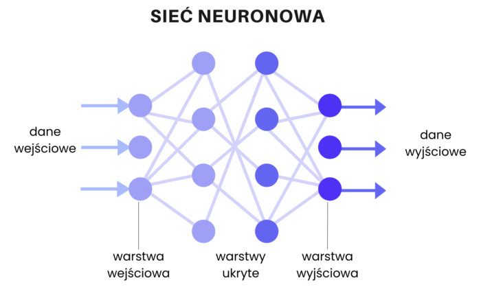

- **Вхідний шар (Input Layer)**: Приймає вхідні сигнали ззовні — ознаки даних (features). Кількість нейронів відповідає розмірності вхідних даних (наприклад, 784 для зображення 28×28 пікселів).

- **Приховані шари (Hidden Layers)**: Один або кілька проміжних шарів, де відбувається:
  - Вилучення та трансформація ознак (feature extraction)
  - Моделювання нелінійних залежностей між входом і виходом
  - Кожен наступний шар виявляє складніші закономірності

- **Вихідний шар (Output Layer)**: Генерує кінцевий результат:
  - Для класифікації: ймовірності приналежності до класів (наприклад, через Softmax)
  - Для регресії: безперервне значення (наприклад, через лінійну активацію)

- **Нейрон (обчислювальна одиниця)**: Виконує операцію зваженого підсумовування входів:
  - $z = \sum_{i} (x_i \cdot w_i) + b$
  - де $x_i$ — входи, $w_i$ — ваги, $b$ — зміщення (bias)
  - Результат проходить через функцію активації: $a = f(z)$

**2. Математичні компоненти:**

- **Функції активації** (вводять нелінійність):
  - **ReLU**: $f(x) = \max(0, x)$ — найпопулярніша, швидка, усуває проблему зникаючого градієнта
  - **Sigmoid**: $f(x) = \frac{1}{1 + e^{-x}}$ — для бінарної класифікації
  - **Tanh**: $f(x) = \tanh(x)$ — центрована навколо 0
  - **Softmax**: для багатокласової класифікації на виході

- **Ваги ($w$) та зміщення ($b$)**: Параметри, які оптимізуються під час навчання. Ініціалізуються випадково (Xavier, He initialization).

**3. Процес навчання (Алгоритм Backpropagation):**

Навчання відбувається циклами (епохами) і складається з чотирьох основних кроків:

- **Пряме поширення (Forward Pass)**:
  - Вхідні дані послідовно проходять через всі шари
  - На кожному шарі обчислюється $z = Wx + b$, потім $a = f(z)$
  - На виході отримуємо передбачення (predikцію) $\hat{y}$

- **Обчислення помилки (Loss Function)**:
  - Визначається різниця між передбаченням $\hat{y}$ та реальною міткою $y$
  - Для регресії: MSE (Mean Squared Error) = $\frac{1}{n}\sum(y - \hat{y})^2$
  - Для класифікації: Cross-Entropy = $-\sum y \log(\hat{y})$

- **Зворотне поширення помилки (Backpropagation)**:
  - Використовуючи правило ланцюжка (chain rule), градієнт помилки "розповсюджується" назад від виходу до входу
  - Обчислюються градієнти функції втрат відносно кожної ваги: $\frac{\partial E}{\partial w}$
  - Це дозволяє визначити, як кожна вага впливає на помилку

- **Оптимізація (Gradient Descent)**:
  - Ваги оновлюються у напрямку, протилежному градієнту:
  - $w_{\text{new}} = w_{\text{old}} - \eta \cdot \frac{\partial E}{\partial w}$
  - де $\eta$ — швидкість навчання (learning rate, типово 0.001-0.1)
  - Варіанти: SGD, Adam, RMSprop

**Асоціація (Команда експертів):**

- **Нейронна мережа** — це як **команда експертів у компанії**:
  - **Вхідний шар** — секретаріат, що збирає вхідні факти та дані
  - **Приховані шари** — відділи аналітиків, кожен шукає свої закономірності та патерни
  - **Вихідний шар** — директор, що виносить остаточне рішення
  - **Backpropagation** — "робота над помилками": коли директор помиляється, він аналізує помилку та дає зворотний зв'язок аналітикам, які коригують свої підходи (ваги), щоб наступного разу не помилитися

**Ключові терміни:**

- Епоха (Epoch) — один повний прохід через весь навчальний набір
- Batch — підмножина даних для одного оновлення ваг
- Overfitting — перенавчання (мережа запам'ятовує дані замість узагальнення)
- Regularization (L1, L2, Dropout) — методи запобігання перенавчанню
- Градієнтний спуск (Gradient Descent)
- Функція втрат (Loss Function)

##### Коротка версія (для заучування, 40–60 сек)

- **Архітектура**: 3 типи шарів — вхідний (дані) → приховані (обробка) → вихідний (результат).
- **Нейрон**: Зважена сума $z = \sum(x_i \cdot w_i) + b$, потім функція активації (ReLU, Sigmoid, Tanh).
- **Навчання (4 кроки)**:
  1. Forward Pass — обчислення передбачення
  2. Loss Function — вимірювання помилки (MSE, Cross-Entropy)
  3. Backpropagation — обчислення градієнтів (chain rule)
  4. Gradient Descent — оновлення ваг: $w = w - \eta \cdot \frac{\partial E}{\partial w}$
- **Мета**: мінімізувати функцію втрат через ітеративну оптимізацію ваг.
- **Асоціація**: Команда експертів → вхід збирає дані, приховані шари аналізують, вихід вирішує; backpropagation = робота над помилками.

---

#### Po polsku (PL)

**Wielowarstwowa sieć neuronowa (MLP - Multilayer Perceptron)** to model obliczeniowy inspirowany biologicznym układem nerwowym, składający się z połączonych ze sobą jednostek obliczeniowych (neuronów), zorganizowanych w warstwy.

**1. Budowa sieci (Architektura):**


- **Warstwa wejściowa (Input Layer)**: Przyjmuje sygnały wejściowe z zewnątrz — cechy danych (features). Liczba neuronów odpowiada wymiarowości danych wejściowych (np. 784 dla obrazu 28×28 pikseli).

- **Warstwy ukryte (Hidden Layers)**: Jedna lub więcej warstw pośrednich, w których zachodzi:
  - Ekstrakcja i transformacja cech (feature extraction)
  - Modelowanie nieliniowych zależności między wejściem a wyjściem
  - Każda kolejna warstwa wykrywa bardziej złożone wzorce

- **Warstwa wyjściowa (Output Layer)**: Generuje ostateczny wynik:
  - Dla klasyfikacji: prawdopodobieństwa przynależności do klas (np. przez Softmax)
  - Dla regresji: wartość ciągłą (np. przez aktywację liniową)

- **Neuron (jednostka obliczeniowa)**: Wykonuje operację sumowania ważonego wejść:
  - $z = \sum_{i} (x_i \cdot w_i) + b$
  - gdzie $x_i$ — wejścia, $w_i$ — wagi, $b$ — bias (obciążenie)
  - Wynik przechodzi przez funkcję aktywacji: $a = f(z)$

**2. Składniki matematyczne:**

- **Funkcje aktywacji** (wprowadzają nieliniowość):
  - **ReLU**: $f(x) = \max(0, x)$ — najpopularniejsza, szybka, eliminuje problem zanikającego gradientu
  - **Sigmoid**: $f(x) = \frac{1}{1 + e^{-x}}$ — dla klasyfikacji binarnej
  - **Tanh**: $f(x) = \tanh(x)$ — wycentrowana wokół 0
  - **Softmax**: dla klasyfikacji wieloklasowej na wyjściu

- **Wagi ($w$) i bias ($b$)**: Parametry optymalizowane podczas uczenia. Inicjalizowane losowo (Xavier, He initialization).

**3. Proces uczenia (Algorytm Backpropagation):**

Uczenie odbywa się w cyklach (epokach) i składa się z czterech głównych kroków:

- **Propagacja w przód (Forward Pass)**:
  - Dane wejściowe sekwencyjnie przechodzą przez wszystkie warstwy
  - Na każdej warstwie obliczane jest $z = Wx + b$, następnie $a = f(z)$
  - Na wyjściu otrzymujemy predykcję $\hat{y}$

- **Obliczanie błędu (Loss Function)**:
  - Wyznaczana jest różnica między predykcją $\hat{y}$ a rzeczywistą etykietą $y$
  - Dla regresji: MSE (Mean Squared Error) = $\frac{1}{n}\sum(y - \hat{y})^2$
  - Dla klasyfikacji: Cross-Entropy = $-\sum y \log(\hat{y})$

- **Propagacja wsteczna (Backpropagation)**:
  - Wykorzystując regułę łańcuchową (chain rule), gradient błędu jest "rozprowadzany" wstecz od wyjścia do wejścia
  - Obliczane są gradienty funkcji straty względem każdej wagi: $\frac{\partial E}{\partial w}$
  - Pozwala to określić, jak każda waga wpływa na błąd

- **Optymalizacja (Gradient Descent)**:
  - Wagi są aktualizowane w kierunku przeciwnym do gradientu:
  - $w_{\text{new}} = w_{\text{old}} - \eta \cdot \frac{\partial E}{\partial w}$
  - gdzie $\eta$ — learning rate (współczynnik uczenia, typowo 0.001-0.1)
  - Warianty: SGD, Adam, RMSprop

**Skojarzenie (Zespół ekspertów):**

- **Sieć neuronowa** to jak **zespół ekspertów w firmie**:
  - **Warstwa wejściowa** — sekretariat zbierający dane wejściowe i fakty
  - **Warstwy ukryte** — działy analityków, każdy szuka swoich wzorców i zależności
  - **Warstwa wyjściowa** — dyrektor podejmujący ostateczną decyzję
  - **Backpropagation** — "praca nad błędami": gdy dyrektor popełnia błąd, analizuje go i przekazuje feedback analitykom, którzy korygują swoje podejścia (wagi), aby następnym razem nie popełnić błędu

**Kluczowe terminy:**

- Epoka (Epoch) — jedno pełne przejście przez cały zbiór treningowy
- Batch — podzbiór danych dla jednej aktualizacji wag
- Overfitting — przetrenowanie (sieć zapamiętuje dane zamiast uogólniać)
- Regularization (L1, L2, Dropout) — metody zapobiegania przetrenowaniu
- Gradient Descent — spadek gradientu
- Loss Function — funkcja straty

##### Wersja krótka (do nauczenia, 40–60 s)

- **Architektura**: 3 typy warstw — wejściowa (dane) → ukryte (przetwarzanie) → wyjściowa (wynik).
- **Neuron**: Suma ważona $z = \sum(x_i \cdot w_i) + b$, następnie funkcja aktywacji (ReLU, Sigmoid, Tanh).
- **Uczenie (4 kroki)**:
  1. Forward Pass — obliczenie predykcji
  2. Loss Function — pomiar błędu (MSE, Cross-Entropy)
  3. Backpropagation — obliczenie gradientów (chain rule)
  4. Gradient Descent — aktualizacja wag: $w = w - \eta \cdot \frac{\partial E}{\partial w}$
- **Cel**: minimalizacja funkcji straty przez iteracyjną optymalizację wag.
- **Skojarzenie**: Zespół ekspertów → wejście zbiera dane, ukryte warstwy analizują, wyjście decyduje; backpropagation = praca nad błędami.

---

## Питання 10

**UA:** Поясніть модель комп'ютерних мереж OSI/ISO та охарактеризуйте кожен рівень.

**PL:** Proszę omówić model referencyjny sieci komputerowej OSI/ISO.

### Пояснення / Wyjaśnienie

#### Українською (UA)
**Модель OSI (Open Systems Interconnection)** — це теоретична модель, яка описує комунікацію в комп'ютерних мережах, розділена на 7 рівнів. Кожен рівень надає послуги вищестоящому рівню та використовує послуги нижестоящого.

**7 рівнів моделі OSI (від нижнього до верхнього):**

1. **Фізичний рівень (Physical Layer)**
   - **Функція**: визначає механічні та електричні аспекти передачі бітів через середовище.
   - **Пристрої**: концентратор (Hub), репітер.
   - **Одиниці**: Біти (0 та 1).
   - **Приклад**: кабелі, радіохвилі.

2. **Канальний рівень (Data Link Layer)**
   - **Функція**: відповідає за фізичну адресацію (MAC) та надійну транспортування даних в межах однієї фізичної мережі.
   - **Пристрої**: комутатор (Switch), мости.
   - **Одиниці**: Кадри (Frames).
   - **MAC-адреси**: 48 біт (напр. `00:1A:2B:3C:4D:5E`).
   - **Протоколи**: Ethernet, PPP.

3. **Мережевий рівень (Network Layer)**
   - **Функція**: відповідає за логічну адресацію та вибір маршруту (маршрутизацію).
   - **Пристрої**: маршрутизатори (Routers).
   - **Одиниці**: Пакети (Packets).
   - **IP-адреси**: логічна адресація (напр. 192.168.1.1).
   - **Основний протокол**: IP (IPv4, IPv6), ICMP.

4. **Транспортний рівень (Transport Layer)**
   - **Функція**: забезпечує передачу даних між хостами, відповідає за сегментацію та контроль помилок.
   - **Протоколи**: TCP (надійна передача з встановленням з'єднання) та UDP (швидка без встановлення).
   - **Порти**: від 0 до 65535 (напр. порт 80 — HTTP, 443 — HTTPS).
   - **Одиниці**: Сегменти (для TCP), датаграми (для UDP).

5. **Сеансовий рівень (Session Layer)**
   - **Функція**: управління комунікаційними сеансами (встановлення, підтримка та завершення).
   - **Протоколи**: RPC (Remote Procedure Call), NetBIOS, PPTP.
   - **Приклад**: логування на сервер, підтримка сеансу.

6. **Рівень представлення (Presentation Layer)**
   - **Функція**: відповідає за форматування даних, стиснення та шифрування.
   - **Протоколи**: SSL/TLS (шифрування), JPEG (зображення), ASCII/Unicode.
   - **Приклад**: переведення даних у читаний формат.

7. **Прикладний рівень (Application Layer)**
   - **Функція**: інтерфейс між користувачем і мережею. Обслуговує такі протоколи, як HTTP, FTP, SMTP, DNS.
   - **Протоколи**: HTTP, FTP, SMTP, DNS, SSH, Telnet.
   - **Приклад**: браузер, поштовий клієнт, файловий сервер.

**Порівняння з TCP/IP моделлю:**
TCP/IP модель має 4 рівні (простіша), OSI має 7. TCP/IP переважає в інтернеті, але OSI залишається еталоном для навчання.

**Правило передачі (Encapsulation):**
При спуску вниз кожен рівень додає свій «заголовок»: L7→L6→...→L1. При підйому вгору заголовки видаляються.

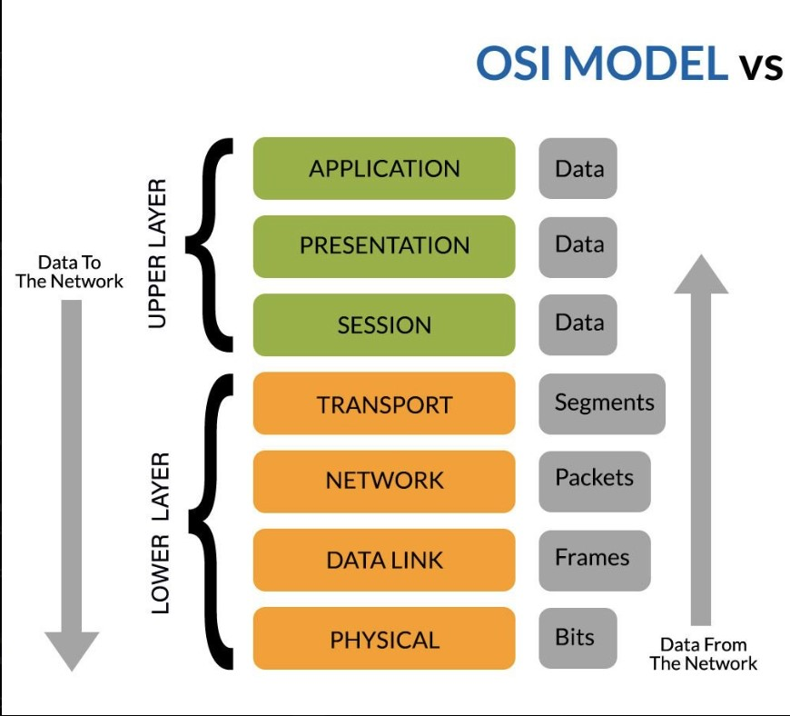

##### Коротка версія (для заучування, 40–60 сек)

1. **Фізичний**: Біти, кабелі, хаби.
2. **Канальний**: MAC-адреси, фрейми, комутатори.
3. **Мережевий**: IP-адреси, маршрутизація, маршрутизатори.
4. **Транспортний**: TCP/UDP, порти, доставка кінець-у-кінець.
5. **Сеансовий**: Встановлення/завершення з'єднання.
6. **Представлення**: Шифрування, компресія.
7. **Прикладний**: HTTP, FTP, Email.

**Памятка**: Від 1 до 7 — від фізики до додатків. Нижні (1-3) для інфраструктури, верхні (5-7) для додатків.

---

#### Po polsku (PL)
**Model OSI (Open Systems Interconnection)** to teoreticzny model opisujący komunikację w sieciach komputerowych, podzielony na 7 warstw. Każda warstwa zapewnia usługi warstwie wyższej i korzysta z usług warstwy niższej.

**7 warstw modelu OSI (od dolnej do górnej):**

1. **Warstwa fizyczna (Physical Layer)**
   - **Rola**: określa aspekty mechaniczne i elektryczne transmisji bitów przez medium.
   - **Urządzenia**: Hub, repeater.
   - **Jednostka**: Bity (0 i 1).
   - **Przykład**: kabel Ethernet, sygnały radiowe.

2. **Warstwa łącza danych (Data Link Layer)**
   - **Rola**: fizyczna adresacja (MAC) i niezawodna transmisja w obrębie sieci lokalnej.
   - **Urządzenia**: przełącznik (Switch), mosty.
   - **Jednostka**: Ramki (Frames).
   - **MAC-adresy**: 48 bitów (np. `00:1A:2B:3C:4D:5E`).
   - **Protokoły**: Ethernet, PPP.

3. **Warstwa sieci (Network Layer)**
   - **Rola**: adresacja logiczna i trasowanie (routing).
   - **Urządzenia**: routery.
   - **Jednostka**: Pakiety (Packets).
   - **IP-adresy**: adresacja logiczna (np. 192.168.1.1).
   - **Główny protokół**: IP (IPv4, IPv6), ICMP.

4. **Warstwa transportu (Transport Layer)**
   - **Rola**: dostawa punkt-punkt, segmentacja, kontrola błędów.
   - **Protokoły**: TCP (niezawodne z nawiązaniem) i UDP (szybkie bez nawiązania).
   - **Porty**: 0-65535 (port 80 = HTTP, 443 = HTTPS).
   - **Jednostka**: Segmenty/Datagramy.

5. **Warstwa sesji (Session Layer)**
   - **Rola**: zarządzanie sesją (nawiązanie, utrzymanie, zakończenie).
   - **Protokoły**: RPC, NetBIOS, PPTP.
   - **Przykład**: logowanie, utrzymanie sesji.

6. **Warstwa prezentacji (Presentation Layer)**
   - **Rola**: formatowanie danych, kompresja, szyfrowanie.
   - **Protokoły**: SSL/TLS, JPEG, ASCII/Unicode.
   - **Przykład**: tłumaczenie danych na zrozumiały format.

7. **Warstwa aplikacji (Application Layer)**
   - **Rola**: interfejs między użytkownikiem a siecią.
   - **Protokoły**: HTTP, FTP, SMTP, DNS, SSH, Telnet.
   - **Przykład**: przeglądarka, klient poczty, serwer plików.

**Porównanie z modelem TCP/IP:**
TCP/IP ma 4 warstwy (prostsze), OSI ma 7. TCP/IP dominuje w internecie, ale OSI pozostaje standardem edukacyjnym.

**Enkapsulacja (Encapsulation):**
Każda warstwa dodaje swój nagłówek: L7→L6→...→L1. Po drodze w górę nagłówki są usuwane.


##### Wersja krótka (do nauczenia, 40–60 s)

1. **Fizyczna**: Bity, kable.
2. **Łącza**: MAC, ramki, przełączniki.
3. **Sieci**: IP, trasowanie, routery.
4. **Transportu**: TCP/UDP, porty.
5. **Sesji**: Połączenie.
6. **Prezentacji**: Szyfrowanie.
7. **Aplikacji**: HTTP, FTP, Email.

**Łatwa pamięć**: Warstwy 1-7 to od fizyki do aplikacji. Niższe (1-3) dla infrastruktury, wyższe (5-7) dla aplikacji.

---

## Питання 11

**UA:** Будь ласка, обговоріть трансляцію адрес NAT та портів PAT у мережах TCP/IP.

**PL:** Proszę omówić translację adresów NAT oraz portów PAT w sieciach TCP/IP.

### Пояснення / Wyjaśnienie

#### Українською (UA)

**NAT (Network Address Translation)** та **PAT (Port Address Translation)** — це механізми, що використовуються в маршрутизаторах для заміни IP-адрес (та портів) у заголовках пакетів, які проходять між різними мережами (зазвичай між локальною мережею та Інтернетом).

**1. NAT (Статичний та Динамічний):**

- **Статичний NAT**: Відображення один-до-одного (1:1). Одна конкретна приватна адреса завжди відповідає одній конкретній публічній адресі. Використовується, наприклад, для внутрішніх серверів, доступних ззовні.

- **Динамічний NAT**: Відображення багато-до-багатьох. Маршрутизатор має пул публічних адрес і динамічно призначає їх пристроям з локальної мережі на час сесії.

**2. PAT (Port Address Translation / NAT Overload):**

- **Суть**: Це найпоширеніша форма NAT (часто звана NAT із перевантаженням).

- **Призначення**: Дозволяє багатьом пристроям у локальній мережі (з різними приватними адресами) використовувати одну спільну публічну адресу.

- **Механізм розрізнення**: Маршрутизатор розрізняє окремі з'єднання завдяки унікальним номерам вихідних портів.

- **Механізм роботи**: 
  - Коли локальний хост надсилає пакет, маршрутизатор замінює його приватну IP-адресу та порт на свою публічну IP-адресу та унікальний порт PAT.
  - Ця пара (приватний IP:порт ↔ публічний IP:порт PAT) записується в таблицю трансляції NAT.
  - Коли приходить відповідь, маршрутизатор перевіряє номер порту в таблиці та передає пакет відповідному хосту всередині мережі.

**Переваги:**
- **Економія IPv4-адрес**: Тисячі пристроїв можуть бути видимі під однією публічною адресою.
- **Безпека**: Приховує внутрішню структуру мережі від зовнішнього світу.

**Асоціація (Багатоквартирний будинок):**
- **Публічна IP-адреса** — адреса самого будинку.
- **Приватна IP-адреса** — номер квартири.
- **Порт PAT** — номер поштової скриньки або конкретне ім'я мешканця на конверті.
- **Маршрутизатор** — консьєрж: листоноша (Інтернет) приносить усе на одну адресу будинку, а консьєрж дивиться на ім'я (порт) і розносить лист у потрібну квартиру.

**Ключові терміни:**
- Приватна адреса (RFC 1918): `10.0.0.0/8`, `172.16.0.0/12`, `192.168.0.0/16`
- Публічна адреса
- Таблиця трансляції (NAT table)
- Мапування портів (Port mapping)

##### Коротка версія (для заучування, 40–60 сек)

- **NAT** — заміна IP-адрес у пакетах при проходженні між мережами.
- **Статичний NAT**: 1 приватний = 1 публічний (для серверів).
- **Динамічний NAT**: група приватних = пул публічних (на час сесії).
- **PAT (NAT Overload)**: багато приватних = 1 публічний (розрізнення через порти).
- **Головна мета**: економія IPv4-адрес + приховування внутрішньої структури мережі.
- **Асоціація**: Будинок (публічна IP) → Квартири (приватні IP) → Поштові скриньки (порти).

---

#### Po polsku (PL)

**NAT (Network Address Translation)** oraz **PAT (Port Address Translation)** to mechanizmy stosowane w ruterach w celu zamiany adresów IP (i portów) w nagłówkach pakietów przechodzących między różnymi sieciami (zazwyczaj między siecią lokalną a Internetem).

**1. NAT (Statyczny i Dynamiczny):**

- **NAT Statyczny**: Mapowanie jeden-do-jeden (1:1). Jeden konkretny adres prywatny zawsze odpowiada jednemu konkretnemu adresowi publicznemu. Stosowane np. dla serwerów wewnętrznych dostępnych z zewnątrz.

- **NAT Dynamiczny**: Mapowanie wiele-do-wielu. Ruter posiada pulę adresów publicznych i przydziela je dynamicznie urządzeniom z sieci lokalnej na czas trwania sesji.

**2. PAT (Port Address Translation / NAT Overload):**

- **Istota**: Jest to najpowszechniejsza forma NAT (często nazywana NAT z przeciążeniem).

- **Przeznaczenie**: Pozwala wielu urządzeniom w sieci lokalnej (z różnymi adresami prywatnymi) korzystać z jednego, wspólnego adresu publicznego.

- **Mechanizm rozróżniania**: Ruter rozróżnia poszczególne połączenia dzięki unikalnym numerom portów źródłowych.

- **Mechanizm działania**:
  - Kiedy host lokalny wysyła pakiet, ruter zamienia jego prywatny IP i port na swój publiczny IP oraz unikalny port PAT.
  - Ta para (prywatny IP:port ↔ publiczny IP:port PAT) jest zapisywana w tablicy translacji NAT.
  - Gdy przychodzi odpowiedź, ruter sprawdza numer portu w tablicy i przekazuje pakiet do właściwego hosta wewnątrz sieci.

**Zalety:**
- **Oszczędność adresów IPv4**: Tysiące urządzeń mogą być widoczne pod jednym adresem publicznym.
- **Bezpieczeństwo**: Ukrywa wewnętrzną strukturę sieci przed światem zewnętrznym.

**Skojarzenie (Budynek mieszkalny):**
- **Publiczny adres IP** — adres budynku.
- **Prywatny adres IP** — numer mieszkania.
- **Port PAT** — numer skrzynki pocztowej lub konkretne imię mieszkańca na kopercie.
- **Ruter** — portier: listonosz (Internet) przynosi wszystko na jeden adres budynku, a portier patrzy na imię (port) i roznosi list do odpowiedniego mieszkania.

**Kluczowe terminy:**
- Adres prywatny (RFC 1918): `10.0.0.0/8`, `172.16.0.0/12`, `192.168.0.0/16`
- Adres publiczny
- Tablica translacji (NAT table)
- Mapowanie portów (Port mapping)

##### Wersja krótka (do nauczenia, 40–60 s)

- **NAT** — zamiana adresów IP w pakietach przy przechodzeniu między sieciami.
- **Statyczny NAT**: 1 prywatny = 1 publiczny (dla serwerów).
- **Dynamiczny NAT**: grupa prywatnych = pula publicznych (na czas sesji).
- **PAT (NAT Overload)**: wiele prywatnych = 1 publiczny (rozróżnienie przez porty).
- **Główny cel**: oszczędność adresów IPv4 + ukrycie wewnętrznej struktury sieci.
- **Asocjacja**: Budynek (publiczny IP) → Mieszkania (prywatne IP) → Skrzynki pocztowe (porty).

---

---

## Питання 12

**UA:** Представте спосіб визначення структурного типу в мові C++, а також спосіб визначення та використання структурної змінної.

**PL:** Przedstaw sposób definicji typu strukturalnego w języku C++ oraz sposób definicji i korzystania ze zmiennej strukturalnej.

### Пояснення / Wyjaśnienie

#### Українською (UA)
У мові C++ структура (struct) — це визначений користувачем тип даних, який дозволяє групувати змінні різних типів під одним наменем. У C++ структури майже ідентичні класам, з тою різницю, що їхні члени за замовчуванням є публічними (public).

**1. Визначення структурного типу:** Структура визначається за допомогою ключового слова struct, після якого йде назва (ідентифікатор) та тіло у фігурних дужках, що завершується крапкою з комою.

```cpp
struct Student {
    std::string imie; // поле структури
    int wiek;         // поле структури
    double srednia;   // поле структури
}; // Крапка з комою обов'язкова!
```

**2. Визначення структурної змінної:** Змінна створюється шляхом вказання назви типу, а потім назви змінної. Її можна ініціалізувати списком значень.

```cpp
Student s1; // Визначення без ініціалізації
Student s2 = {"Jan", 21, 4.5}; // Агрегатна ініціалізація (C++11)
```

**3. Використання змінної (Доступ до полів):**
- Використовуємо оператор крапки (.) для об'єктів.
- Використовуємо оператор стрілки (->) для вказівників на структури.

```cpp
s1.imie = "Anna"; // Запис
cout << s1.imie;  // Читання

Student* ptr = &s1;
ptr->wiek = 22;   // Доступ через вказівник
```

**4. Пам'ять та вирівнювання (Alignment):** Розмір структури (sizeof) часто більший за суму розмірів її полів. Компілятор додає padding (порожні байти), щоб вирівняти дані за природними межами пам'яті (наприклад, 4 або 8 байт), що прискорює доступ процесора до даних.

**Асоціація та технічні нюанси:**
- Структура — це як "Анкета" або "Паспорт". У паспорті є поля: ім'я (рядок), серія (число), дата (об'єкт). Сам паспорт — це один об'єкт, але всередині — різні типи даних.
- Важливо пам'ятати: у C++ struct може мати конструктори, методи та наслідування (так само як class), але на іспиті наголошуй на тому, що головна відмінність — це public за замовчуванням.
- Розмір порожньої структури: `struct Empty {};` займає 1 байт, щоб об'єкт мав унікальну адресу в пам'яті.

##### Коротка версія (для заучування, 40–60 сек)

- **Структура** — тип даних для групування різних типів (поля різних типів під одною назвою).
- **Визначення**: `struct Назва { поля; };` — обов'язкова крапка з комою.
- **Змінна**: `Назва змінна;` або `Назва z = {значення};` (агрегатна ініціалізація).
- **Доступ**: `.` для об'єктів, `->` для вказівників.
- **Різниця з class**: члени struct за замовчуванням public.
- **Padding**: розмір може бути більшим за суму полів (вирівнювання в пам'яті).

---

#### Po polsku (PL)
W języku C++ struktura (struct) to zdefiniowany przez użytkownika typ danych, który pozwala na grupowanie zmiennych różnych typów pod jedną nazwą. W C++ struktury są niemal identyczne z klasami, z tą różnicą, że ich składniki są domyślnie publiczne.

**1. Definicja typu strukturalnego:** Strukturę definiujemy za pomocą słowa kluczowego struct, po którym następuje nazwa (identyfikator) oraz ciało ujęte w nawiasy klamrowe, zakończone średnikiem.

```cpp
struct Student {
    std::string imie; // pole struktury
    int wiek;         // pole struktury
    double srednia;   // pole struktury
}; // Średnik jest obowiązkowy!
```

**2. Definicja zmiennej strukturalnej:** Zmienną tworzymy podając nazwę typu, a następnie nazwę zmiennej. Można ją zainicjalizować listą wartości.

```cpp
Student s1; // Definicja bez inicjalizacji
Student s2 = {"Jan", 21, 4.5}; // Inicjalizacja zagregowana (C++11)
```

**3. Korzystanie ze zmiennej (Dostęp do pól):**
- Używamy operatora kropki (.) dla obiektów.
- Używamy operatora strzałki (->) dla wskaźników na struktury.

```cpp
s1.imie = "Anna"; // Zapis
cout << s1.imie;  // Odczyt

Student* ptr = &s1;
ptr->wiek = 22;   // Dostęp przez wskaźnik
```

**4. Pamięć i wyrównanie (Alignment):** Rozmiar struktury (sizeof) często jest większy niż suma rozmiarów jej składników. Kompilator dodaje padding (puste bajty), aby wyrównać dane do naturalnych granic pamięci (np. 4 lub 8 bajtów), co przyspiesza dostęp procesora do danych.

##### Wersja krótka (do nauczenia, 40–60 s)

- **Struktura** — typ danych do grupowania różnych typów (pola różnych typów pod jedną nazwą).
- **Definicja**: `struct Nazwa { pola; };` — średnik obowiązkowy.
- **Zmienna**: `Nazwa zmienna;` lub `Nazwa z = {wartości};` (inicjalizacja zagregowana).
- **Dostęp**: `.` dla obiektów, `->` dla wskaźników.
- **Różnica z class**: składniki struct domyślnie public.
- **Padding**: rozmiar może być większy niż suma pól (wyrównanie w pamięci).

---

## Питання 13

**UA:** Охарактеризуйте машину Тюрінга, обговоріть її складність та наведіть відмінності й подібності між її детермінованим та недетермінованим варіантами.

**PL:** Scharakteryzuj maszynę Turinga, omów jej złożoność oraz podaj różnice i podobieństwa pomiędzy deterministycznym a niedeterministycznym jej wariantem.

### Пояснення / Wyjaśnienie

#### Українською (UA)

**Машина Тюрінга (МТ)** — це абстрактна математична модель пристрою для виконання алгоритмів, запропонована Аланом Тюрінгом у 1936 році. Вона є фундаментом теоретичної інформатики і визначає межі обчислюваності.

**1. Будова Машини Тюрінга:**

- **Нескінченна стрічка**: Розділена на комірки, кожна з яких містить символ з кінцевого алфавіту (включаючи порожній символ).

- **Головка читання/запису**: Може читати символи зі стрічки, записувати нові символи та пересуватися вліво або вправо на одну комірку за крок.

- **Реєстр станів**: Зберігає поточний стан машини з кінцевого набору станів (включаючи початковий стан $q_0$, стани прийняття та стан відхилення).

- **Функція переходу ($\delta$)**: Визначає поведінку машини. На основі поточного стану та прочитаного символу функція визначає:
  - Який символ записати на стрічку
  - Куди посунути головку (вліво L, вправо R, або залишитися S)
  - В який стан перейти

**2. Обчислювальна складність:**

- **Часова складність**: Кількість кроків (операцій головки), які машина виконує від початку до зупинки. Позначається як $T(n)$, де $n$ — розмір входу.

- **Просторова (пам'ятна) складність**: Кількість комірок стрічки, які машина відвідала або використала під час обчислень. Позначається як $S(n)$.

**3. Варіанти: Детермінована (DTM) vs Недетермінована (NTM):**

**Подібності:**

- **Обчислювальна еквівалентність**: Обидві машини можуть розв'язувати один і той самий набір задач (розв'язні/нерозв'язні задачі). Будь-яка NTM може бути змодельована (симульована) за допомогою DTM.

- **Однакова структура**: Обидві використовують стрічку, головку, кінцеві стани та функцію переходу.

- **Теза Черча-Тюрінга**: Обидва варіанти відповідають формальному визначенню алгоритму.

**Відмінності:**

- **Кількість переходів**: У DTM для даного стану та прочитаного символу існує рівно один перехід (одна дія). У NTM може існувати багато можливих переходів — машина "вибирає" кілька шляхів одночасно (дерево обчислень).

- **Модель виконання**: DTM виконує один детермінований шлях. NTM теоретично виконує всі можливі шляхи паралельно, і якщо хоча б один шлях приводить до прийняття — вхід приймається.

- **Класи складності**: DTM визначає клас P (задачі, розв'язні за поліноміальний час). NTM визначає клас NP (задачі, розв'язні за поліноміальний час на недетермінованій машині, або перевірювані за поліноміальний час на DTM).

**Асоціація (Кінопроектор та лабіринт):**

- **Машина Тюрінга** — це як старий кінопроектор або касетний плеєр: є стрічка, є головка, яка її читає і крутить, і є інструкція: "якщо бачиш такий кадр — роби це".

- **DTM** — це людина в лабіринті, яка на кожному розпутті має чітку інструкцію, куди йти (один шлях).

- **NTM** — це людина, яка може "клонувати" себе на кожному розпутті, щоб одночасно перевірити всі можливі шляхи. Якщо хоча б один клон знайде вихід — задача розв'язана.

**Ключові терміни:**

- Стрічка (tape), головка (head), стани (states), функція переходу (transition function)
- Класи складності: P, NP, NP-повнота
- Теза Черча-Тюрінга
- Проблема зупинки (Halting Problem)

##### Коротка версія (для заучування, 40–60 сек)

- **МТ**: Стрічка + головка + стани + функція переходу $\delta$.
- **Будова**: Нескінченна стрічка, головка (читання/запис/рух), реєстр станів, $\delta$ (стан + символ → дія).
- **Складність**: Часова ($T(n)$ — кроки) і просторова ($S(n)$ — комірки).
- **DTM**: Один стан + один символ = точно одна дія → клас P.
- **NTM**: Багато можливих переходів одночасно (дерево шляхів) → клас NP.
- **Еквівалентність**: Обидві розв'язують ті самі задачі, але NTM потенційно швидша (теоретично).
- **Асоціація**: Кінопроектор (стрічка + інструкції); DTM = один шлях у лабіринті, NTM = клони перевіряють усі шляхи.

---

#### Po polsku (PL)

**Maszyna Turinga (MT)** to abstrakcyjny model matematyczny urządzenia służącego do wykonywania algorytmów, zaproponowany przez Alana Turinga w 1936 roku. Jest fundamentem informatyki teoretycznej i definiuje granice obliczalności.

**1. Budowa Maszyny Turinga:**

- **Nieskończona taśma**: Podzielona na komórki, z których każda zawiera symbol z skończonego alfabetu (w tym symbol pusty).

- **Głowica odczytu/zapisu**: Potrafi czytać symbole z taśmy, zapisywać nowe symbole oraz przesuwać się w lewo lub w prawo o jedną komórkę na krok.

- **Rejestr stanów**: Przechowuje aktualny stan maszyny ze skończonego zbioru stanów (w tym stan początkowy $q_0$, stany akceptujące i stan odrzucenia).

- **Funkcja przejścia ($\delta$)**: Określa zachowanie maszyny. Na podstawie aktualnego stanu i odczytanego symbolu funkcja określa:
  - Jaki symbol zapisać na taśmie
  - W którą stronę przesunąć głowicę (w lewo L, w prawo R, lub pozostać S)
  - W jaki stan przejść

**2. Złożoność obliczeniowa:**

- **Złożoność czasowa**: Liczba kroków (operacji głowicy), jakie maszyna wykonuje od początku do zatrzymania. Oznaczana jako $T(n)$, gdzie $n$ — rozmiar wejścia.

- **Złożoność pamięciowa**: Liczba komórek taśmy, które maszyna odwiedziła lub wykorzystała podczas obliczeń. Oznaczana jako $S(n)$.

**3. Warianty: Deterministyczna (DTM) vs Niedeterministyczna (NTM):**

**Podobieństwa:**

- **Równoważność obliczeniowa**: Obie maszyny potrafią rozwiązać ten sam zbiór problemów (rozstrzygalne/nierozstrzygalne problemy). Każda NTM może zostać zasymulowana przez DTM.

- **Ta sama struktura**: Obie korzystają z taśmy, głowicy, skończonych stanów i funkcji przejścia.

- **Teza Churcha-Turinga**: Oba warianty odpowiadają formalnemu określeniu algorytmu.

**Różnice:**

- **Liczba przejść**: W DTM dla danego stanu i odczytanego symbolu istnieje dokładnie jedno przejście (jedna akcja). W NTM może istnieć wiele możliwych przejść — maszyna "wybiera" wiele ścieżek jednocześnie (drzewo obliczeń).

- **Model wykonania**: DTM wykonuje jedną deterministyczną ścieżkę. NTM teoretycznie wykonuje wszystkie możliwe ścieżki równolegle, i jeśli przynajmniej jedna ścieżka prowadzi do akceptacji — wejście jest akceptowane.

- **Klasy złożoności**: DTM definiuje klasę P (problemy rozwiązywalne w czasie wielomianowym). NTM definiuje klasę NP (problemy rozwiązywalne w czasie wielomianowym na maszynie niedeterministycznej, lub weryfikowalne w czasie wielomianowym na DTM).

**Skojarzenie (Projektor i labirynt):**

- **Maszyna Turinga** — to jak stary projektor filmowy lub odtwarzacz kasetowy: jest taśma, jest głowica, która ją czyta i kręci, i jest instrukcja: "jeśli widzisz taką klatkę — zrób to".

- **DTM** — to człowiek w labiryncie, który na każdym rozdrożu ma jasną instrukcję, dokąd iść (jedna ścieżka).

- **NTM** — to człowiek, który może "sklonować" siebie na każdym rozdrożu, aby jednocześnie sprawdzić wszystkie możliwe ścieżki. Jeśli przynajmniej jeden klon znajdzie wyjście — problem rozwiązany.

**Kluczowe terminy:**

- Taśma (tape), głowica (head), stany (states), funkcja przejścia (transition function)
- Klasy złożoności: P, NP, NP-zupełność
- Teza Churcha-Turinga
- Problem stopu (Halting Problem)

##### Wersja krótka (do nauczenia, 40–60 s)

- **MT**: Taśma + głowica + stany + funkcja przejścia $\delta$.
- **Budowa**: Nieskończona taśma, głowica (odczyt/zapis/ruch), rejestr stanów, $\delta$ (stan + symbol → akcja).
- **Złożoność**: Czasowa ($T(n)$ — kroki) i pamięciowa ($S(n)$ — komórki).
- **DTM**: Jeden stan + jeden symbol = dokładnie jedna akcja → klasa P.
- **NTM**: Wiele możliwych przejść jednocześnie (drzewo ścieżek) → klasa NP.
- **Równoważność**: Obie rozwiązują te same problemy, ale NTM potencjalnie szybsza (teoretycznie).
- **Skojarzenie**: Projektor (taśma + instrukcje); DTM = jedna ścieżka w labiryncie, NTM = klony sprawdzają wszystkie ścieżki.

---

## Питання 14

**UA:** Охарактеризуйте діаграму класів нотації UML.

**PL:** Scharakteryzuj diagram klas notacji UML. 

### Пояснення / Wyjaśnienie

#### Українською (UA)

**Діаграма класів** — це найважливіша структурна діаграма в мові UML (Unified Modeling Language). Вона представляє статичну структуру системи, описуючи її класи, атрибути, операції (методи) та відносини між об'єктами.

**1. Складові класу (прямокутник, розділений на три секції):**

- **Заголовок**: Назва класу (жирним шрифтом; якщо клас абстрактний — курсивом).
- **Атрибути (Поля)**: Описують стан об'єкта. Запис: `видимість назва: тип = значення_за_замовчуванням`.
- **Операції (Методи)**: Описують поведінку. Запис: `видимість назва(параметри): тип_повернення`.

**2. Символи видимості:**

- `+` : public (публічний)
- `-` : private (приватний)
- `#` : protected (захищений)
- `~` : package (пакетний)

**3. Зв'язки між класами:**

- **Узагальнення (Спадкування)**: Суцільна лінія з порожнім трикутником `▷`. Вказує на зв'язок "є типом" (наприклад, Собака є типом Тварини).

- **Асоціація**: Звичайна лінія `—`, що з'єднує класи, позначаючи загальний зв'язок. Може мати кратність (наприклад, `1`, `0..*`).

- **Агрегація** (порожній ромб `◇`): Відношення "частина-ціле", де частина може існувати без цілого (наприклад, Студент і Факультет).

- **Композиція** (зафарбований ромб `◆`): Сильне відношення "частина-ціле". Якщо видалити ціле, частини також видаляються (наприклад, Будинок і Кімнати).

- **Реалізація**: Пунктирна лінія з порожнім трикутником `- - ▷` (імплементація інтерфейсу).

**Приклад діаграми класів UML:**

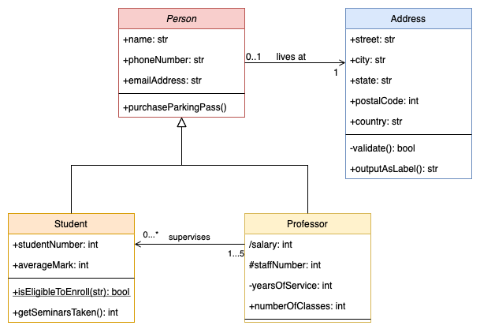

##### Коротка версія (для заучування, 40–60 сек)

- **UML діаграма класів**: статична структура системи (класи + зв'язки).
- **Клас**: прямокутник з 3 секціями (назва, атрибути, методи).
- **Видимість**: `+` public, `-` private, `#` protected, `~` package.
- **Зв'язки**:
  - Спадкування: `▷` (є типом)
  - Асоціація: `—` (загальний зв'язок)
  - Агрегація: `◇` (частина може існувати без цілого)
  - Композиція: `◆` (частина не може існувати без цілого)
  - Реалізація: `- - ▷` (інтерфейс)

---

#### Po polsku (PL)

**Diagram klas** to najważniejszy strukturalny diagram w języku UML (Unified Modeling Language). Przedstawia on statyczną strukturę systemu, opisując jego klasy, atrybuty, operacje (metody) oraz relacje między obiektami.

**1. Składowe klasy (prostokąt podzielony na trzy sekcje):**

- **Nagłówek**: Nazwa klasy (pogrubiona; jeśli klasa jest abstrakcyjna – pisana kursywą).
- **Atrybuty (Pola)**: Opisują stan obiektu. Zapis: `widoczność nazwa: typ = wartość_domyślna`.
- **Operacje (Metody)**: Opisują zachowanie. Zapis: `widoczność nazwa(parametry): typ_zwracany`.

**2. Symbole widoczności:**

- `+` : public (publiczny)
- `-` : private (prywatny)
- `#` : protected (chroniony)
- `~` : package (pakietowy)

**3. Relacje między klasami:**

- **Generalizacja (Dziedziczenie)**: Linia ciągła zakończona pustym trójkątem `▷`. Wskazuje na relację "jest rodzajem" (np. Pies jest rodzajem Zwierzęcia).

- **Asocjacja**: Zwykła linia `—` łącząca klasy, oznaczająca ogólną relację. Może mieć określoną krotność (np. `1`, `0..*`).

- **Agregacja** (pusty diament `◇`): Relacja "część-całość", gdzie część może istnieć bez całości (np. Student i Wydział).

- **Kompozycja** (zamalowany diament `◆`): Silna relacja "część-całość". Jeśli usuniemy całość, części również zostają usunięte (np. Budynek i Pokoje).

- **Realizacja**: Linia przerywana z pustym trójkątem `- - ▷` (implementacja interfejsu).

**Przykładowy diagram klas UML:**


##### Wersja krótka (do nauczenia, 40–60 s)

- **Diagram klas UML**: statyczna struktura systemu (klasy + relacje).
- **Klasa**: prostokąt z 3 sekcjami (nazwa, atrybuty, metody).
- **Widoczność**: `+` public, `-` private, `#` protected, `~` package.
- **Relacje**:
  - Dziedziczenie: `▷` (jest rodzajem)
  - Asocjacja: `—` (ogólna relacja)
  - Agregacja: `◇` (część może istnieć bez całości)
  - Kompozycja: `◆` (część nie może istnieć bez całości)
  - Realizacja: `- - ▷` (interfejs)

---

---

## Питання 15

**UA:** Перелічіть та охарактеризуйте структури операційних систем.

**PL:** Wymień i omów struktury systemów operacyjnych. 

### Пояснення / Wyjaśnienie

#### Українською (UA)

**Структура операційної системи** визначає спосіб організації та взаємодії окремих компонентів ядра (kernel) та системних служб.

**1. Монолітна структура (Monolithic Structure):**

- **Характеристика**: Вся операційна система (керування пам'яттю, процесами, драйвери) працює в одному адресному просторі ядра (kernel space).
- **Переваги**: Дуже висока продуктивність завдяки відсутності витрат на зв'язок між модулями (прості виклики функцій).
- **Недоліки**: Низька стабільність (помилка в одному драйвері може зупинити всю систему) і складність підтримки коду.
- **Приклади**: Linux, MS-DOS, класичні системи UNIX.

**2. Шарова структура (Layered Approach):**

- **Характеристика**: Система розділена на шари (від 0 до N). Найнижчий шар (0) — це апаратне забезпечення, найвищий (N) — інтерфейс користувача. Кожен шар використовує послуги тільки безпосередньо нижчого шару.
- **Переваги**: Легкість налагодження (debugging) та модифікації окремих рівнів.
- **Недоліки**: Складність у визначенні чітких меж шарів та падіння продуктивності (дані мають пройти крізь усі рівні).
- **Приклад**: Система THE (Дейкстри).

**3. Мікроядро (Microkernel):**

- **Характеристика**: Ядро містить лише абсолютний мінімум функціональності: IPC (міжпроцесна взаємодія), керування пам'яттю та базове планування. Решта служб (драйвери, файлові системи) працюють у просторі користувача (user space).
- **Переваги**: Висока безпека та стабільність (збій служби не "кладе" ядро), легкість розширення.
- **Недоліки**: Нижча продуктивність через часте перемикання контексту та пересилання повідомлень (message passing).
- **Приклади**: QNX, Symbian, ядро Mach (частина macOS).

**4. Модульна структура (Loadable Kernel Modules - LKM):**

- **Характеристика**: Сучасний підхід, де ядро має монолітну основу, але дозволяє динамічно завантажувати та видаляти модулі (наприклад, драйвери) під час роботи.
- **Переваги**: Гнучкість мікроядра при продуктивності монолітної системи.
- **Приклад**: Сучасний Linux (модулі `.ko`), Solaris.

**5. Гібридна структура (Hybrid):**

- **Характеристика**: Поєднує риси монолітного ядра (продуктивність) та мікроядра (структура).
- **Приклад**: Windows NT (ядро Windows), macOS (XNU).

**Асоціація:**
- **Моноліт**: Швейцарський ніж — усе в одному корпусі. Зламалося одне лезо (драйвер) — незручно користуватися всім ножем.
- **Мікроядро**: Набір інструментів у ящику. Якщо зламався один ключ, ти просто береш інший, а ящик (ядро) цілий.

**Ключові терміни**: Kernel space (простір ядра), User space (простір користувача), IPC (міжпроцесна взаємодія), Стабільність vs Продуктивність.

##### Коротка версія (для заучування, 40–60 сек)

- **Монолітна**: Все в одному (Linux). Швидка, але нестабільна.
- **Шарова**: Ієрархія шарів. Легка у побудові, важка у продуктивності.
- **Мікроядро**: Мінімум у ядрі (IPC), решта в User Space (QNX). Дуже стабільна, але повільніша.
- **Модульна**: Динамічні модулі (LKM). Стандарт у сучасному Linux.
- **Гібридна**: Мікс обох підходів (Windows, macOS).
- **Асоціація**: Моноліт = Швейцарський ніж; Мікроядро = Набір інструментів.

---

#### Po polsku (PL)

**Struktura systemu operacyjnego** określa sposób, w jaki poszczególne komponenty jądra (kernel) i usług systemowych są zorganizowane i ze sobą współpracują.

**1. Struktura monolityczna (Monolithic Structure):**

- **Charakterystyka**: Cały system operacyjny (zarządzanie pamięcią, procesami, sterowniki) pracuje w jednej przestrzeni adresowej jądra (kernel space).
- **Zalety**: Bardzo wysoka wydajność dzięki braku narzutu na komunikację między modułami (wywołania funkcji).
- **Wady**: Mała stabilność (błąd w jednym sterowniku może zawiesić cały system) i trudna konserwacja kodu.
- **Przykłady**: Linux, MS-DOS, klasyczne systemy UNIX.

**2. Struktura warstwowa (Layered Approach):**

- **Charakterystyka**: System podzielony jest na warstwy (0 do N). Warstwa najniższa (0) to sprzęt, a najwyższa (N) to interfejs użytkownika. Każda warstwa korzysta wyłącznie z usług warstwy bezpośrednio niższej.
- **Zalety**: Łatwość debugowania i modyfikacji poszczególnych poziomów.
- **Wady**: Trudność w zdefiniowaniu czystych warstw i spadek wydajności (dane muszą przejść przez wiele poziomów).
- **Przykład**: System THE (Dijkstry).

**3. Mikrojądro (Microkernel):**

- **Charakterystyka**: Jądro zawiera tylko absolutne minimum funkcjonalności: IPC (komunikacja międzyprocesowa), zarządzanie pamięcią i podstawowe planowanie. Pozostałe usługi (sterowniki, systemy plików) działają w przestrzeni użytkownika (user space).
- **Zalety**: Wysokie bezpieczeństwo i stabilność (awaria usługi nie kładzie jądra), łatwość rozszerzania.
- **Wady**: Niższa wydajność z powodu częstego przełączania kontekstu i przesyłania wiadomości (message passing).
- **Przykłady**: QNX, Symbian, jądro Mach (część macOS).

**4. Struktura modularna (Loadable Kernel Modules - LKM):**

- **Charakterystyka**: Współczesne podejście, gdzie jądro ma rdzeń monolityczny, ale pozwala na dynamiczne ładowanie i usuwanie modułów (np. sterowników) w czasie pracy.
- **Zalety**: Elastyczność mikrojądra przy wydajności systemu monolitycznego.
- **Przykład**: Współczesny Linux (moduły `.ko`), Solaris.

**5. Struktura hybrydowa (Hybrid):**

- **Charakterystyka**: Łączy cechy jądra monolitycznego (wydajność) i mikrojądra (struktura).
- **Przykład**: Windows NT (jądro Windowsa), macOS (XNU).

**Skojarzenie (Асоціація):**
- **Monolit**: Szwajcarski scyzoryk — wszystko w jednym korpusie. Złamało się jedno ostrze (sterownik) — niewygodnie używać całego noża.
- **Mikrojądro**: Zestaw narzędzi w skrzynce. Jeśli złamał się jeden klucz, po prostu bierzesz inny, a skrzynka (jądro) jest cała.

**Kluczowe terminy**: Kernel space (przestrzeń jądra), User space (przestrzeń użytkownika), IPC (komunikacja międzyprocesowa), Stabilność vs Wydajność.

##### Wersja krótka (do nauczenia, 40–60 s)

- **Monolityczna**: Wszystko w jednym (Linux). Szybka, ale niestabilna.
- **Warstwowa**: Hierarchia warstw. Łatwa w budowie, trudna w wydajności.
- **Mikrojądro**: Minimum w jądrze (IPC), reszta w User Space (QNX). Bardzo stabilna, ale wolniejsza.
- **Modularna**: Dynamiczne moduły (LKM). Standard w dzisiejszym Linuxie.
- **Hybrydowa**: Miks obu podejść (Windows, macOS).
- **Asocjacja**: Monolit = Scyzoryk; Mikrojądro = Skrzynka narzędzi.

---

---

## Питання 16

**UA:** Опишіть різницю між жадібними алгоритмами та динамічним програмуванням.

**PL:** Opisz różnicę pomiędzy algorytmami zachłannymi i dynamicznymi.

### Пояснення / Wyjaśnienie

#### Українською (UA)
Обидва підходи використовуються для розв'язання задач оптимізації, але вони відрізняються стратегією прийняття рішень.

**1. Жадібні алгоритми (Greedy Algorithms):**
- **Стратегія**: На кожному кроці вибирається рішення, яке здається найкращим у цей момент (локально оптимальний вибір), з надією, що це призведе до глобального оптимуму.
- **Особливості**: Вони швидкі та мають низьку обчислювальну складність. Раз прийняте рішення ніколи не переглядається.
- **Недолік**: Не завжди гарантують знаходження найкращого (глобального) рішення.
- **Приклади**: Алгоритм Дейкстри, алгоритм Крускала, задача про видачу решти (для стандартних валютних систем).

**2. Динамічне програмування (Dynamic Programming):**
- **Стратегія**: Вирішує задачу шляхом поділу її на менші підзадачі, що перекриваються. Результати цих підзадач зберігаються (техніка запам'ятовування — memoization або табуляція), щоб не обчислювати їх повторно.
- **Особливості**: Гарантує знаходження оптимального глобального рішення (якщо задача має оптимальну підструктуру).
- **Складність**: Зазвичай повільніше за жадібні алгоритми, але значно швидше за метод "грубої сили" (brute-force).
- **Приклади**: Задача про рюкзак (дискретна), послідовність Фібоначчі (з оптимізацією), найдовша спільна підпослідовність (LCS).

**Ключові відмінності:**

| Характеристика | Жадібний алгоритм | Динамічне програмування |
| :--- | :--- | :--- |
| Підхід | Найкращий вибір "тут і зараз". | Аналіз усіх підзадач. |
| Оптимальність | Не завжди (лише у специфічних випадках). | Завжди гарантована (якщо застосовно). |
| Складність | Зазвичай $O(n \log n)$ або $O(n)$. | Зазвичай вища, напр. $O(n^2)$ або $O(n \cdot W)$. |
| Перегляд рішень | Немає можливості повернутися назад. | Розглядає вплив рішень на майбутні стани. |

**Асоціація (Задача про рюкзак):**
- **Жадібний підхід**: Уяви, що ти грабуєш магазин. Ти береш найдорожчу річ, потім наступну за ціною. Це швидко, але може виявитися, що взявши дві дешеві, але легкі речі замість однієї дорогої та важкої, ти б виніс більше грошей.
- **Динамічний підхід**: Ти прораховуєш усі можливі комбінації ваги та ціни, записуючи результати в таблицю. Це займе більше часу, але ти винесеш максимально можливий прибуток.

**Приклад коду (Видача решти - Жадібний алгоритм):**

```cpp
// Жадібний алгоритм видачі решти працює правильно лише для певних систем номіналів
void wydajReszte(int kwota) {
    int nominaly[] = {200, 100, 50, 20, 10, 5, 2, 1};
    for(int n : nominaly) {
        while(kwota >= n) {
            cout << n << " ";
            kwota -= n;
        }
    }
}
```

##### Коротка версія (для заучування, 40–60 сек)

- **Жадібний**: вибирає найкраще рішення "зараз", швидко ($O(n)$ або $O(n \log n)$), але **не завжди** оптимальне.
- **Динамічне програмування**: розбиває задачу на підзадачі, запам'ятовує результати, **завжди** знаходить оптимум, але повільніше ($O(n^2)$ або вище).
- **Різниця**: Жадібний не повертається назад; ДП аналізує всі варіанти.
- **Приклади**: Жадібний — Дейкстра, Крускал; ДП — рюкзак, Фібоначчі, LCS.

---

#### Po polsku (PL)
Oba podejścia służą do rozwiązywania problemów optymalizacyjnych, ale różnią się strategią podejmowania decyzji.

**1. Algorytmy zachłanne (Greedy Algorithms):**
- **Strategia**: W każdym kroku wybierają rozwiązanie, które wydaje się najlepsze w danej chwili (wybór lokalnie optymalny), z nadzieją, że doprowadzi to do globalnego optimum.
- **Cechy**: Są szybkie i mają niską złożoność obliczeniową. Raz podjęta decyzja nigdy nie jest cofana.
- **Wada**: Nie zawsze gwarantują znalezienie najlepszego (globalnego) rozwiązania.
- **Przykłady**: Algorytm Dijkstry, algorytm Kruskala, wydawanie reszty (dla systemów walutowych takich jak PLN).

**2. Programowanie dynamiczne (Dynamic Programming):**
- **Strategia**: Rozwiązuje problem poprzez podział na mniejsze, nachodzące na siebie podproblemy. Wyniki tych podproblemów są przechowywane (technika spamiętywania - memoization lub tablicowania), aby nie obliczać ich wielokrotnie.
- **Cechy**: Gwarantuje znalezienie optymalnego rozwiązania globalnego (jeśli problem posiada optymalną podstrukturę).
- **Złożoność**: Zazwyczaj wolniejsze od algorytmów zachłannych, ale znacznie szybsze niż podejście siłowe (brute-force).
- **Przykłady**: Problem plecakowy (wersja decyzyjna), ciąg Fibonacciego (z optymalizacją), najdłuższy wspólny podciąg (LCS).

**Kluczowe różnice:**

| Cecha | Algorytm zachłanny | Programowanie dynamiczne |
| :--- | :--- | :--- |
| Podejście | Wybór najlepszy "tu i teraz". | Analiza wszystkich podproblemów. |
| Optymalność | Nie zawsze (tylko w specyficznych przypadkach). | Zawsze gwarantowana (jeśli stosowalne). |
| Złożoność | Zazwyczaj $O(n \log n)$ lub $O(n)$. | Zazwyczaj wyższa, np. $O(n^2)$ lub $O(n \cdot W)$. |
| Cofanie decyzji | Brak możliwości powrotu. | Rozważa skutki decyzji dla przyszłych stanów. |

**Asocjacja (Problem plecakowy):**
- **Podejście zachłanne**: Wyobraź sobie, że okradasz sklep. Bierzesz najdroższą rzecz, potem kolejną. To szybkie, ale może się okazać, że biorąc dwie tanie, ale lekkie rzeczy zamiast jednej drogiej i ciężkiej, wyniósłbyś więcej pieniędzy.
- **Podejście dynamiczne**: Przeliczasz wszystkie możliwe kombinacje wagi i wartości, zapisując wyniki w tabeli. Zajmuje więcej czasu, ale wynosisz maksymalny możliwy zysk.

**Przykład kodu (Wydawanie reszty - Algorytm zachłanny):**

```cpp
// Algorytm zachłanny wydawania reszty działa poprawnie tylko dla pewnych systemów nominalnych
void wydajReszte(int kwota) {
    int nominaly[] = {200, 100, 50, 20, 10, 5, 2, 1};
    for(int n : nominaly) {
        while(kwota >= n) {
            cout << n << " ";
            kwota -= n;
        }
    }
}
```

##### Wersja krótka (do nauczenia, 40–60 s)

- **Zachłanny**: wybiera najlepsze rozwiązanie "teraz", szybko ($O(n)$ lub $O(n \log n)$), ale **nie zawsze** optymalne.
- **Programowanie dynamiczne**: dzieli problem na podproblemy, zapamiętuje wyniki, **zawsze** znajduje optimum, ale wolniej ($O(n^2)$ lub wyżej).
- **Różnica**: Zachłanny nie cofa się; PD analizuje wszystkie warianty.
- **Przykłady**: Zachłanny — Dijkstra, Kruskal; PD — plecak, Fibonacci, LCS.

---

# Питання по спеціальності / Pytania zakresowe

## Питання 1 / Pytanie 1

**UA:** Тестування (види, рівні тестів) та життєвий цикл програмного забезпечення.

**PL:** Testowanie (rodzaje, poziomy testów) a cykl życia oprogramowania.

### Пояснення / Wyjaśnienie

**UA:**

Тестування — це невід'ємна частина життєвого циклу (SDLC), яка супроводжує його на всіх етапах (особливо в V-Model).

**1. Рівні тестування (Levels of Testing):**
Йдуть від найменшого до найбільшого ("Піраміда тестування").
*   **Модульне (Unit Testing):** Перевірка окремих функцій/класів (робить розробник).
*   **Інтеграційне (Integration Testing):** Перевірка взаємодії між модулями (чи працюють вони разом?).
*   **Системне (System Testing):** Перевірка всієї готової системи в цілому (чи відповідає вимогам?).
*   **Приймальне (Acceptance Testing):** Перевірка замовником (UAT), чи готова програма до релізу.

**2. Види тестування (Types of Testing):**
*   **Функціональне:** *Що* система робить? (Чи працює логін? Чи додається товар у кошик?).
*   **Нефункціональне:** *Як* система працює?
    - *Навантажувальне (Performance):* Чи витримає 1000 юзерів?
    - *Безпека (Security):* Чи можна зламати?
    - *Юзабіліті (Usability):* Чи зручно користуватися?
*   **Регресійне:** Перевірка, чи не зламали нові зміни те, що вже працювало.

##### Коротка версія (для заучування)

- **Рівні**:
  1. Юніт (код).
  2. Інтеграція (зв'язки).
  3. Системне (вся програма).
  4. Приймальне (клієнт).
- **Види**:
  - Функціональне (що робить).
  - Нефункціональне (швидкість, безпека).
  - Регресійне (перевірка старого).

---

**PL:**

Testowanie jest integralną częścią cyklu życia oprogramowania (SDLC). W modelu V każdemu etapowi tworzenia odpowiada odpowiedni poziom testów.

**1. Poziomy testowania (Levels):**
*   **Jednostkowe (Unit Testing):** Testowanie pojedynczych funkcji/metod (przez programistę).
*   **Integracyjne (Integration Testing):** Sprawdzanie współpracy między modułami lub systemami.
*   **Systemowe (System Testing):** Testowanie kompletnego systemu pod kątem wymagań.
*   **Akceptacyjne (Acceptance Testing):** Weryfikacja przez klienta (UAT) przed wdrożeniem.

**2. Rodzaje testowania (Types):**
*   **Funkcjonalne:** *Co* system robi? (Np. czy funkcja "Zaloguj" działa?).
*   **Niefunkcjonalne:** *Jak* system działa?
    - *Wydajnościowe (Performance):* Szybkość i stabilność.
    - *Bezpieczeństwa (Security):* Odporność na ataki.
    - *Użyteczności (Usability):* Łatwość obsługi.
*   **Regresyjne:** Sprawdzenie, czy nowe zmiany nie zepsuły działających funkcji.

##### Wersja krótka (do nauczenia)

- **Poziomy**:
  1. Unit (małe kawałki).
  2. Integration (połączenia).
  3. System (całość).
  4. Acceptance (dla klienta).
- **Rodzaje**:
  - Funkcjonalne (działanie).
  - Niefunkcjonalne (szybkość, bezpieczeństwo).
  - Regresyjne (czy stare wciąż działa).

---

## Питання 2 / Pytanie 2

**UA:** Охарактеризуйте цілі та методи модульного тестування (Unit Testing).

**PL:** Scharakteryzuj cele i metody testowania jednostkowego.

### Пояснення / Wyjaśnienie

**UA:**

**Модульне тестування (Unit Testing)** — це перевірка найменших незалежних частин програми (функцій, методів, класів) окремо від решти системи.

**Цілі:**
1.  **Гарантія якості:** Впевнитися, що функція повертає правильний результат (наприклад, `add(2, 2)` повертає `4`).
2.  **Регресійне тестування:** Переконатися, що нові зміни не зламали старий код.
3.  **Документація:** Тести показують, як **має** працювати код.
4.  **Спрощення рефакторингу:** Можна сміливо змінювати код, якщо тести "зелені".

**Методи та інструменти:**
- **xUnit Frameworks:** JUnit (Java), NUnit (C#), unittest/pytest (Python), GoogleTest (C++).
- **Mocking (Імітація):** Якщо функція залежить від бази даних або мережі, ми створюємо "фейкові" об'єкти (Mock/Stub), щоб тестувати тільки логіку функції, а не базу даних.

**Структура тесту (AAA):**
1.  **Arrange:** Підготовка даних (створити об'єкти).
2.  **Act:** Виклик методу, який тестуємо.
3.  **Assert:** Перевірка результату (чи дорівнює очікуваному?).

##### Коротка версія (для заучування)

- **Що це?**: Тест для однієї маленької функції.
- **Ціль**: Щоб все працювало і не ламалося потім.
- **Структура AAA**: Підготуй (Arrange) -> Зроби (Act) -> Перевір (Assert).
- **Ізоляція**: Використовуємо Mocks (заглушки) замість реальної БД.

---

**PL:**

**Testowanie jednostkowe (Unit Testing)** polega na weryfikacji najmniejszych fragmentów kodu (funkcji, metod, klas) w izolacji od reszty systemu.

**Cele:**
1.  **Weryfikacja poprawności:** Upewnienie się, że kod działa zgodnie z założeniami.
2.  **Zapobieganie regresji:** Wykrywanie błędów po wprowadzeniu zmian w kodzie.
3.  **Ułatwienie refaktoryzacji:** Bezpieczne ulepszanie kodu przy zachowaniu funkcjonalności.
4.  **Dokumentacja:** Testy pokazują przykłady użycia kodu.

**Metody i narzędzia:**
- **Frameworki:** JUnit, NUnit, Pytest, Jest.
- **Mocking (Atrapy):** Izolowanie testowanego kodu od zewnętrznych zależności (np. bazy danych) poprzez użycie obiektów Mock lub Stub.

**Struktura testu (AAA):**
1.  **Arrange:** Przygotuj dane wejściowe.
2.  **Act:** Wykonaj testowaną metodę.
3.  **Assert:** Sprawdź, czy wynik jest zgodny z oczekiwaniami.

##### Wersja krótka (do nauczenia)

- **Co to jest?**: Testowanie pojedynczych funkcji/metod.
- **Po co?**: Żeby znaleźć błędy wcześnie i nie psuć kodu przy zmianach.
- **Zasada AAA**: Arrange (przygotuj), Act (wykonaj), Assert (sprawdź).
- **Izolacja**: Testujemy samą logikę, bez bazy danych (używamy Mocków).

---

## Питання 3 / Pytanie 3

**UA:** Обговоріть техніку розробки програмного забезпечення через тестування (TDD - Test-Driven Development).

**PL:** Omów technikę tworzenia oprogramowania Test-Driven Development.

### Пояснення / Wyjaśnienie

**UA:**

**TDD (Test-Driven Development)** — це методологія розробки, коли **спочатку пишуться тести**, а вже потім — код, який їх виконує.

**Цикл TDD (Red-Green-Refactor):**

1.  🔴 **Red (Червоний):** Написати тест для нової функції. Оскільки функція ще не написана, тест **провалюється** (помилка компіляції або виконання).
2.  🟢 **Green (Зелений):** Написати **мінімально необхідний код**, щоб тест пройшов успішно. Якість коду тут не головне, головне — щоб "загорілося зелене".
3.  🔵 **Refactor (Рефакторинг):** Покращити код (прибрати дублювання, покращити імена змінних), зберігаючи тести зеленими.

**Переваги:**
- Висока надійність коду (менше багів).
- Код відразу задокументований тестами.
- Легше змінювати код у майбутньому (тести покажуть, якщо ви щось зламали).

**Недоліки:**
- Писати код довше на старті.
- Потрібно вміти писати хороші тести.

##### Коротка версія (для заучування)

- Суть: **Спочатку тест, потім код.**
- Цикл **RGR**:
  1. **Red**: Тест не працює (бо коду нема).
  2. **Green**: Пишемо код, щоб тест запрацював.
  3. **Refactor**: Покращуємо код.

---

**PL:**

**TDD (Test-Driven Development)** to technika programowania, w której **najpierw powstają testy**, a dopiero potem kod aplikacji.

**Cykl TDD (Red-Green-Refactor):**

1.  🔴 **Red (Czerwony):** Napisz test dla nowej funkcjonalności. Test **musi nie przejść** (bo funkcjonalności jeszcze nie ma).
2.  🟢 **Green (Zielony):** Napisz **niezbędne minimum kodu**, aby test przeszedł pomyślnie. Nie dbaj o piękno kodu na tym etapie.
3.  🔵 **Refactor (Refaktoryzacja):** Ulepsz kod (czytelność, optymalizacja), upewniając się, że testy nadal przechodzą.

**Zalety (Korzyści):**
- Mniejsza liczba błędów (Bugs).
- Bezpieczny refaktoring (zmiany w kodzie).
- Testy pełnią rolę żywej dokumentacji.

**Wady:**
- Wolniejszy start (trzeba napisać więcej kodu testowego).
- Wymaga dyscypliny i umiejętności pisania testów.

##### Wersja krótka (do nauczenia)

- Zasada: **Najpierw test, potem kod.**
- Cykl **RGR**:
  1. **Red**: Test failed (brak kodu).
  2. **Green**: Test passed (kod działa).
  3. **Refactor**: Clean code (czyszczenie).

---

## Питання 4 / Pytanie 4

**UA:** Обговоріть типові функції інструментів, що підтримують процес налагодження (дебаггингу) програмного забезпечення.

**PL:** Omówić typowe funkcje narzędzi wspierających proces debugowania oprogramowania.

### Пояснення / Wyjaśnienie

**UA:**

**Дебагер (Debugger)** — це інструмент для пошуку та виправлення помилок (багів) у коді.

**Основні функції:**

1.  **Точки зупинки (Breakpoints)**
    - Дозволяють зупинити виконання програми на конкретному рядку коду.
    - Використовується, щоб заглянути "під капот" у критичний момент.
    - *Conditional Breakpoint:* Зупинити тільки якщо `х > 100`.

2.  **Покрокове виконання (Stepping)**
    - **Step Over (F10):** Виконати рядок і зупинитися на наступному (не заходячи всередину функцій).
    - **Step Into (F11):** Зайти всередину функції, яку викликають у цьому рядку.
    - **Step Out:** Виконати функцію до кінця і вийти назад у місце виклику.

3.  **Перегляд змінних (Variables / Watch)**
    - Можливість бачити поточні значення всіх змінних у момент зупинки.
    - Можна змінювати значення "на льоту", щоб перевірити гіпотезу.

4.  **Стек викликів (Call Stack)**
    - Показує ланцюжок функцій: хто викликав поточну функцію, хто викликав попередню, і так до `main()`.
    - Допомагає зрозуміти, "як ми сюди потрапили".

5.  **Evaluate Expression (Обчислення виразів)**
    - Виконання довільного коду або формули прямо в режимі паузи.

##### Коротка версія (для заучування)

- **Breakpoints**: "Стоп тут!" (зупинка на рядку).
- **Step Over/Into**: Йти по коду крок за кроком.
- **Watch**: Дивитися значення змінних (`x = 5`).
- **Call Stack**: Хто кого викликав (історія шляху).

---

**PL:**

**Debugger** to narzędzie do analizy kodu w czasie rzeczywistym, służące do znajdowania i naprawiania błędów (bugów).

**Główne funkcje:**

1.  **Pułapki (Breakpoints)**
    - Zatrzymują wykonywanie programu w wybranej linii kodu.
    - Pozwalają sprawdzić stan aplikacji w danym momencie.
    - *Conditional Breakpoint:* Zatrzymaj tylko, jeśli warunek jest spełniony (np. `i == 5`).

2.  **Praca krokowa (Stepping)**
    - **Step Over:** Wykonaj linię i idź dalej (nie wchodź do funkcji).
    - **Step Into:** Wejdź do środka wywoływanej funkcji.
    - **Step Out:** Dokończ obecną funkcję i wróć do miejsca wywołania.

3.  **Podgląd zmiennych (Watch / Locals)**
    - Wyświetlanie aktualnych wartości zmiennych w pamięci.
    - Możliwość ręcznej zmiany wartości w trakcie debugowania.

4.  **Stos wywołań (Call Stack)**
    - Lista funkcji, które doprowadziły do obecnego miejsca w kodzie (ścieżka wywołania).
    - Odpowiedź na pytanie: "Skąd się tu wzięliśmy?".

5.  **Immediate Window / Evaluate**
    - Możliwość wpisania i wykonania fragmentu kodu "na żywo" w zatrzymanym programie.

##### Wersja krótka (do nauczenia)

- **Breakpoints**: Zatrzymanie programu w konkretnym miejscu.
- **Stepping**: Wykonywanie kodu linijka po linijce.
- **Watch**: Podglądanie wartości zmiennych.
- **Call Stack**: Historia wywołań funkcji.

---

## Питання 5 / Pytanie 5

**UA:** Обговоріть переваги використання системи контролю версій (VCS).

**PL:** Omówić korzyści z wykorzystania systemu kontroli wersji.

### Пояснення / Wyjaśnienie

**UA:**

**Система контролю версій (VCS - Version Control System)** — це програмне забезпечення для керування змінами в коді (найпопулярніша: **Git**).

**Основні переваги:**

1.  **Історія змін (History & Backup)**
    - Зберігається кожна версія файлу. Можна повернутися назад ("відкотитися"), якщо щось зламалося.
    - Видно *хто*, *коли* і *чому* (commit message) вніс зміни.

2.  **Спільна робота (Collaboration)**
    - Дозволяє команді працювати над одним проектом одночасно.
    - Система автоматично об'єднує зміни (Merge) і повідомляє про конфлікти, якщо двоє людей змінили той самий рядок.

3.  **Гілкування (Branching)**
    - Можна створювати окремі "гілки" (branches) для нових функцій або експериментів, не ламаючи основний код (main/master).
    - Після тестування гілка вливається (Merge Request / Pull Request) в основну.

4.  **Безпека та Відстежуванність**
    - Ви знаєте автора кожного рядка коду (`git blame`).

**Приклади:** Git (GitHub, GitLab, Bitbucket), SVN, Mercurial.

##### Коротка версія (для заучування)

- **Машина часу**: Можна повернути старий код, якщо новий не працює.
- **Командна робота**: Багато людей пишуть код разом без хаосу.
- **Гілки (Branches)**: Безпечне додавання нових фіч.
- **Бекап**: Код зберігається на сервері.

---

**PL:**

**System kontroli wersji (VCS)** to narzędzie do zarządzania zmianami w kodzie źródłowym (standardem jest **Git**).

**Główne korzyści:**

1.  **Historia zmian i kopia bezpieczeństwa**
    - Możliwość powrotu do dowolnej, działającej wersji kodu (Rollback).
    - Pełna historia: kto, kiedy i co zmienił.

2.  **Praca zespołowa (Collaboration)**
    - Umożliwia wielu programistom pracę na tych samych plikach jednocześnie bez nadpisywania swojej pracy.
    - Mechanizm łączenia kodu (Merge) i rozwiązywania konfliktów.

3.  **Gałęzie (Branching)**
    - Tworzenie izolowanych kopii kodu (Branch) do pracy nad nowymi funkcjami.
    - Główna wersja (Master/Main) pozostaje stabilna podczas prac developerskich.

4.  **Śledzenie błędów**
    - Łatwo znaleźć, która zmiana wprowadziła błąd (`git bisect`).

**Przykłady:** Git, SVN.

##### Wersja krótka (do nauczenia)

- **Historia (Undo)**: Można cofnąć zepsute zmiany.
- **Współpraca**: Zespół pracuje równolegle nad jednym projektem.
- **Gałęzie (Branches)**: Bezpieczne testowanie nowych funkcji.
- **Kopia zapasowa**: Kod jest bezpieczny na serwerze (np. GitHub).

---

## Питання 6 / Pytanie 6

**UA:** Обговоріть способи профілювання програм та інструменти, що використовуються в цьому процесі.

**PL:** Omówić sposoby profilowania programów i narzędzia wykorzystywane w tym procesie.

### Пояснення / Wyjaśnienie

**UA:**

**Профілювання (Profiling)** — це аналіз роботи програми під час виконання для виявлення "вузьких місць" (bottlenecks), витоків пам'яті або надмірного використання процесора.

**Основні методи профілювання:**

1.  **Інструментація (Instrumentation)**
    - У код програми додаються спеціальні інструкції (маркери) на етапі компіляції або виконання.
    - **Плюси:** Дуже висока точність (міряє кожен виклик).
    - **Мінуси:** Сповільнює роботу програми (Overhead), змінює її поведінку.

2.  **Семплінг (Sampling)**
    - Профайлер періодично (наприклад, кожні 1 мс) "зупиняє" програму і дивиться, яка функція зараз виконується.
    - **Плюси:** Мало впливає на швидкість роботи.
    - **Мінуси:** Менша точність (можна пропустити короткі функції).

**Що вимірюють:**
- **CPU Time:** Скільки часу процесор витрачає на функцію.
- **Memory Usage:** Скільки пам'яті виділяється (пошук Memory Leaks).
- **Call Graph:** Хто яку функцію викликав і скільки разів.

**Популярні інструменти:**
- **Valgrind (Memcheck, Callgrind):** Linux, пошук витоків пам'яті.
- **gprof:** Стандартний профайлер GNU (GCC).
- **Visual Studio Profiler:** Для Windows/.NET/C++.
- **Perf:** Потужний інструмент для Linux ядра.

##### Коротка версія (для заучування)

- **Профілювання** — це пошук "гальм" та витоків пам'яті.
- **Методи**:
  1. **Інструментація**: Вставка лічильників у код (точно, але повільно).
  2. **Семплінг**: Періодична перевірка "де ми зараз?" (швидко, але менш точно).
- **Інструменти**: Valgrind (пам'ять), gprof, Visual Studio Profiler.

---

**PL:**

**Profilowanie** to dynamiczna analiza oprogramowania w celu zmierzenia jego wydajności, zużycia pamięci i czasu wykonywania poszczególnych funkcji. Cel: optymalizacja.

**Główne metody profilowania:**

1.  **Instrumentacja (Instrumentation)**
    - Dodanie dodatkowego kodu (markerów) do programu w celu śledzenia wykonania.
    - **Zalety:** Bardzo dokładne pomiary (ilość wywołań, dokładny czas).
    - **Wady:** Spowalnia działanie programu (duży narzut/overhead).

2.  **Próbkowanie (Sampling)**
    - Profiler okresowo przerywa działanie programu i sprawdza rejestr licznika rozkazów (gdzie jesteśmy?).
    - **Zalety:** Mały wpływ na wydajność, działa na produkcji.
    - **Wady:** Mniej dokładne, może pominąć krótkie funkcje.

**Co mierzymy:**
- Zużycie CPU (czas procesora).
- Alokację pamięci (wycieki pamięci / Memory Leaks).
- Częstotliwość wywołań funkcji.

**Narzędzia:**
- **Valgrind:** Analiza pamięci (Linux).
- **gprof:** Klasyczny profiler GCC.
- **Visual Studio Diagnostic Tools:** Wbudowane w VS.
- **Wireshark:** Do profilowania sieci.

##### Wersja krótka (do nauczenia)

- **Profilowanie**: Szukanie wąskich gardeł (gdzie program zamula) i wycieków pamięci.
- **Metody**:
  1. **Instrumentacja**: Dokładne, ale obciąża program (dodatkowy kod).
  2. **Próbkowanie**: Szybkie, sprawdza stan co jakiś czas.
- **Narzędzia**: Valgrind, Visual Studio Profiler, gprof.

---

## Питання 7 / Pytanie 7

**UA:** Порівняйте модель Bare-metal та модель, що базується на багатозадачності RTOS у програмному забезпеченні вбудованих систем.

**PL:** Porównaj model bare-metal oraz model bazujący na multitaskingu dostarczanym przez RTOS w oprogramowaniu systemów wbudowanych.

### Пояснення / Wyjaśnienie

**UA:**

Це два основні підходи до написання прошивок для мікроконтролерів.

**1. Bare-metal ("Голе залізо")**
- **Принцип:** Програма працює без операційної системи. Зазвичай це нескінченний цикл `while(1)` (Super Loop), який послідовно викликає функції, плюс переривання (Interrupts) для термінових подій.
- **Плюси:**
    - Максимальна продуктивність (нульові накладні витрати).
    - Повний контроль над залізом.
    - Простота для дуже малих проектів.
- **Мінуси:**
    - Важко реалізувати багатозадачність (одна довга функція гальмує все).
    - Складність масштабування ("Спагетті-код").
    - Важко дотримуватися точних таймінгів, якщо задач стає багато.

**2. RTOS (Операційна система реального часу)**
- **Принцип:** Використовує **Планувальник (Scheduler)**. Програма розбивається на незалежні **задачі (Tasks)**. Планувальник перемикає процесор між ними (Context Switching), створюючи ілюзію одночасної роботи.
- **Особливості:**
    - **Витискання (Preemption):** Важлива задача може перервати менш важливу миттєво.
    - **Синхронізація:** Використовує черги, семафори, м'ютекси.
- **Плюси:**
    - Легко писати складні системи (поділ на модулі).
    - Гарантований час реакції на події.
- **Мінуси:**
    - Використовує ресурси процесора та пам'яті (Overhead).
    - Складніше налаштування.

##### Коротка версія (для заучування)

- **Bare-metal**:
  - `while(1)` (Super Loop).
  - Простий, найшвидший, без витрат пам'яті.
  - Погано для складних задач (одне гальмує все).
- **RTOS**:
  - Планувальник (Scheduler) + Задачі (Tasks).
  - Багатозадачність, пріоритети.
  - Легше керувати складним проектом.
  - Їсть трохи ресурсів.

---

**PL:**

Są to dwa główne podejścia do tworzenia oprogramowania dla systemów wbudowanych.

**1. Bare-metal**
- **Zasada:** Brak systemu operacyjnego. Program to zazwyczaj nieskończona pętla `while(1)` (Super Loop), która wykonuje funkcje sekwencyjnie + przerwania (Interrupts).
- **Zalety:**
    - Pełna kontrola nad sprzętem i maksymalna wydajność.
    - Brak narzutu (overhead) na system operacyjny.
    - Prostota w małych projektach.
- **Wady:**
    - Trudna obsługa wielozadaniowości (jedna wolna funkcja blokuje resztę).
    - Trudne utrzymanie przy rozroście kodu ("Spaghetti code").

**2. RTOS (Real-Time Operating System)**
- **Zasada:** Wykorzystuje **Planistę (Scheduler)**. Aplikacja jest podzielona na niezależne **Zadania (Tasks)**. Planista przełącza procesor między nimi (Context Switching), dając wrażenie równoległości.
- **Cechy:**
    - **Wywłaszczanie (Preemption):** Zadanie o wyższym priorytecie przerywa zadanie o niższym.
    - **Synchronizacja:** Kolejki, semafory, mutexy.
- **Zalety:**
    - Łatwiejsze zarządzanie złożonymi systemami (modułowość).
    - Gwarancja czasu reakcji (determinzm).
- **Wady:**
    - Zużywa zasoby (pamięć RAM, cykle CPU).
    - Większy próg wejścia.

##### Wersja krótka (do nauczenia)

- **Bare-metal**:
  - Pętla `while(1)`.
  - Maksymalna szybkość, brak narzutu.
  - Trudne przy skomplikowanych projektach (brak wielozadaniowości).
- **RTOS**:
  - Używa Planisty (Scheduler) i Zadań (Tasks).
  - Prawdziwa wielozadaniowość (wywłaszczanie).
  - Łatwiejsze skalowanie kodu, ale zużywa trochę zasobów.

---

## Питання 8 / Pytanie 8

**UA:** Порівняйте методи забезпечення безколізійного доступу до спільних апаратних ресурсів в RTOS, що реалізуються за допомогою: а) м'ютексів та б) критичних секцій.

**PL:** Porównaj metody zapewnienia bezkolizyjnego dostępu do współdzielonych zasobów sprzętowych w RTOS realizowane za pomocą: a) mutexów i b) sekcji krytycznych.

### Пояснення / Wyjaśnienie

**UA:**

В системах реального часу (RTOS) доступ до спільних ресурсів (пам'ять, порти, периферія) має бути синхронізований.

**1. М'ютекс (Mutex - Mutual Exclusion)**
- **Принцип:** Це спеціальний об'єкт ("ключ"). Потік бере м'ютекс перед використанням ресурсу і віддає після. Якщо м'ютекс зайнятий, інший потік **чекає (блокується)** і переходить у стан "Sleeping".
- **Використання:** Для тривалих операцій (доступ до файлу, передача даних по UART).
- **Плюси:** Дозволяє іншим (більш пріоритетним) задачам працювати, поки поточна чекає.
- **Мінуси:** Витрати часу на перемикання контексту (Context Switch). Можлива проблема "інверсії пріоритетів".

**2. Критична секція (Critical Section)**
- **Принцип:** Це ділянка коду, яка виконується **нерозривно**. В RTOS це зазвичай реалізується через **тимчасову заборону переривань** (Disable Interrupts). Ніхто не може перервати виконання цього коду.
- **Використання:** Для дуже коротких операцій (зміна змінної-лічильника, запис в регістр).
- **Плюси:** Дуже швидко, нульові накладні витрати на перемикання задач.
- **Мінуси:** Якщо секція занадто довга, система "зависає" (зростає Interrupt Latency), і можна пропустити важливі події.

**Порівняння:**
- **М'ютекс** присипляє задачу (добре для довгих дій), **Критична секція** зупиняє всю систему/планувальник (добре для миттєвих змін).

##### Коротка версія (для заучування)

- **М'ютекс**:
  - Як ключ від туалету (один зайшов, інші чекають).
  - Задача "спить", поки чекає.
  - Для **довгих** операцій.
- **Критична секція**:
  - Повне відключення переривань (Disable Interrupts).
  - Ніхто не може перервати процес.
  - Для **миттєвих** операцій (зміна змінної).
  - Небезпечно затримувати надовго!

---

**PL:**

W systemach czasu rzeczywistego (RTOS) dostęp do wspólnych zasobów musi być synchronizowany.

**1. Mutex (Mutual Exclusion)**
- **Zasada:** Obiekt synchronizacji ("klucz"). Zadanie pobiera mutex przed dostępem i oddaje po zakończeniu. Jeśli mutex jest zajęty, zadanie **czeka (blokuje się)** i oddaje procesor innym zadaniom.
- **Zastosowanie:** Dłuższe operacje (dostęp do plików, transmisja danych).
- **Zalety:** Nie blokuje całego systemu, pozwala działać innym zadaniom.
- **Wady:** Narzut czasowy na przełączanie kontekstu. Ryzyko inwersji priorytetów.

**2. Sekcja krytyczna (Critical Section)**
- **Zasada:** Fragment kodu wykonywany atomowo (niepodzielnie). Najczęściej realizowany przez **wyłączenie przerwań** (Disable Interrupts). Żadne inne zadanie ani przerwanie nie może wtedy zadziałać.
- **Zastosowanie:** Bardzo krótkie operacje (zmiana flagi, inkrementacja licznika).
- **Zalety:** Bardzo szybkie, brak narzutu na przełączanie zadań.
- **Wady:** Blokuje cały system. Zbyt długie wyłączenie przerwań zwiększa opóźnienia systemu (Interrupt Latency).

**Porównanie:**
- **Mutex** usypia zadanie (dobre do długich zadań). **Sekcja krytyczna** blokuje przerywania (dobre do błyskawicznych operacji).

##### Wersja krótka (do nauczenia)

- **Mutex**:
  - Jak klucz (jeden ma, reszta czeka).
  - Zadanie przechodzi w stan uśpienia.
  - Do **dłuższych** operacji.
- **Sekcja krytyczna**:
  - Wyłączenie przerwań (nikt nie przeszkadza).
  - Atomowe wykonanie.
  - Do **bardzo krótkich** operacji.
  - Uwaga: nie może trwać długo, bo system "stanie".

---

## Питання 9 / Pytanie 9

**UA:** Назвіть та охарактеризуйте методи оптимізації веб-сторінок для пошукових систем (SEO).

**PL:** Wymień i scharakteryzuj metody optymalizacji stron internetowych pod kątem silnika wyszukiwarek.

### Пояснення / Wyjaśnienie

**UA:**

**SEO (Search Engine Optimization)** — це комплекс заходів для підвищення позицій сайту в результатах пошуку (Google).

1.  **On-page SEO (Внутрішня оптимізація)**
    - Робота безпосередньо над **сайтом**.
    - **Контент:** Унікальні та корисні тексти, використання ключових слів (Keywords).
    - **Мета-теги:** Правильні `Title`, `Description` та заголовки `H1`–`H6`.
    - **Швидкість:** Оптимізація зображень, чистий код, швидке завантаження (Core Web Vitals).
    - **Адаптивність:** Сайт має зручно працювати на мобільних телефонах (Mobile-First Indexing).

2.  **Off-page SEO (Зовнішня оптимізація)**
    - Підвищення авторитету сайту **ззовні**.
    - **Лінкбілдинг (Backlinks):** Отримання посилань на ваш сайт з інших авторитетних ресурсів.
    - **Соціальні сигнали:** Активність та згадки бренду в соцмережах (SMM).

3.  **Технічне SEO**
    - Налаштування `sitemap.xml` (карта сайту) та `robots.txt` (правила для роботів).
    - Використання захищеного протоколу **HTTPS** (SSL).
    - Читабельні URL-адреси (Friendly URL).

##### Коротка версія (для заучування)

- **On-page (Всередині)**: Якісний текст, ключові слова, швидкість, теги (`Title`, `H1`).
- **Off-page (Ззовні)**: Посилання з інших сайтів (авторитет), соцмережі.
- **Технічне**: HTTPS, карта сайту, адаптивність під мобільні.
- **Мета**: Бути першим у Google.

---

**PL:**

**SEO (Search Engine Optimization)** to proces poprawy widoczności strony w wynikach wyszukiwania.

1.  **SEO On-site (Optymalizacja wewnętrzna)**
    - Działania w obrębie **samej strony**.
    - **Treść (Content):** Unikalne teksty zawierające słowa kluczowe.
    - **Struktura kodu:** Poprawne tagi HTML (`<title>`, `<meta description>`, `<h1>`), semantyka.
    - **Wydajność:** Szybkość ładowania strony (optymalizacja grafik, cache).
    - **Responsywność (RWD):** Dostosowanie do urządzeń mobilnych.

2.  **SEO Off-site (Optymalizacja zewnętrzna)**
    - Budowanie autorytetu domeny w sieci.
    - **Link Building:** Pozyskiwanie linków zwrotnych z innych wartościowych stron (backlinks).
    - Aktywność w mediach społecznościowych.

3.  **SEO Techniczne**
    - Pliki `sitemap.xml` (mapa dla robotów) i `robots.txt`.
    - Certyfikat bezpieczeństwa SSL (**HTTPS**).
    - Przyjazne linki (np. `/produkt` zamiast `/?id=123`).

##### Wersja krótka (do nauczenia)

- **On-site**: To, co na stronie (teksty, słowa kluczowe, szybkość).
- **Off-site**: To, co poza stroną (linki z innych stron budujące zaufanie).
- **Techniczne**: Poprawny kod, bezpieczeństwo (HTTPS), mobilność.
- **Cel**: Wyższa pozycja w Google.

---

## Питання 10 / Pytanie 10

**UA:** Архітектури веб-додатків.

**PL:** Architektury aplikacji internetowych.

### Пояснення / Wyjaśnienie

**UA:**

Архітектура веб-додатку визначає, як взаємодіють його компоненти (клієнт, сервер, база даних).

**Основні типи архітектур (по структурі додатку):**

1.  **MPA (Multi-Page Application)** — Класична модель.
    - При кожному переході сервер генерує нову HTML-сторінку.
    - **Плюси:** Просте SEO, менше навантаження на браузер.
    - **Мінуси:** Повільніша взаємодія (перезавантаження сторінки).
    - *Приклад:* Старі сайти, класичні інтернет-магазини (PHP, JSP).

2.  **SPA (Single-Page Application)** — Сучасна модель.
    - Завантажується `index.html` один раз. Далі вміст оновлюється динамічно через JavaScript (AJAX/API). Браузер не перезавантажується.
    - **Плюси:** Швидкий і плавний інтерфейс (як у нативній програмі).
    - **Мінуси:** Складніше SEO (потрібен SSR), довше перше завантаження.
    - *Приклад:* Gmail, Facebook, React/Angular додатки.

3.  **PWA (Progressive Web Application)**
    - Це SPA, що поводиться як мобільний додаток (працює офлайн, можна встановити на телефон).

**Основні типи архітектур (по організації коду на сервері):**

1.  **Моноліт (Monolithic)**
    - Весь код (Frontend, Backend, логіка) в одному проекті/сервісі.
    - *Легко почати, але важко масштабувати великі проекти.*
2.  **Мікросервіси (Microservices)**
    - Додаток розбитий на малі незалежні сервіси, що спілкуються через мережу (REST/gRPC).
    - *Гнучко і надійно, але складно в управлінні.*

##### Коротка версія (для заучування)

- **MPA**: Багато сторінок, перезавантаження при кожному кліку (старий стиль).
- **SPA**: Одна сторінка, динамічне оновлення без перезавантаження (React, Angular).
- **Моноліт**: "Все в одному" (весь код разом).
- **Мікросервіси**: Багато маленьких незалежних програм, що працюють разом.

---

**PL:**

Architektura aplikacji internetowej to sposób organizacji komponentów systemu i przepływu danych między nimi.

**Główne typy architektur (Frontend/Sposób działania):**

1.  **MPA (Multi-Page Application)** — Klasyczne podejście.
    - Każda akcja użytkownika powoduje przeładowanie strony i pobranie nowego HTML z serwera.
    - **Zalety:** Dobre SEO, prosta implementacja.
    - **Wady:** Mniejsza płynność działania (przeładowania).
    - *Przykład:* Tradycyjne portale, sklepy (Allegro w wersji klasycznej).

2.  **SPA (Single-Page Application)** — Nowoczesne podejście.
    - Ładuje się tylko raz. Treść podmieniana jest dynamicznie przez JavaScript bez przeładowania strony.
    - **Zalety:** Bardzo szybki interfejs, wrażenie aplikacji desktopowej.
    - **Wady:** Trudniejsze SEO, większe obciążenie przeglądarki.
    - *Przykład:* Gmail, aplikacje React/Vue.

3.  **PWA (Progressive Web Application)**
    - SPA, która działa jak aplikacja natywna (działa offline, powiadomienia push).

**Główne typy architektur (Backend/Struktura):**

1.  **Monolit (Monolithic)**
    - Cała aplikacja to jeden wielki kod i jeden proces.
    - *Prosty na start, trudny do skalowania.*
2.  **Mikroserwisy (Microservices)**
    - Aplikacja podzielona na małe, niezależne usługi komunikujące się ze sobą.
    - *Skalowalne i odporne na awarie, ale skomplikowane.*

##### Wersja krótka (do nauczenia)

- **MPA**: Wiele stron, każde kliknięcie przeładowuje stronę.
- **SPA**: Jedna strona, treść zmienia się dynamicznie (płynnie).
- **Monolit**: Cały system w jednym kawałku kodu.
- **Mikroserwisy**: System podzielony na wiele małych, niezależnych części.


---

## Питання 11 / Pytanie 11

**UA:** Охарактеризуйте життєвий цикл веб-додатку.

**PL:** Opisz cykl życia aplikacji internetowej.

### Пояснення / Wyjaśnienie

**UA:**

Життєвий цикл веб-додатку (SDLC - Software Development Life Cycle) — це етапи, через які проходить проект від ідеї до завершення роботи.

1.  **Планування та аналіз (Planning & Analysis)**
    - Визначення мети сайту, цільової аудиторії (ЦА).
    - Збір вимог (який функціонал потрібен).
    - *Результат:* Технічне завдання (ТЗ).

2.  **Проектування (Design)**
    - Створення структури (Sitemap) та прототипів (Wireframes).
    - Розробка дизайну інтерфейсу (UI/UX).
    - Проектування архітектури бази даних (ERD).

3.  **Розробка (Development)**
    - **Frontend:** Верстка (HTML/CSS), програмування клієнтської частини (JS/React).
    - **Backend:** Написання серверної логіки (PHP/Python/Node.js), створення API.
    - **Database:** Налаштування БД (SQL/NoSQL).

4.  **Тестування (Testing)**
    - Перевірка на помилки (Bugs).
    - Тестування кросбраузерності (чи працює в Chrome, Safari, Firefox) та адаптивності (мобільні пристрої).
    - *Типи:* Unit-тести, інтеграційні, QA (Manual).

5.  **Розгортання (Deployment)**
    - Купівля домену та хостингу/сервера.
    - Налаштування CI/CD (автоматична викладка).
    - Публікація сайту в мережі (Production).

6.  **Підтримка та обслуговування (Maintenance)**
    - Виправлення помилок, виявлених користувачами.
    - Регулярні оновлення контенту та безпеки (патчі).
    - SEO-оптимізація та моніторинг.

##### Коротка версія (для заучування)

1.  **Аналіз**: Що робимо? (ТЗ, вимоги).
2.  **Дизайн**: Як виглядає? (UI/UX, макети).
3.  **Розробка**: Пишемо код (Frontend + Backend).
4.  **Тестування**: Шукаємо баги.
5.  **Реліз**: Заливаємо на сервер.
6.  **Підтримка**: Оновлюємо та лікуємо.

---

**PL:**

Cykl życia aplikacji internetowej (SDLC) to proces tworzenia oprogramowania od pomysłu do utrzymania.

1.  **Planowanie i Analiza (Planning & Analysis)**
    - Określenie celów biznesowych i grupy docelowej.
    - Zbieranie wymagań funkcjonalnych.
    - *Wynik:* Specyfikacja wymagań.

2.  **Projektowanie (Design)**
    - Tworzenie makiet (Wireframes) i projektu graficznego (UI/UX).
    - Projektowanie architektury systemu i bazy danych.

3.  **Programowanie (Development)**
    - **Frontend:** Tworzenie interfejsu (HTML, CSS, JS, Frameworki).
    - **Backend:** Logika serwera, API, integracja z bazą danych.

4.  **Testowanie (Testing)**
    - Weryfikacja poprawności działania (QA).
    - Testy funkcjonalne, wydajnościowe, bezpieczeństwa oraz kompatybilności (RWD, przeglądarki).

5.  **Wdrożenie (Deployment)**
    - Konfiguracja serwera i domeny.
    - Publikacja aplikacji w środowisku produkcyjnym (często przez CI/CD).

6.  **Utrzymanie (Maintenance)**
    - Monitorowanie działania aplikacji.
    - Naprawa błędów, aktualizacje bezpieczeństwa, rozwój nowych funkcji.

##### Wersja krótka (do nauczenia)

1.  **Analiza**: Wymagania i cele.
2.  **Design**: Wygląd i architektura (UI/UX).
3.  **Kodowanie**: Praca programistów (Front/Back).
4.  **Testy**: Sprawdzanie błędów.
5.  **Wdrożenie**: Publikacja (wrzucenie na serwer).
6.  **Utrzymanie**: Aktualizacje i opieka.

---

## Питання 12 / Pytanie 12

**UA:** Способи персоналізації веб-додатків.

**PL:** Sposoby personalizacji aplikacji internetowych.

### Пояснення / Wyjaśnienie

**UA:**

**Персоналізація** — це процес адаптації контенту та функціоналу веб-додатку під потреби конкретного користувача. Це покращує UX (User Experience) та залученість.

**Основні способи персоналізації:**

1.  **Явна персоналізація (Explicit)**
    - Користувач **сам** налаштовує додаток під себе.
    - *Приклади:* Вибір мови, темна/світла тема, налаштування сповіщень, заповнення профілю (аватар, ім'я).

2.  **Неявна персоналізація (Implicit)**
    - Система автоматично аналізує **поведінку** користувача і підлаштовується.
    - Базується на історії переглядів, пошукових запитах, лайках.
    - *Приклади:* Рекомендації YouTube/Netflix ("Вам може сподобатися"), таргетована реклама.

3.  **Контекстна персоналізація**
    - Базується на поточному контексті користувача.
    - *Приклади:*
        - **Геолокація:** Показ погоди для твого міста або найближчих магазинів.
        - **Пристрій:** Адаптивний дизайн (RWD) для мобільного телефону.
        - **Час:** Автоматичне перемикання на нічний режим ввечері.

**Технічна реалізація:**
- **Cookies & LocalStorage:** Зберігання налаштувань у браузері.
- **Профілі користувачів (БД):** Зберігання історії та вподобань на сервері.
- **AI/ML:** Алгоритми машинного навчання для складних рекомендацій.

##### Коротка версія (для заучування)

- **Явна:** Установки користувача (тема, мова).
- **Неявна:** Аналіз поведінки (рекомендації, історія).
- **Контекстна:** Локація (GPS), пристрій (mobile), час.
- **Мета:** Покращити досвід (UX) та утримати користувача.

---

**PL:**

**Personalizacja** to proces dostosowywania treści i funkcjonalności aplikacji internetowej do potrzeb konkretnego użytkownika. Cel to lepszy UX i większe zaangażowanie.

**Główne sposoby personalizacji:**

1.  **Personalizacja jawna (Explicit)**
    - Użytkownik **sam** wybiera ustawienia.
    - *Przykłady:* Wybór języka, tryb ciemny/jasny (dark mode), konfiguracja profilu.

2.  **Personalizacja niejawna (Implicit)**
    - System analizuje **zachowanie** użytkownika i automatycznie dostosowuje treści.
    - Opiera się na historii przeglądania i kliknięciach.
    - *Przykłady:* Systemy rekomendacji Netflix/YouTube, reklamy targetowane.

3.  **Personalizacja kontekstowa**
    - Opiera się na aktualnych warunkach.
    - *Przykłady:*
        - **Geolokalizacja:** Wyświetlanie pogody lub mapy dla danego miasta.
        - **Urządzenie:** Dostosowanie układu strony do telefonu (Responsive Web Design).

**Realizacja techniczna:**
- **Cookies / LocalStorage:** Zapisywanie prostych ustawień w przeglądarce.
- **Baza danych:** Zapisywanie historii zakupów i preferencji na serwerze.
- **Algorytmy AI:** Do analizy danych i przewidywania, co użytkownik polubi.

##### Wersja krótka (do nauczenia)

- **Jawna:** Ustawienia ręczne (motyw, język).
- **Niejawna:** Na podstawie historii i zachowania (rekomendacje).
- **Kontekstowa:** Lokalizacja, rodzaj urządzenia.
- Technologie: Cookies, bazy danych, AI (Machine Learning).

---

## Питання 13 / Pytanie 13

**UA:** Опишіть шаблон проектування MVC.

**PL:** Proszę opisać wzorzec projektowy MVC.

### Пояснення / Wyjaśnienie

**UA:**

**MVC (Model–View–Controller)** — це архітектурний шаблон, який розділяє програму на три основні компоненти для відокремлення логіки обробки даних від інтерфейсу користувача.

1.  **Model (Модель)**
    - Відповідає за **бізнес-логіку** та дані.
    - Зберігає та обробляє інформацію, взаємодіє з базою даних.
    - Нічого не знає про інтерфейс (View) та контролер.
    - *Приклад:* класи сутностей (`User`, `Product`), сервіси, репозиторії.

2.  **View (Вигляд / Представлення)**
    - Відповідає за **відображення** даних користувачеві (UI).
    - Не містить бізнес-логіки.
    - Отримує дані від Контролера (рідше — підписується на події Моделі) і показує їх.
    - *Приклад:* HTML-сторінки, шаблони (Razor, Thymeleaf), JSON-відповіді.

3.  **Controller (Контролер)**
    - **Посередник** між Моделлю та Виглядом.
    - Приймає запити від користувача (наприклад, HTTP-запити або кліки), обробляє їх, викликаючи методи Моделі.
    - Вибирає відповідний Вигляд для показу результату.
    - *Приклад:* Controller у Spring MVC, ASP.NET Core.

**Переваги:**
- Чіткий поділ відповідальності (Separation of Concerns).
- Легше тестувати бізнес-логіку (Модель) окремо від UI.
- Можливість змінювати інтерфейс без зміни логіки.

##### Коротка версія (для заучування, 40–60 сек)

- **MVC** ділить програму на: **Model** (дані), **View** (вигляд), **Controller** (управління).
- **Model**: бізнес-логіка, робота з БД.
- **View**: те, що бачить користувач (інтерфейс, HTML).
- **Controller**: приймає запити, оновлює модель і вибирає вид.
- Основна мета: розділити логіку та відображення для зручності розробки.

---

**PL:**

**Wzorzec projektowy MVC (Model–View–Controller)**

MVC to architektoniczny wzorzec projektowy, którego celem jest oddzielenie logiki aplikacji od warstwy prezentacji oraz obsługi wejścia użytkownika.

Wzorzec MVC dzieli aplikację na trzy główne komponenty:

1.  **Model**
    - Odpowiada za **logikę biznesową**, przechowywanie i przetwarzanie danych.
    - Komunikuje się z bazą danych lub innymi źródłami.
    - Nie wie nic o interfejsie użytkownika.
    - *Przykład:* klasy encji, repozytoria, serwisy.

2.  **View (Widok)**
    - Odpowiada za **prezentację danych** użytkownikowi (interfejs/UI).
    - Nie zawiera logiki biznesowej.
    - Wyświetla dane dostarczone przez Kontroler.
    - *Przykład:* strony HTML, szablony Razor, komponenty UI.

3.  **Controller (Kontroler)**
    - **Pośrednik** między Modelem a Widokiem.
    - Obsługuje żądania użytkownika (np. requesty HTTP).
    - Wywołuje metody Modelu i wybiera odpowiedni Widok.
    - *Przykład:* kontrolery w Spring MVC lub ASP.NET.

**Zalety:**
- Wyraźny podział odpowiedzialności.
- Łatwiejsze testowanie (szczególnie Modelu).
- Możliwość niezależnego rozwoju UI i logiki.

##### Wersja krótka (do nauczenia, 40–60 s)

- **MVC** dzieli aplikację na: **Model** (dane), **View** (wygląd) i **Controller** (sterowanie).
- **Model**: logika biznesowa, baza danych.
- **View**: to, co widzi użytkownik (UI, HTML).
- **Controller**: odbiera żądania, aktualizuje model i wybiera widok.
- Cel: oddzielenie logiki od wyglądu (Separation of Concerns).

---

## Питання 14 / Pytanie 14

**RU:** Схарактеризуй структуру HTML документа.

**PL:** Scharakteryzuj strukturę dokumentu HTML.

### Обьяснение / Wyjaśnienie

**RU:**

## Структура HTML-документа

**HTML-документ** — это не просто набор текста, а **строгая иерархическая структура (дерево)**, состоящая из элементов, называемых **тегами**. Вложенность тегов и их правильная последовательность называется **DOM (Document Object Model)**.

### Базовый скелет

Любая правильная веб-страница начинается с этого стандартного шаблона:

```html
<!DOCTYPE html>
<html lang="ru">
<head>
    <meta charset="UTF-8">
    <title>Заголовок страницы</title>
</head>
<body>
    <h1>Привет, мир!</h1>
</body>
</html>
```

### Разбор основных элементов

**1. <!DOCTYPE html>**

Это не тег, а инструкция для браузера. Стоит самой первой и указывает на стандарт **HTML5**. Без этой строки браузер отобразит страницу некорректно.

**2. <html>** — корневой элемент

Весь документ находится внутри этих тегов. Атрибут `lang="ru"` важен для поисковиков и скринридеров (программ для чтения с экрана), указывая язык контента.

**3. Два обязательных раздела: <head> и <body>**

Внутри `<html>` документ всегда делится на две части:

**<head> (Голова):**
- Служебная информация (метаданные)
- Не видна пользователю на странице (кроме заголовка во вкладке)
- Здесь подключаются стили (CSS), шрифты, скрипты (JS), указывается кодировка (UTF-8)
- Ключевой тег: `<title>` — название вкладки браузера

**<body> (Тело):**
- Содержит весь видимый контент: текст, картинки, кнопки, видео
- Всё, что видит пользователь, должно быть здесь

### Семантическая структура (HTML5)

В прошлом верстка строилась на одних `<div>`. Современный **HTML5** использует **семантические теги** — специальные разделы, которые объясняют браузеру и поисковикам роль контента:

**<header>** — «шапка» сайта или раздела (логотип, меню)

**<nav>** — блок навигации (ссылки)

**<main>** — основной контент страницы (один на страницу)

**<section>** / **<article>** — смысловые разделы

**<footer>** — «подвал» сайта (копирайты, контакты)

**<h1>–<h6>** — заголовки (от самого важного H1 до наименее важного H6)

### Краткая версия (для собеседования, 40–60 сек)

- **DOM** — древовидная структура HTML-документа.
- **<!DOCTYPE html>** — инструкция для браузера использовать HTML5.
- **<html>** — корневой тег. Внутри два раздела:
  - **<head>** — метаданные, CSS, JS, `<title>` (не видно пользователю)
  - **<body>** — весь видимый контент
- **Семантические теги** (`<header>`, `<main>`, `<footer>`, `<section>`) делают код логичным для SEO и доступности.

**PL:**

## Struktura dokumentu HTML

**Dokument HTML** — to nie tylko tekst, ale **ścisła hierarchiczna struktura (drzewo)** złożona z elementów zwanych **tagami**. Zagnieżdżanie tagów i ich prawidłowa kolejność to **DOM (Document Object Model)**.

### Podstawowy szkielet

Każda prawidłowa strona internetowa zaczyna się od tego standardowego szablonu:

```html
<!DOCTYPE html>
<html lang="pl">
<head>
    <meta charset="UTF-8">
    <title>Tytuł strony</title>
</head>
<body>
    <h1>Cześć, świecie!</h1>
</body>
</html>
```

### Analiza głównych elementów

**1. <!DOCTYPE html>**

To nie tag, lecz instrukcja dla przeglądarki. Stoi na początku i wskazuje na standard **HTML5**. Bez tej linii przeglądarka wyświetli stronę niepoprawnie.

**2. <html>** — element główny

Cały dokument znajduje się wewnątrz tych tagów. Atrybut `lang="pl"` jest ważny dla wyszukiwarek i czytników ekranu (programów dla osób niewidomych), wskazując język zawartości.

**3. Dwie obowiązkowe sekcje: <head> i <body>**

Wewnątrz `<html>` dokument zawsze dzieli się na dwie części:

**<head> (Nagłówek):**
- Informacje pomocnicze (metadane)
- Nie widoczna dla użytkownika na stronie (oprócz tytułu na karcie)
- Tutaj podłączane są style (CSS), czcionki, skrypty (JS), kodowanie (UTF-8)
- Kluczowy tag: `<title>` — nazwa karty przeglądarki

**<body> (Treść):**
- Zawiera całą widoczną zawartość: tekst, obrazy, przyciski, wideo
- Wszystko, co widzi użytkownik, powinno być tutaj

### Struktura semantyczna (HTML5)

W przeszłości układ budowano na samych `<div>`. Nowoczesny **HTML5** używa **tagów semantycznych** — specjalnych sekcji, które wyjaśniają przeglądarce i wyszukiwarkom rolę zawartości:

**<header>** — «głowica» strony lub sekcji (logo, menu)

**<nav>** — blok nawigacji (linki)

**<main>** — główna zawartość strony (jeden na stronę)

**<section>** / **<article>** — logiczne sekcje

**<footer>** — «stopka» strony (prawa autorskie, kontakt)

**<h1>–<h6>** — nagłówki (od najważniejszego H1 do najmniej ważnego H6)

### Krótka wersja (do nauki, 40–60 s)

- **DOM** — hierarchiczna struktura dokumentu HTML.
- **<!DOCTYPE html>** — instrukcja dla przeglądarki, aby użyć HTML5.
- **<html>** — tag główny. Wewnątrz dwie sekcje:
  - **<head>** — metadane, CSS, JS, `<title>` (niewidoczne dla użytkownika)
  - **<body>** — całą widoczną zawartość
- **Tagi semantyczne** (`<header>`, `<main>`, `<footer>`, `<section>`) czynią kod logicznym dla SEO i dostępności.

---

---

## Питання 15 / Pytanie 15

**UA:** Охарактеризуйте види селекторів CSS.

**PL:** Scharakteryzuj rodzaje selektorów CSS.

### Пояснення / Wyjaśnienie

**UA:**

Селектори в CSS — це шаблони, які вказують браузеру, до яких саме HTML-елементів застосувати стиль (колір, розмір, шрифт тощо).

**1. Базові селектори (Podstawowe)**
*   **За тегом (Element Selector):** Вибирає всі елементи з цим ім'ям.
    ```css
    p { color: blue; } /* Усі абзаци стануть синіми */
    ```
*   **За класом (Class Selector):** Починається з крапки `.`. Найпопулярніший тип.
    ```css
    .btn { background: red; } /* Елементи з class="btn" */
    ```
*   **За ID (ID Selector):** Починається з решітки `#`. Має найвищий пріоритет.
    ```css
    #header { height: 50px; } /* Елемент з id="header" (тільки один на сторінці) */
    ```
*   **Універсальний (*):** Вибирає взагалі все.
    ```css
    * { margin: 0; } /* Скинути відступи для всіх елементів */
    ```

**2. Комбінатори (Kombinatory)**
*   **Нащадок (Descendant ` `):** Пробіл. Будь-яка глибина вкладеності.
    `div p { ... }` — усі `p`, що лежать десь всередині `div`.
*   **Дитина (Child `>`):** Тільки прямі діти.
    `ul > li { ... }` — тільки `li` першого рівня вкладеності в `ul`.

**3. Псевдокласи та Псевдоелементи**
*   **Псевдокласи (`:`):** Описують **стан** елемента.
    ```css
    a:hover { color: green; } /* Коли мишкою наведено на посилання */
    input:focus { border: 1px solid blue; } /* Коли курсор у полі */
    li:first-child { font-weight: bold; } /* Перший елемент списку */
    ```
*   **Псевдоелементи (`::`):** Стилізують певну **частину** елемента.
    ```css
    p::first-line { color: red; } /* Перший рядок абзацу */
    div::before { content: "★"; } /* Вставити символ перед елементом */
    ```

**4. За атрибутом**
*   `[type="text"] { ... }` — вибирає інпути тільки текстового типу.

---

**PL:**

Selektory CSS to wzorce, które mówią przeglądarce, które elementy HTML mają zostać ostylowane.

**1. Selektory proste (Simple selectors)**
*   **Elementu (Tagu):** Wybiera wszystkie tagi danego typu.
    ```css
    h1 { color: red; } /* Wszystkie nagłówki H1 */
    ```
*   **Klasy (Class):** Oznaczone kropką `.`. Można używać wielokrotnie.
    ```css
    .error { border: 1px solid red; } /* Elementy z class="error" */
    ```
*   **Identyfikatora (ID):** Oznaczone krzyżykiem `#`. Musi być unikalne (tylko jeden taki element na stronie).
    ```css
    #main-nav { background: black; } /* Element z id="main-nav" */
    ```

**2. Kombinatory (Combinators)**
*   **Potomek (Descendant — spacja):** Wybiera elementy zagnieżdżone na dowolnym poziomie.
    `div span { ... }` — wszystkie `span` wewnątrz `div`.
*   **Dziecko (Child — `>`):** Wybiera tylko bezpośrednie dzieci.
    `div > p { ... }` — tylko `p`, które są bezpośrednio w `div`.

**3. Pseudoklasy (Pseudo-classes)**
Definiują **stan** elementu. Zaczynają się od dwukropka `:`.
*   `button:hover` — po najechaniu myszką.
*   `a:visited` — odwiedzony link.
*   `li:nth-child(2)` — drugi element listy.

**4. Pseudoelementy (Pseudo-elements)**
Definiują **część** elementu. Zaczynają się od podwójnego dwukropka `::`.
*   `p::first-letter` — pierwsza litera akapitu.
*   `div::after` — wstawia treść po elemencie (często do ikon).

##### Wersja krótka (do nauczenia, 40–60 s)

- **ID (`#id`)** — unikalny, najwyższy priorytet.
- **Klasa (`.klasa`)** — wielokrotnego użytku, najczęstszy.
- **Tag (`div`)** — ogólny dla wszystkich znaczników.
- **Pseudoklasy (`:hover`)** — style dla dynamicznych stanów (np. najechanie).
- **Kombinatory** — określają relacje (spacja = potomek, `>` = dziecko).

---

## Питання 16 / Pytanie 16

**UA:** Охарактеризуйте основні веб-технології, що працюють на стороні клієнта.

**PL:** Scharakteryzuj podstawowe technologie internetowe działające po stronie klienta.

### Пояснення / Wyjaśnienie

**UA:**

Клієнтські технології (Frontend) — це те, що виконується у браузері користувача. Основою є "Свята Трійця": HTML, CSS та JavaScript.

1.  **HTML (HyperText Markup Language)**
    - Це мова розмітки, що відповідає за **структуру** та **зміст**.
    - Визначає, що є заголовком, абзацом, картинкою чи кнопкою.
    - *Аналогія:* Це "скелет" веб-сторінки.

2.  **CSS (Cascading Style Sheets)**
    - Мова стилів, що відповідає за **зовнішній вигляд**.
    - Визначає кольори, шрифти, відступи, розташування елементів (Layout) та адаптивність (RWD).
    - *Аналогія:* Це "одяг" та "макіяж" сторінки.

3.  **JavaScript (JS)**
    - Мова програмування, що відповідає за **поведінку** та **інтерактивність**.
    - Дозволяє реагувати на кліки, перевіряти форми, робити анімації та завантажувати дані без перезавантаження сторінки (AJAX/Fetch).
    - *Аналогія:* Це "м'язи" та "нервова система".

**Додаткові технології:**
- **WebAssembly (Wasm)**: Дозволяє запускати код C++/Rust у браузері з високою швидкістю (для ігор, редакторів відео).
- **Web Storage (LocalStorage, Cookies)**: Зберігання даних у браузері користувача.

##### Коротка версія (для заучування, 40–60 сек)

- **HTML**: Структура (скелет). Заголовки, текст, картинки.
- **CSS**: Вигляд (одяг). Кольори, шрифти, дизайн.
- **JavaScript**: Логіка (мозок/м'язи). Кліки, анімації, запити до сервера.
- Усе це працює в **браузері** користувача.

---

**PL:**

Podstawowe technologie po stronie klienta (Frontend) opierają się na trzech filarach:

1.  **HTML (HyperText Markup Language)**
    - Język znaczników służący do tworzenia **struktury** strony.
    - Definiuje elementy takie jak nagłówki, akapity, listy, obrazy.
    - *To "szkielet" strony.*

2.  **CSS (Cascading Style Sheets)**
    - Język stylów odpowiedzialny za **wygląd** i prezentację.
    - Definiuje kolory, czcionki, układ (Layout, Flexbox, Grid) oraz responsywność (RWD).
    - *To "ubranie" strony.*

3.  **JavaScript (JS)**
    - Język programowania, który nadaje stronie **interaktywność**.
    - Obsługuje zdarzenia (kliknięcia), manipuluje elementami strony (DOM), komunikuje się z serwerem (AJAX) bez przeładowania.
    - *To "mięśnie" strony.*

**Dodatkowo:**
- **WebAssembly**: Umożliwia uruchamianie wydajnego kodu (np. z C++) w przeglądarce.
- **Web Storage / Cookies**: Przechowywanie danych w przeglądarce.

##### Wersja krótka (do nauczenia, 40–60 s)

- **HTML**: Struktura (szkielet) – co jest na stronie.
- **CSS**: Wygląd (skóra/ubranie) – jak to wygląda.
- **JavaScript**: Działanie (mięśnie) – co to robi (interakcja, logika).
- Wszystkie działają w **przeglądarce** (client-side).

---

## Питання 17 / Pytanie 17

**UA:** Назвіть алгоритми визначення видимих поверхонь та обговоріть один із них.

**PL:** Podaj algorytmy wyznaczania powierzchni widocznych oraz omów jeden z nich.

### Пояснення / Wyjaśnienie

**UA:**

У 3D-графіці важливо малювати лише ті об'єкти, які бачить камера, і не малювати те, що сховано за ними. Для цього існують алгоритми видалення невидимих поверхонь.

**Основні алгоритми:**
1.  **Z-Buffer (Буфер глибини)** — найпопулярніший.
2.  **Алгоритм Художника (Painter’s Algorithm)**.
3.  **Ray Casting (Кидання променів)**.
4.  **Відсікання задніх граней (Back-face Culling)**.
5.  **Алгоритм Варнока (Warnock Algorithm)**.

---

**Детальний опис: Z-Buffer (Буфер глибини)**

Це стандартний метод, який апаратно реалізований у всіх відеокартах.

**Принцип роботи:**
Крім пам'яті для кольору пікселя (Frame Buffer), створюється буфер такої ж розмирості для зберігання **відстані** до об'єкта в цьому пікселі (Z-координата).

**Алгоритм для кожного пікселя:**
1.  Спочатку Z-буфер заповнюється "нескінченною" глибиною.
2.  Коли малюється об'єкт, програма перевіряє: "Чи цей новий фрагмент **ближчий** до камери, ніж те, що вже записано в буфері?".
3.  **Якщо так:** записуємо нову глибину в Z-buffer і новий колір на екран.
4.  **Якщо ні:** ігноруємо цей фрагмент (він схований за чимось іншим).

**Плюси:**
- Простота і швидкість.
- Об'єкти можна малювати в будь-якому порядку.

**Мінуси:**
- Потребує додаткової пам'яті.
- Проблеми з прозорістю (прозорі об'єкти треба сортувати вручну).

##### Коротка версія (для заучування, 40–60 сек)

- **Алгоритми**: Z-Buffer, Художник, Ray Casting.
- **Z-Buffer**:
    - Це таблиця, де зберігається відстань до кожного пікселя.
    - Перед малюванням перевіряємо: якщо новий об'єкт ближче — малюємо, якщо далі — ні.
    - Дозволяє малювати об'єкти в будь-якому порядку.

---

**PL:**

Algorytmy wyznaczania powierzchni widocznych służą do ustalenia, co widać na ekranie, a co jest zasłonięte, aby nie tracić mocy obliczeniowej na rysowanie niewidocznych elementów.

**Najważniejsze algorytmy:**
1.  **Z-bufor (Depth Buffer)** – standard w kartach graficznych.
2.  **Algorytm malarza (Painter’s Algorithm)**.
3.  **Ray casting** (rzucanie promieni).
4.  **Back-face culling** (odrzucanie tylnych ścianek).

---

**Szczegółowe omówienie: Z-bufor (Bufor głębokości)**

To najpowszechniejsza metoda, wspierana sprzętowo przez GPU.

**Zasada działania:**
Oprócz koloru piksela, system przechowuje w pamięci (w buforze Z) informację o **odległości** tego piksela od obserwatora (kamery).

**Algorytm:**
1.  Na początku bufor Z jest wypełniony wartością nieskończoną (maksymalną głębokością).
2.  Podczas rysowania obiektu sprawdzamy dla każdego piksela: *Czy ten punkt jest bliżej niż to, co już tam jest?*
3.  **Tak:** Zapisz nową koligację koloru i zaktualizuj odległość w buforze Z.
4.  **Nie:** Zignoruj punkt (jest zasłonięty przez coś bliższego).

**Zalety:**
- Można rysować obiekty w dowolnej kolejności.
- Bardzo szybki (wsparcie sprzętowe).

**Wady:**
- Zajmuje dodatkową pamięć.
- Problemy z przezroczystością (wymaga ręcznego sortowania).

##### Wersja krótka (do nauczenia, 40–60 s)

- **Algorytmy**: Z-buffer, Malarza, Ray Casting.
- **Z-buffer**:
    - Pamięta odległość każdego piksela od kamery.
    - Jeśli nowy obiekt jest bliżej – nadpisuje piksel. Jeśli dalej – jest ignorowany.
    - Standard w grach i kartach graficznych.

---

## Питання 18 / Pytanie 18

**UA:** Обговоріть метод трасування променів (ray-tracing) та його властивості.

**PL:** Omów metodę śledzenia promieni (ray-tracing) oraz podaj jej właściwości.

### Пояснення / Wyjaśnienie

**UA:**

**Ray-Tracing (Трасування променів)** — це метод створення фотореалістичних зображень у комп'ютерній графіці шляхом симуляції фізичної поведінки світла.

**Як це працює:**
Замість того, щоб світло йшло від лампи до ока (як у реальності), комп'ютер випускає умовний промінь **з камери (ока)** у кожен піксель екрану і "стежить" за його шляхом назад до джерел світла.

**Процес:**
1.  **Генерація променя**: З камери випускаються промені через кожен піксель екрану.
2.  **Перетин**: Алгоритм шукає найближчий об'єкт, у який влучив промінь.
3.  **Вторинні промені**: Залежно від матеріалу (дзеркало, скло) промінь може відбитися, заломитися або поглинутися.
4.  **Тіні**: Випускається промінь до джерела світла; якщо на шляху є перешкода, точка в тіні.

**Властивості:**
- **Глобальне освітлення (Global Illumination)**: враховує взаємний вплив об'єктів (колір червоної стіни може "відбитися" на білій підлозі).
- **Реалістичність**: ідеальні відбиття, заломлення (скло, вода), м'які тіні.
- **Обчислювальна складність**: вимагає величезної потужності (мільярди обчислень). Тому раніше використовувався лише у кіно, а зараз (завдяки картам серії RTX) — і в іграх.

**Порівняння:**
На відміну від **растеризації** (де малюються трикутники один за одним), Ray-Tracing малює *світло*.

##### Коротка версія (для заучування, 40–60 сек)

- **Ray-Tracing** — симуляція реального світла.
- Промінь летить із **камери** (ока) в сцену, відбивається від об'єктів і шукає світло.
- Дає супер-реалізм: дзеркальні відбиття, прозорість, правильні тіні.
- Мінус: дуже повільно, вимагає потужного комп'ютера.

---

**PL:**

**Ray-tracing (Śledzenie promieni)** to metoda generowania obrazów komputerowych poprzez symulację fizycznej ścieżki światła w scenie 3D.

**Zasada działania:**
Promień światła jest wypuszczany **z oka obserwatora (kamery)** przez każdy piksel ekranu w głąb sceny.
1.  **Wykrywanie kolizji**: Algorytm sprawdza, w który obiekt trafił promień.
2.  **Symulacja zjawisk**:
    - **Odbicie (Reflection)**: np. lustro.
    - **Załamanie (Refraction)**: np. szkło, woda.
    - **Cień (Shadow)**: sprawdzenie, czy punkt widzi źródło światła.
3.  **Obliczenie koloru**: Suma wszystkich efektów świetlnych w danym punkcie.

**Właściwości:**
- ✅ **Fotorealizm**: Naturalne cienie, lustrzane odbicia i załamania światła.
- ✅ **Global Illumination**: Uwzględnia światło odbite od innych obiektów.
- ❌ **Koszt obliczeniowy**: Metoda jest bardzo wymagająca. Wymaga potężnego sprzętu (np. kart graficznych RTX do działania w czasie rzeczywistym).

**Różnica:**
W przeciwieństwie do klasycznej **rasteryzacji** (powierzchownego rysowania trójkątów), ray-tracing symuluje zachowanie fotonów.

##### Wersja krótka (do nauczenia, 40–60 s)

- **Ray-tracing**: Symulacja fizyki światła w komputerze.
- Promień leci **z kamery** do obiektu i sprawdza: odbicia, cienie, załamania.
- Efekt: Fotorealistyczna grafika (lustra, woda, cienie).
- Wada: Bardzo obciąża komputer.

---

## Питання 19 / Pytanie 19

**UA:** Назвіть методи моделювання кривих та поверхонь і обговоріть один із них.

**PL:** Wymień metody modelowania krzywych i powierzchni oraz omów jedną z nich.

### Пояснення / Wyjaśnienie

**UA:**

У комп'ютерній графіці існує кілька основних підходів до представлення форм:

1.  **Полігональне моделювання (Polygonal Modeling)**
    - Об'єкт складається з множини плоских багатокутників (зазвичай трикутників).
    - Найпопулярніший метод у іграх та 3D-рендерінгу (GPU "любить" трикутники).
    - *Мінус:* Складно отримати ідеально гладку поверхню (видно грані).

2.  **Параметричні криві та поверхні (Parametric Curves/Surfaces)**
    - Форма описується математичними формулами.
    - **Криві Безьє (Bézier Curves)**.
    - **B-Splines (B-сплайни)**.
    - **NURBS (Non-Uniform Rational B-Splines)**: Стандарт у інженерії (CAD), дозволяє створювати ідеально точні моделі.

3.  **Неявні поверхні (Implicit Surfaces)**
    - Задаються формулою $f(x, y, z) = 0$ (наприклад, сфера).
    - Використовуються для моделювання рідин (metaballs) або у медичній візуалізації.

---

**Детальний опис: Криві Безьє (Bézier Curves)**

Це параметричні криві, які широко використовуються в комп'ютерній графіці (векторні редактори CorelDraw/Illustrator, шрифти TrueType, анімація руху).

**Характеристики:**
- Визначаються набором **контрольних точок** ($P_0, P_1, \dots, P_n$).
- Крива завжди проходить через **початкову** ($P_0$) і **кінцеву** ($P_n$) точки.
- Інші точки (керуючі) не лежать на кривій, а "притягують" її до себе, визначаючи вигин.
- **Опукла оболонка**: крива завжди лежить всередині багатокутника, утвореного контрольними точками.

**Застосування:**
- Векторна графіка (малювання ліній).
- Шрифти (опис контурів букв).
- Анімація (траєкторія руху камери або об'єкта).

##### Коротка версія (для заучування, 40–60 сек)

- **Методи**:
    1.  **Полігони** (трикутники) – для ігор.
    2.  **NURBS / Безьє** (математика) – для точного дизайну (автомобілі, шрифти).
    3.  **Implicit** (формули) – для науки/медицини.
- **Криві Безьє**:
    - Задаються контрольними точками.
    - Проходять через початок і кінець.
    - Використовуються у векторній графіці та шрифтах.

---

**PL:**

W grafice komputerowej istnieje kilka głównych podejść do reprezentowania kształtów:

1.  **Modelowanie wielokątne (Polygonal Modeling)**
    - Obiekt składa się z płaskich wielokątów (zazwyczaj trójkątów).
    - Standard w grach i renderingu czasu rzeczywistego.
    - *Wada:* Trudno uzyskać idealną gładkość (widać krawędzie).

2.  **Krzywe i powierzchnie parametryczne**
    - Kształt opisany jest wzorami matematycznymi.
    - **Krzywe Beziera**.
    - **B-Splines**.
    - **NURBS**: Standard w inżynierii (CAD), pozwala na idealną precyzję.

3.  **Powierzchnie uwikłane (Implicit Surfaces)**
    - Zdefiniowane przez równanie $f(x, y, z) = 0$.
    - Używane np. do modelowania cieczy (metaballs).

---

**Szczegółowe omówienie: Krzywe Beziera (Bézier Curves)**

Są to krzywe parametryczne powszechnie stosowane w grafice komputerowej (grafika wektorowa, fonty, animacja).

**Cechy:**
- Są definiowane przez zbiór **punktów kontrolnych**.
- Krzywa przechodzi przez punkt **początkowy** i **końcowy**, ale niekoniecznie przez punkty pośrednie (które tylko "zakrzywiają" jej kształt).
- **Własność otoczki wypukłej**: cała krzywa mieści się wewnątrz wielokąta wyznaczonego przez punkty kontrolne.
- Są łatwe do obliczenia i skalowania bez utraty jakości.

**Zastosowanie:**
- Grafika wektorowa (CorelDraw, Illustrator, SVG).
- Typografia (fonty TrueType, PostScript).
- Definiowanie ścieżek ruchu w animacji.

##### Wersja krótka (do nauczenia, 40–60 s)

- **Metody**:
    1.  **Poligony** (siatki trójkątów) – gry.
    2.  **Parametryczne** (NURBS, Bezier) – CAD, grafika wektorowa.
    3.  **Uwikłane** (wzory) – symulacje.
- **Krzywe Beziera**:
    - Definiowane przez punkty kontrolne.
    - Idealnie gładkie.
    - Używane w fontach i grafice wektorowej.

---

## Питання 20 / Pytanie 20

**UA:** Назвіть та схарактеризуйте алгоритми пошуку веб-сторінок та визначення їх позицій у результатах.

**PL:** Wymień i scharakteryzuj działanie algorytmów wyszukiwania stron internetowych oraz ustalania ich pozycji w wynikach.

### Пояснення / Wyjaśnienie

**UA:**

Процес роботи пошукової системи складається з трьох етапів:
1.  **Crawling (Сканування)**: Збір інформації.
2.  **Indexing (Індексація)**: Обробка та збереження.
3.  **Ranking (Ранжування)**: Сортування результатів.

---

**1. Алгоритми сканування (Crawling)**
Роботи (павуки, краулери) автоматично переходять за посиланнями, скачуючи вміст сторінок.
- *Принципи:* Використовують граф WWW (посилання = ребра).
- *Правила:* Файл `robots.txt` дозволяє або забороняє сканування.

**2. Алгоритми індексації**
Обробка тексту для швидкого пошуку.
- *Методи:* Токенізація (розбиття на слова), лематизація (зведення до словникової форми), видалення стоп-слів (і, та, на).
- *Результат:* Інвертований індекс (Слово → Список документів).

**3. Алгоритми ранжування (Ranking) — Найважливіше**
Визначають, яка сторінка буде першою.

- **PageRank (посилальний аналіз)**
    - Історично перший алгоритм Google.
    - *Ідея:* Сторінка важлива, якщо на неї посилаються інші важливі сторінки. Посилання = голос.

- **TF-IDF (текстовий аналіз)**
    - Оцінює важливість слова в документі.
    - *TF (Term Frequency):* Як часто слово є в тексті (чим більше, тим краще).
    - *IDF (Inverse Document Frequency):* Наскільки рідкісним є слово взагалі (чим рідше слово в інших текстах, тим воно цінніше).

- **BM25**
    - Покращена версія TF-IDF. Враховує довжину тексту та насиченість ключовими словами (щоб уникнути спаму ключовиками). Стандарт у сучасних системах типу Elasticsearch.

- **Семантичні алгоритми (AI)**
    - Розуміють *сенс* запиту, а не просто шукають слова (наприклад, BERT у Google). Враховують контекст і синоніми.

##### Коротка версія (для заучування, 40–60 сек)

- **3 етапи**: Crawling (скачати), Indexing (записати в базу), Ranking (відсортувати).
- **Ranking** вирішує, хто перший:
    - **PageRank**: Хто на тебе посилається? (авторитет).
    - **TF-IDF / BM25**: Чи є слова з запиту в тексті? (релевантність).
    - **AI/Semantic**: Чи відповідає текст на питання користувача по суті?

---

**PL:**

Proces wyszukiwania i ustalania pozycji stron składa się z trzech głównych etapów:

1.  **Crawling (Skanowanie / Przeszukiwanie)**: Zbieranie informacji przez roboty.
2.  **Indeksowanie (Indexing)**: Przetwarzanie i zapisywanie danych.
3.  **Ranking (Ustalanie pozycji)**: Sortowanie wyników według trafności.

---

**1. Algorytmy skanowania (Crawling)**
Roboty internetowe (crawlery, pająki) automatycznie przechodzą między stronami za pomocą linków.
- *Zasada:* Wykorzystują strukturę grafu WWW (linki = krawędzie).
- *Reguły:* Plik `robots.txt` określa, które części strony robot może odwiedzić.

**2. Algorytmy indeksowania**
Analiza pobranej treści w celu umożliwienia szybkiego wyszukiwania.
- *Metody:*
    - **Tokenizacja**: dzielenie tekstu na pojedyncze słowa.
    - **Lematyzacja**: sprowadzanie słów do formy podstawowej.
    - **Usuwanie stop words**: ignorowanie słów nieznaczących (i, oraz, na).
- *Wynik:* **Indeks odwrócony** (Inverted Index) – mapa: Słowo → Lista dokumentów.

**3. Algorytmy rankingu (Ranking) – Najważniejsze**
Decydują, która strona pojawi się jako pierwsza w wynikach.

- **PageRank (Analiza linków)**
    - Historycznie pierwszy algorytm Google.
    - *Zasada:* Strona jest ważna, jeśli linkują do niej inne ważne strony. Link traktowany jest jako "głos zaufania".

- **TF-IDF (Analiza tekstowa)**
    - Ocenia ważność słowa w dokumencie.
    - *TF (Term Frequency):* Jak często słowo występuje w danym tekście (im częściej, tym lepiej).
    - *IDF (Inverse Document Frequency):* Jak rzadkie jest słowo w całym internecie (im rzadsze ogólnie, tym cenniejsze w tym kontekście).

- **BM25**
    - Ulepszona wersja TF-IDF.
    - Uwzględnia długość dokumentu i nasycenie słów kluczowych (zapobiega manipulacji przez spamowanie słowami kluczowymi). Standard w systemach takich jak Elasticsearch.

- **Algorytmy semantyczne (AI)**
    - Rozumieją *znaczenie* zapytania, a nie tylko wyszukują słowa (np. algorytm BERT w Google). Uwzględniają kontekst, intencję użytkownika i synonimy.

##### Wersja krótka (do nauczenia, 40–60 s)

- **3 etapy**: Crawling (pobieranie), Indeksowanie (zapisywanie), Ranking (sortowanie).
- **Ranking** decyduje o kolejności:
    - **PageRank**: Kto do ciebie linkuje? (autorytet).
    - **TF-IDF / BM25**: Czy słowa kluczowe są w tekście? (trafność).
    - **AI/Semantic**: Czy tekst odpowiada na pytanie użytkownika? (kontekst).

---

## Питання 21 / Pytanie 21

**UA:** Назвіть динамічні діаграми UML, що використовуються при проектуванні інформаційних систем, та детально обговоріть одну обрану діаграму.

**PL:** Wymień dynamiczne diagramy UML używane w projektowaniu systemów informatycznych oraz omów szczegółowo jeden wybrany diagram.

### Пояснення / Wyjaśление

**UA:**

**Динамічні діаграми UML** описують **поведінку** системи в часі: взаємодію об'єктів, потік процесів та зміну станів. Вони відповідають на питання "Як система працює?", на відміну від статичних діаграм, що показують структуру.

**Список динамічних діаграм:**
1.  **Діаграма варіантів використання (Use Case Diagram)**: показує, що користувач робить з системою.
2.  **Діаграма послідовності (Sequence Diagram)**: показує обмін повідомленнями в часі.
3.  **Діаграма діяльності (Activity Diagram)**: показує алгоритм або бізнес-процес (блок-схема).
4.  **Діаграма станів (State Machine Diagram)**: життєвий цикл об'єкта (зміна станів).
5.  **Діаграма комунікації (Communication Diagram)**: схожа на Sequence, але фокус на зв'язках, а не часі.

---

**Детальний опис: Діаграма послідовності (Sequence Diagram)**

Ця діаграма показує **інтеракцію** між об'єктами у хронологічному порядку.

**Основні елементи:**
- **Учасники (Actors/Objects)**: прямокутники зверху.
- **Лінії життя (Lifelines)**: вертикальні пунктирні лінії, що йдуть вниз (час плине зверху вниз).
- **Повідомлення (Messages)**: стрілки між лініями життя (виклик методів).
    - *Синхронні* (суцільна стрілка) — чекаємо відповіді.
    - *Асинхронні* (відкрита стрілка) — не чекаємо.
    - *Повернення* (пунктирна стрілка) — результат.
- **Фокус управління (Activation Bar)**: прямокутник на лінії життя, показує, коли об'єкт "працює" (виконує код).

**Застосування:**
- Деталізація логіки конкретного Use Case (наприклад, "Процес логіну").
- Проектування API та взаємодії компонентів.

##### Коротка версія (для заучування, 40–60 сек)

- **Динамічні діаграми** — це "фільм" про роботу системи.
- **Приклади**: Use Case, Sequence, Activity, State.
- **Sequence Diagram (Послідовності)**:
    - Показує спілкування об'єктів **у часі**.
    - Головне: хто (об'єкт), кому (стрілка), що сказав (метод) і коли (порядок зверху вниз).

---

**PL:**

**Dynamiczne diagramy UML** służą do opisu zachowania systemu w czasie – pokazują interakcje, procesy i zmiany stanów.

**Lista dynamicznych diagramów UML:**
1.  **Diagram przypadków użycia (Use Case Diagram)**.
2.  **Diagram sekwencji (Sequence Diagram)**.
3.  **Diagram aktywności (Activity Diagram)**.
4.  **Diagram stanów (State Machine Diagram)**.
5.  **Diagram komunikacji (Communication Diagram)**.

---

**Szczegółowe omówienie: Diagram sekwencji (Sequence Diagram)**

Przedstawia interakcje pomiędzy obiektami w czasie, koncentrując się na **kolejności** wysyłanych komunikatów.
Odpowiada na pytanie: *kto, z kim i w jakiej kolejności wymienia dane?*

**Główne elementy:**
- **Obiekty/Aktorzy**: prostokąty na górze.
- **Linie życia (Lifelines)**: pionowe przerywane linie (czas płynie w dół).
- **Komunikaty (Messages)**: strzałki między liniami (wywołania metod).
    - *Synchroniczne* (pełny grot) – czekamy na wynik.
    - *Asynchroniczne* (otwarty grot) – działamy dalej ("fire and forget").
- **Aktywacje (Activation bars)**: wąskie prostokąty na linii życia (czas wykonywania operacji).

**Zastosowanie:**
- Modelowanie logiki biznesowej dla konkretnego przypadku użycia (np. logowanie).
- Projektowanie API i komunikacji między serwisami.

##### Wersja krótka (do nauczenia, 40–60 s)

- **Diagramy dynamiczne**: pokazują działanie systemu (ruch).
- **Przykłady**: Use Case, Sequence, Activity.
- **Diagram sekwencji**:
    - Pokazuje wymianę komunikatów w **czasie**.
    - Kluczowe: Oś czasu idzie w dół.
    - Elementy: Obiekty, Linie życia, Strzałki (komunikaty).

---

## Питання 22 / Pytanie 22

**UA:** Обговоріть фази життєвого циклу інформаційної системи.

**PL:** Omów fazy cyklu życia systemu informatycznego.

### Пояснення / Wyjaśление

**UA:**

**Життєвий цикл розробки системи (SDLC — System Development Life Cycle)** описує етапи існування програмного забезпечення: від ідеї до виведення з експлуатації.

**Основні фази:**

1.  **Аналіз вимог**
    - Збір потреб замовника.
    - Визначення функціональних (що робить) і нефункціональних (як робить) вимог.
    - *Це найважливіший етап, бо виправляти помилки тут найдешевше.*

2.  **Проектування (Design)**
    - Створення архітектури системи, структури бази даних, інтерфейсів (UI/UX).
    - Результат: технічне завдання для розробників.

3.  **Реалізація (Implementacja / Coding)**
    - Написання програмного коду.
    - Перетворення проекту на працюючу програму.

4.  **Тестування (Testing)**
    - Перевірка на помилки (баги) та відповідність вимогам.
    - Види: модульне, інтеграційне, системне, приймальне.

5.  **Впровадження (Deployment)**
    - Встановлення системи на сервери замовника.
    - Навчання користувачів.

6.  **Підтримка та супровід (Maintenance)**
    - Найдовша фаза.
    - Виправлення помилок, які знайшли користувачі, та додавання нових функцій.

##### Коротка версія (для заучування, 40–60 сек)

- **SDLC** — це життєвий шлях програми.
- **Фази**:
    1.  **Слухаємо** (Аналіз).
    2.  **Плануємо** (Проектування).
    3.  **Будуємо** (Код).
    4.  **Перевіряємо** (Тести).
    5.  **Запускаємо** (Впровадження).
    6.  **Ремонтуємо** (Підтримка).

---

**PL:**

**Cykl życia systemu informatycznego (SDLC)** opisuje etapy, przez które przechodzi system – od pomysłu do wycofania.

**Fazy cyklu życia:**

1.  **Analiza wymagań**
    - Co system ma robić? Zbieranie oczekiwań klienta.
    - *Błędy popełnione tutaj są najdroższe w naprawie!*

2.  **Projektowanie**
    - Planowanie architektury, bazy danych, interfejsu.
    - Powstaje "rysunek techniczny" systemu.

3.  **Implementacja (Wytwarzanie)**
    - Pisanie kodu źródłowego.
    - Przekształcenie projektu w działający program.

4.  **Testowanie**
    - Szukanie błędów i sprawdzanie zgodności z wymaganiami.
    - Rodzaje: jednostkowe, integracyjne, akceptacyjne.

5.  **Wdrożenie**
    - Instalacja u klienta, szkolenie użytkowników, start produkcyjny.

6.  **Eksploatacja i utrzymanie**
    - Codzienne używanie systemu, naprawianie błędów i aktualizacje.
    - *Najdłuższa i najdroższa faza.*

##### Wersja krótka (do nauczenia, 40–60 s)

- **SDLC** – etapy życia programu.
- **Kroki**:
    1.  **Analiza** (wymagania).
    2.  **Projektowanie** (architektura).
    3.  **Implementacja** (kodowanie).
    4.  **Testowanie** (szukanie błędów).
    5.  **Wdrożenie** (instalacja).
    6.  **Utrzymanie** (naprawy i rozwój – najdłuższy etap).

Schemat cyklu życia (skrót)

Analiza → Projekt → Implementacja → Testy → Wdrożenie → Utrzymanie → Wycofanie

---

## Питання 23 / Pytanie 23

**UA:** Охарактеризуйте методологію RUP (Rational Unified Process), що підтримує процес розробки інформаційних систем.

**PL:** Scharakteryzuj metodykę RUP (Rational Unified Process) wspomagającą proces wytwarzania systemów informatycznych.

### Пояснення / Wyjaśление

**UA:**

**RUP (Rational Unified Process)** — це ітеративно-інкрементальна методологія розробки програмного забезпечення, створена компанією Rational (зараз IBM). Вона базується на чіткому розподілі ролей, завдань та артефактів.

**Основні принципи RUP:**
1.  **Ітеративність**: проект розбивається на цикли (ітерації).
2.  **Керування вимогами**: використання Use Cases (варіантів використання) як основи.
3.  **Візуальне моделювання**: широке використання UML.
4.  **Фокус на архітектурі**: стабільна архітектура створюється на ранніх етапах.

**Чотири фази RUP:**

1.  **Inception (Початок / Ініціація)**
    - *Мета:* Визначити межі проекту, оцінити ризики та вартість.
    - *Результат:* Бізнес-план, бачення проекту.

2.  **Elaboration (Уточнення / Розробка архітектури)**
    - *Мета:* Аналіз домену, створення базової архітектури, усунення найбільших ризиків.
    - *Результат:* "Скелет" системи, детальні вимоги.
    - *Це найважливіша технічна фаза.*

3.  **Construction (Побудова / Конструювання)**
    - *Мета:* Написання коду, створення функціоналу.
    - *Результат:* Готова бета-версія продукту.

4.  **Transition (Впровадження / Передача)**
    - *Мета:* Передача системи користувачам, навчання, виправлення помилок.
    - *Результат:* Працюючий продукт у клієнта.

##### Коротка версія (для заучування, 40–60 сек)

- **RUP** — це "важка", формальна методологія від IBM.
- Базується на **Use Cases** та **UML**.
- Має 4 фази:
    1.  **Inception**: Що робимо? (Ідея).
    2.  **Elaboration**: Як робимо? (Архітектура).
    3.  **Construction**: Робимо! (Код).
    4.  **Transition**: Віддаємо клієнту (Реліз).

---

**PL:**

**RUP (Rational Unified Process)** to metodyka iteracyjno-przyrostowa, opracowana przez IBM. Opisuje dokładnie **kto** (role), **co** (artefakty), **kiedy** i **jak** (aktywności) wykonuje w projekcie.

**Główne cechy RUP:**
- **Iteracyjność**: projekt realizowany w cyklach.
- **Sterowanie przypadkami użycia (Use Cases)**: funkcjonalność definiowana przez scenariusze użytkownika.
- **Nacisk na architekturę**: wczesne projektowanie fundamentów systemu.
- **Formalizacja**: dużo dokumentacji i ściśle określone procesy.

**Fazy metodyki RUP:**

1.  **Inception (Inicjacja)**
    - *Cel:* Określenie zakresu, wizji i ryzyk. Czy warto to robić?

2.  **Elaboration (Elaboracja)**
    - *Cel:* Zaprojektowanie stabilnej architektury, doprecyzowanie wymagań.
    - *Najważniejsza faza techniczna.*

3.  **Construction (Konstrukcja)**
    - *Cel:* Implementacja, kodowanie, testowanie funkcjonalności. Budowa systemu.

4.  **Transition (Przejście)**
    - *Cel:* Wdrożenie u klienta, szkolenia, poprawki błędów.

##### Wersja krótka (do nauczenia, 40–60 s)

- **RUP** – sformalizowana metodyka od IBM, oparta na UML i przypadkach użycia (Use Cases).
- **Inception**: Start, określenie celu.
- **Elaboration**: Architektura (najważniejsze!).
- **Construction**: Kodowanie.
- **Transition**: Wdrożenie.

Gdzie stosuje się RUP?

duże i średnie projekty IT,

systemy krytyczne,

projekty o wysokim ryzyku technicznym.

---

## Питання 24 / Pytanie 24

**UA:** Характеристика паралельних систем зі спільною та розподіленою пам'яттю.

**PL:** Charakterystyka systemów równoległych z pamięcią współdzieloną i rozproszoną.

### Пояснення / Wyjaśление

**UA:**

**Паралельні системи** використовують кілька обчислювальних блоків одночасно для підвищення продуктивності. Вони поділяються на дві основні категорії за способом організації пам'яті:

1.  **Системи зі спільною пам'яттю (Shared Memory)**
    - Кілька процесорів/ядер мають доступ до **єдиного глобального адресного простору**.
    - Комунікація відбувається через змінні в пам'яті.
    - **Плюси**: просте програмування, швидкий обмін даними.
    - **Мінуси**: "пляшкове горлечко" на шині пам'яті, складна синхронізація (потрібні м'ютекси), погана масштабованість.
    - *Приклади*: Багатоядерні процесори (SMP), NUMA.

2.  **Системи з розподіленою пам'яттю (Distributed Memory)**
    - Кожен процесор має **власну локальну пам'ять**, до якої інші не мають прямого доступу.
    - Комунікація відбувається через **мережу** (передача повідомлень).
    - **Плюси**: відмінна масштабованість (можна додавати тисячі вузлів), немає конфліктів за шину пам'яті.
    - **Мінуси**: складніше програмування, затримки при передачі даних мережею.
    - *Приклади*: Кластери (Clusters), Грід-системи, Суперкомп'ютери.

##### Коротка версія (для заучування, 40–60 сек)

- **Shared Memory** (Спільна): одна пам'ять на всіх (як одна дошка в класі). Легко ділитися даними, але важко писати одночасно. (Приклад: твій ноутбук).
- **Distributed Memory** (Розподілена): у кожного своя пам'ять (у кожного свій зошит). Треба передавати записки (повідомлення). Легко додавати нових учнів, але спілкування довше. (Приклад: дата-центр).

---

**PL:**

**Systemy równoległe** to systemy, w których wiele jednostek wykonuje zadania jednocześnie. Dzielą się na dwie główne kategorie ze względu na organizację pamięci:

1.  **Systemy z pamięcią współdzieloną (Shared Memory)**
    - Wiele procesorów ma dostęp do **jednej wspólnej przestrzeni adresowej**.
    - Komunikacja odbywa się poprzez odczyt i zapis zmiennych w pamięci.
    - **Zalety**: prosty model programowania, szybki dostęp do danych.
    - **Wady**: problemy synchronizacji (race condition), ograniczona skalowalność (wąskie gardło na szynie pamięci).
    - *Przykłady*: Komputery wielordzeniowe (SMP), architektury NUMA.

2.  **Systemy z pamięcią rozproszoną (Distributed Memory)**
    - Każdy węzeł posiada **własną pamięć lokalną**. Brak wspólnej przestrzeni adresowej.
    - Komunikacja odbywa się przez **przesyłanie komunikatów** (sieć).
    - **Zalety**: bardzo dobra skalowalność, brak konfliktów dostępu do pamięci.
    - **Wady**: trudniejsze programowanie, opóźnienia komunikacyjne.
    - *Przykłady*: Klastry komputerowe, superkomputery.

##### Wersja krótka (do nauczenia, 40–60 s)

- **Shared Memory**: Wspólna pamięć dla wszystkich procesorów. Szybka komunikacja, ale trudna synchronizacja i słaba skalowalność (max kilkadziesiąt rdzeni).
- **Distributed Memory**: Każdy procesor ma swoją pamięć. Skaluje się do tysięcy węzłów, ale komunikacja przez sieć jest wolniejsza.

---

## Питання 25 / Pytanie 25

**UA:** Моделі та стандарти паралельного/розподіленого програмування для систем зі спільною та розподіленою пам'яттю.

**PL:** Modele i standardy programowania równoległego/rozproszonego dla systemów z pamięcią współdzieloną i rozproszoną.

### Пояснення / Wyjaśление

**UA:**

**Типи архітектур пам'яті:**
1.  **Спільна пам'ять (Shared Memory)**
    - Усі процесори мають доступ до єдиного адресного простору.
    - Комунікація відбувається через змінні в пам'яті.
    - *Вимога:* Синхронізація (м'ютекси), щоб уникнути конфліктів.
2.  **Розподілена пам'ять (Distributed Memory)**
    - Кожен вузол (процесор) має власну локальну пам'ять.
    - Інші процесори не мають прямого доступу до чужої пам'яті.
    - Комунікація відбувається через **передачу повідомлень**.

**Стандарти та моделі:**

1.  **Для спільної пам'яті:**
    - **OpenMP (Open Multi-Processing)**: Високорівневий API (директиви компілятора) для C/C++/Fortran. Простий у використанні.
    - **Pthreads (POSIX Threads)**: Низькорівнева бібліотека потоків у UNIX-системах. Дає повний контроль.
    - **TPL / Java Threads**: Бібліотеки у високорівневих мовах (C#, Java).

2.  **Для розподіленої пам'яті:**
    - **MPI (Message Passing Interface)**: Головний стандарт для суперкомп'ютерів та кластерів. Процеси обмінюються повідомленнями (`send`, `receive`).
    - **RPC (Remote Procedure Call)**: Виклик функції на іншому комп'ютері так, ніби вона локальна (gRPC, RMI).
    - **Модель Акторів (Actor Model)**: (Erlang, Akka) — незалежні об'єкти (актори), що спілкуються повідомленнями без спільного стану.

##### Коротка версія (для заучування, 40–60 сек)

- **Спільна пам'ять**: усі бачать одну пам'ять. Головний стандарт — **OpenMP** (просто) або **Pthreads** (гнучко).
- **Розподілена пам'ять**: кожен має свою пам'ять, спілкуються листами. Головний стандарт — **MPI**.
- **Гібридна модель**: поєднання обох (кластери, де вузли мають спільну пам'ять, але між собою спілкуються через MPI).

---

**PL:**

**Modele systemów: pamięć współdzielona i rozproszona**

1.  **Systemy z pamięcią współdzieloną (Shared Memory)**
    - Wiele procesorów/wątków korzysta z tej samej przestrzeni adresowej.
    - Komunikacja odbywa się przez zmienne w pamięci.
    - Wymaga synchronizacji (np. mutexy), aby uniknąć błędów.

2.  **Systemy z pamięcią rozproszoną (Distributed Memory)**
    - Każdy węzeł ma własną pamięć lokalną.
    - Komunikacja odbywa się poprzez przesyłanie komunikatów (message passing).
    - Lepsza skalowalność.

**Modele i standardy programowania:**

1.  **Dla pamięci współdzielonej:**
    - **OpenMP**: Dyrektywy kompilatora, łatwe zrównoleglanie pętli (C/C++).
    - **Pthreads (POSIX Threads)**: Niskopoziomowy standard wątków w systemach Unix.
    - **Wątki w językach wysokiego poziomu**: Java Threads, C# TPL.

2.  **Dla pamięci rozproszonej:**
    - **MPI (Message Passing Interface)**: Standard przemysłowy w obliczeniach HPC (klastry, superkomputery). Komunikacja punkt-punkt i grupowa.
    - **RPC (Remote Procedure Call)**: Wywoływanie procedur na zdalnej maszynie.
    - **Model aktorów**: (np. Erlang, Akka) – asynchroniczna komunikacja bez współdzielonego stanu.

##### Wersja krótka (do nauczenia, 40–60 s)

- **Pamięć współdzielona**: wspólny adres, komunikacja przez zmienne. Standardy: **OpenMP**, **Pthreads**.
- **Pamięć rozproszona**: osobna pamięć, komunikacja przez wiadomości. Standard: **MPI**.
- **Model hybrydowy**: MPI między węzłami + OpenMP wewnątrz węzła (typowe dla superkomputerów).

---

## Питання 26 / Pytanie 26

**UA:** Основні проблеми паралельного програмування, механізми синхронізації.

**PL:** Podstawowe problemy programowania współbieżnego, mechanizmy synchronizacji.

### Пояснення / Wyjaśление

**UA:**

**Паралельне програмування** передбачає одночасне виконання кількох потоків або процесів, які мають спільний доступ до ресурсів (пам'ять, файли). Головна складність — коректна координація цього доступу.

**Основні проблеми:**

1.  **Race Condition (Стан гонитви)**
    - Кілька потоків одночасно змінюють спільні дані без контролю.
    - Результат залежить від випадковості (хто встиг перший).
    - *Наслідок:* непередбачувані помилки, пошкоджені дані.

2.  **Deadlock (Взаємне блокування)**
    - Ситуація "клінчу", коли потік A чекає на ресурс, який тримає потік B, а потік B чекає на ресурс потоку A.
    - Ніхто не може продовжити роботу.

3.  **Starvation (Голодування)**
    - Потік не отримує доступ до ресурсів через те, що інші потоки мають вищий пріоритет і постійно займають чергу.

4.  **Livelock (Активне блокування)**
    - Потоки реагують на дії один одного (відступають), але жоден не виконує корисної роботи (як двоє людей у дверях, що пропускають одне одного).

**Механізми синхронізації:**

1.  **Mutex (М'ютекс)**
    - Об'єкт, який дозволяє лише **одному** потоку одночасно виконувати код у критичній секції.
    - "Ключ", який треба взяти перед входом і повернути після виходу.

2.  **Semaphore (Семафор)**
    - Лічильник, що дозволяє доступ до ресурсу **N** потокам одночасно.
    - *Бінарний семафор* працює як м'ютекс.

3.  **Monitor (Монітор)**
    - Високорівнева абстракція (наприклад, у Java `synchronized`), яка автоматично керує блокуванням доступу до методів об'єкта.

4.  **Atomic Variables (Атомарні змінні)**
    - Змінні, операції над якими (читання, запис, інкремент) неможливо перервати. Вони виконуються як одна інструкція процесора.

##### Коротка версія (для заучування, 40–60 сек)

- **Проблеми**:
    - **Race Condition**: хаос у даних через одночасний запис.
    - **Deadlock**: вічне очікування (зависання).
    - **Starvation**: потік ніколи не отримує ресурс.
- **Рішення (Синхронізація)**:
    - **Mutex**: пускає тільки одного (туалетна кабінка).
    - **Semaphore**: пускає N потоків (турнікет).
    - **Monitor**: вбудований у мову механізм захисту.

---

**PL:**

**Programowanie współbieżne** polega na jednoczesnym wykonywaniu wielu wątków lub procesów, które mogą współdzielić zasoby. Głównym wyzwaniem jest koordynacja dostępu do tych zasobów.

**Podstawowe problemy:**

1.  **Warunki wyścigu (Race condition)**
    - Kilka wątków jednocześnie modyfikuje wspólny zasób.
    - Wynik zależy od przypadkowej kolejności wykonania operacji.
    - *Skutek:* niespójne dane.

2.  **Zakleszczenie (Deadlock)**
    - Dwa (lub więcej) wątki czekają na siebie nawzajem, blokując zasoby. Program przestaje działać ("wiesza się").

3.  **Zagłodzenie (Starvation)**
    - Wątek nie może uzyskać dostępu do zasobu, ponieważ inne wątki są stale faworyzowane.

4.  **Livelock**
    - Wątki reagują na siebie (np. ustępują sobie miejsca), ale żaden nie wykonuje realnej pracy. System działa (nie wisi), ale nie robi postępów.

**Mechanizmy synchronizacji:**

1.  **Mutex (Mutual Exclusion)**
    - Zapewnia wyłączny dostęp do sekcji krytycznej.
    - Tylko jeden wątek może posiadać mutex w danym czasie.

2.  **Semafor**
    - Licznik kontrolujący dostęp do zasobów.
    - Może pozwalać na dostęp **N** wątkom jednocześnie.

3.  **Monitor**
    - Mechanizm wysokopoziomowy (np. `synchronized`), który automatycznie synchronizuje dostęp do metod obiektu.

4.  **Zmienne atomowe**
    - Operacje na nich są niepodzielne (nie mogą być przerwane). Nie wymagają blokad.

##### Wersja krótka (do nauczenia, 40–60 s)

- **Problemy**:
    - **Race Condition**: błędy przez równoczesny dostęp.
    - **Deadlock**: wzajemne zablokowanie (nikt nie idzie dalej).
    - **Starvation**: wątek czeka w nieskończoność.
- **Rozwiązania**:
    - **Mutex**: wpuszcza tylko jednego (jak klucz).
    - **Semafor**: wpuszcza określoną liczbę wątków.
    - **Monitor**: wbudowany w język strażnik obiektu.

---

## Питання 27 / Pytanie 27

**UA:** Перелічіть принципи та сценарії створення резервних копій.

**PL:** Wymień zasady i scenariusze tworzenia kopii zapasowych.

### Пояснення / Wyjaśление

**UA:**

**Резервна копія (Backup)** — це процес копіювання даних для їх відновлення після збою системи, помилки користувача, кібератаки (наприклад, ransomware) або фізичної втрати носія.

**Основні принципи створення резервних копій:**

1.  **Правило 3-2-1** (Золотий стандарт):
    - **3** екземпляри даних (один основний + дві копії).
    - **2** різні типи носіїв (наприклад, локальний HDD та хмарне сховище).
    - **1** копія зберігається *off-site* (в іншому приміщенні або хмарі), щоб захиститися від пожежі/крадіжки.

2.  **Регулярність та Автоматизація**
    - Бекапи повинні робитися за розкладом (щодня/щотижня) і без ручного втручання, щоб уникнути людського фактору.

3.  **Перевірка (Тестування)**
    - Резервна копія вважається успішною лише тоді, коли перевірено процес **відновлення** даних.

4.  **Безпека**
    - Копії бажано шифрувати та обмежувати до них доступ.

**Сценарії резервного копіювання:**

1.  **Повний (Full Backup)**
    - Копіюються **всі** дані.
    - **+** Найпростіше і найшвидше відновлення.
    - **-** Займає найбільше місця і часу на створення.

2.  **Інкрементальний (Incremental Backup)**
    - Копіюються лише ті дані, що змінилися з моменту **останнього будь-якого** бекапу.
    - **+** Найшвидший процес створення, займає мінімум місця.
    - **-** Найдовше відновлення (потрібен останній повний + *всі* наступні інкрементальні).

3.  **Диференціальний (Differential Backup)**
    - Копіюються дані, змінені з моменту останнього **повного** бекапу.
    - **+** Відновлення швидше за інкрементальний (потрібен повний + один диференціальний).
    - **-** Займає більше місця, ніж інкрементальний, оскільки дублює зміни.

##### Коротка версія (для заучування, 40–60 сек)

- **Головне правило 3-2-1**: 3 копії, 2 носії, 1 офлайн/хмара.
- **Full backup**: копіюємо все. Довго робити, швидко відновлювати.
- **Incremental**: копіюємо зміни від *минулого* разу. Швидко робити, довго відновлювати (ланцюжок).
- **Differential**: копіюємо зміни від *повного* бекапу. Середній варіант.
- **Важливо**: регулярність, автоматизація і тестування відновлення.

---

**PL:**

**Kopia zapasowa (Backup)** – proces duplikowania danych w celu ich odzyskania po awarii systemu, błędzie lub ataku.

**Zasady tworzenia kopii zapasowych:**

1.  **Zasada 3-2-1** (Najważniejsza!):
    - **3** kopie danych.
    - **2** różne nośniki.
    - **1** kopia przechowywana poza główną lokalizacją (off-site).

2.  **Regularność i Automatyzacja**
    - Kopie powinny być wykonywane cyklicznie i automatycznie, aby wyeliminować błąd ludzki.

3.  **Testowanie i Bezpieczeństwo**
    - Należy regularnie testować proces przywracania danych (backup bez testu jest bezwartościowy).
    - Kopie powinny być szyfrowane i przechowywane w bezpiecznym miejscu.

**Scenariusze tworzenia kopii zapasowych:**

1.  **Backup pełny (Full backup)**
    - Kopia wszystkich danych.
    - ✅ Łatwe i szybkie odtwarzanie.
    - ❌ Duży rozmiar, długi czas tworzenia.

2.  **Backup przyrostowy (Incremental backup)**
    - Kopiowane są tylko dane zmienione od **ostatniego** backupu (pełnego lub przyrostowego).
    - ✅ Szybki zapis, mały rozmiar.
    - ❌ Wolniejsze odtwarzanie (potrzeba wielu plików: Full + wszystkie Incremental).

3.  **Backup różnicowy (Differential backup)**
    - Kopiowane są dane zmienione od ostatniego **pełnego** backupu.
    - ✅ Szybsze odtwarzanie niż w przyrostowym.
    - ❌ Rozmiar rośnie z czasem (duplikacja zmian względem Full).

##### Wersja krótka (do nauczenia, 40–60 s)

- **Zasada 3-2-1**: 3 kopie, 2 nośniki, 1 poza firmą.
- **Full backup**: wszystko (wolny zapis, szybki odczyt).
- **Incremental**: tylko zmiany od ostatniego razu (szybki zapis, wolny odczyt - łańcuch).
- **Differential**: zmiany od pełnego backupu (kompromis).
- **Najważniejsze**: automatyzacja i testowanie odzyskiwania.

---

## Питання 28 / Pytanie 28

**UA:** Перелічіть та обговоріть способи реалізації масивів RAID.

**PL:** Wymień i omów sposoby realizacji macierzy RAID.

### Пояснення / Wyjaśление

**UA:**

**RAID (Redundant Array of Independent Disks)** — це технологія об'єднання кількох фізичних дисків в один логічний елемент для підвищення швидкодії, надійності зберігання даних або обох цілей одночасно.

**Основні рівні RAID:**

1.  **RAID 0 (Striping — чергування)**
    - Дані розбиваються на блоки і записуються одночасно на всі диски.
    - **Плюси:** максимальна швидкість читання і запису.
    - **Мінуси:** нульова відмовостійкість. Якщо ламається один диск — втрачаються всі дані.
    - *Вимоги:* Мінімум 2 диски.

2.  **RAID 1 (Mirroring — дзеркалювання)**
    - Дані повністю дублюються на двох (або більше) дисках.
    - **Плюси:** висока надійність (система працює, поки живий хоч один диск), швидке читання.
    - **Мінуси:** використовується лише 50% ємності (при 2 дисках), повільніший запис.
    - *Вимоги:* Мінімум 2 диски.

3.  **RAID 5 (Striping with Parity — чергування з парністю)**
    - Дані і контрольні суми (парність) розподіляються по всіх дисках.
    - **Плюси:** витримує вихід з ладу одного диска, хороший баланс швидкості читання і економії місця.
    - **Мінуси:** повільний запис (треба рахувати контрольну суму).
    - *Вимоги:* Мінімум 3 диски.

4.  **RAID 6 (Double Parity)**
    - Схожий на RAID 5, але пише подвійну контрольну суму.
    - **Плюси:** витримує відмову **двох** дисків.
    - **Мінуси:** ще повільніший запис, менше корисного місця.
    - *Вимоги:* Мінімум 4 диски.

5.  **RAID 10 (RAID 1+0)**
    - Поєднання дзеркалювання та чергування (масив страйпів із дзеркал).
    - **Плюси:** дуже швидкий і надійний.
    - **Мінуси:** дорого (доступно лише 50% об'єму).
    - *Вимоги:* Мінімум 4 диски.

##### Коротка версія (для заучування, 40–60 сек)

- **RAID** — об'єднання дисків для швидкості або надійності.
- **RAID 0 (Speed)**: дані ріжуться на частини. Швидко, але небезпечно (один збій = все пропало).
- **RAID 1 (Safety)**: копія (дзеркало). Надійно, але втрачаємо половину місця.
- **RAID 5 (Balance)**: розподілені дані + контрольна сума. Може зламатися 1 диск.
- **RAID 10 (Best)**: дзеркало + швидкість. Найкращий варіант, але найдорожчий.

---

**PL:**

**RAID (Redundant Array of Independent Disks)** to technologia łączenia wielu dysków fizycznych w jedną logiczną macierz w celu zwiększenia wydajności, niezawodności lub obu jednocześnie.

**Główne sposoby realizacji macierzy RAID (poziomy RAID):**

1.  **RAID 0 – striping (wydajność)**
    - **Opis:** Dane są dzielone na bloki i zapisywane naprzemiennie na kilku dyskach.
    - **Cechy:**
        - ✅ bardzo wysoka wydajność (odczyt i zapis)
        - ❌ brak redundancji (awaria jednego dysku = utrata wszystkich danych)
    - **Zastosowanie:** caching, obróbka wideo (dane niekrytyczne).
    - *Min. liczba dysków:* 2

2.  **RAID 1 – mirroring (bezpieczeństwo)**
    - **Opis:** Dane są zapisywane jednocześnie na dwóch (lub więcej) dyskach.
    - **Cechy:**
        - ✅ pełna redundancja danych, wysoka niezawodność
        - ❌ dostępna pojemność = 50% (przy 2 dyskach), wolniejszy zapis
    - **Zastosowanie:** systemy operacyjne, ważne dane.
    - *Min. liczba dysków:* 2

3.  **RAID 5 – striping + parzystość**
    - **Opis:** Dane i informacje parzystości są rozłożone równomiernie na wszystkich dyskach.
    - **Cechy:**
        - ✅ tolerancja awarii jednego dysku
        - ✅ dobry kompromis między wydajnością a bezpieczeństwem
        - ❌ wolniejszy zapis (obliczanie parzystości)
    - **Zastosowanie:** serwery plików, bazy danych.
    - *Min. liczba dysków:* 3

4.  **RAID 6 – podwójna parzystość**
    - **Opis:** Podobny do RAID 5, ale z dwiema informacjami parzystości.
    - **Cechy:**
        - ✅ tolerancja awarii **dwóch** dysków
        - ❌ jeszcze wolniejszy zapis i większy narzut na pojemność
    - **Zastosowanie:** duże macierze, systemy krytyczne.
    - *Min. liczba dysków:* 4

5.  **RAID 10 (1+0) – mirroring + striping**
    - **Opis:** Połączenie RAID 1 i RAID 0 (najpierw mirror, potem striping).
    - **Cechy:**
        - ✅ bardzo wysoka wydajność i niezawodność
        - ❌ kosztowny (tylko 50% pojemności użytecznej)
    - **Zastosowanie:** bazy danych, systemy o wysokim obciążeniu.
    - *Min. liczba dysków:* 4

##### Wersja krótka (do nauczenia, 40–60 s)

- **RAID** – łączenie dysków w celu poprawy szybkości lub bezpieczeństwa.
- **RAID 0**: Szybkość (striping), brak bezpieczeństwa.
- **RAID 1**: Bezpieczeństwo (kopia/mirror), połowa pojemności.
- **RAID 5**: Balans (sumy kontrolne), odporność na awarię 1 dysku.
- **RAID 10**: Szybkość + Bezpieczeństwo (połączenie 0 i 1), drogie rozwiązanie.

---

## Питання 29 / Pytanie 29

**UA:** Що таке файлова система? Назвіть та опишіть три обрані файлові системи.

**PL:** Czym jest system plików? Wymień i opisz trzy wybrane systemy plików.

### Пояснення / Wyjaśление

**UA:**

**Файлова система** — це спосіб організації, запису та зчитування даних на носії пам’яті (наприклад, жорсткому диску, SSD, флешці).
Вона дозволяє операційній системі керувати файлами та каталогами, визначати їх структуру, імена, розташування та атрибути (права доступу, розмір).

**Приклади файлових систем:**

1. **FAT32**
   - Проста і старіша файлова система, часто використовується на флеш-накопичувачах та картах пам’яті.
   - **Недолік:** обмеження розміру окремого файлу до ~4 ГБ та відсутність просунутих механізмів безпеки.

2. **NTFS**
   - Сучасна система, що використовується в **Windows**.
   - Підтримує великі файли, контроль доступу (ACL), шифрування та журналювання (що підвищує надійність).

3. **ext4**
   - Основна файлова система для **Linux**.
   - Висока продуктивність, підтримка величезних файлів та журналювання (захист від пошкодження даних при збоях).

##### Коротка версія (для заучування, 40–60 сек)

- **Файлова система**: це спосіб організації даних на диску (імена, права, каталог).
- **FAT32**: проста, сумісна (флешки), але макс. файл 4 ГБ.
- **NTFS** (Windows): надійна, є журнал, права доступу, великі файли.
- **ext4** (Linux): швидка, надійна (журнал), стандарт для Linux.

---

**PL:**

**Czym jest system plików?**

System plików to sposób organizacji, zapisu i odczytu danych na nośniku pamięci (np. dysku twardym, SSD, pendrive).
Umożliwia on systemowi operacyjnemu zarządzanie plikami i katalogami, określanie ich struktury, nazw, lokalizacji oraz atrybutów, takich jak prawa dostępu czy rozmiar.

**Przykładowe systemy plików:**

1. **FAT32**
   - Jest to prosty i starszy system plików, często używany na pendrive’ach i kartach pamięci.
   - Jego wadą jest ograniczenie rozmiaru pojedynczego pliku do około 4 GB oraz brak zaawansowanych mechanizmów bezpieczeństwa.

2. **NTFS**
   - Nowoczesny system plików stosowany w systemach **Windows**.
   - Obsługuje duże pliki, posiada mechanizmy kontroli dostępu, szyfrowania oraz dziennikowania, co zwiększa bezpieczeństwo i niezawodność danych.

3. **ext4**
   - System plików używany głównie w systemach **Linux**.
   - Charakteryzuje się wysoką wydajnością, obsługą bardzo dużych plików oraz dziennikowaniem, które chroni dane przed uszkodzeniem w przypadku awarii systemu.

##### Wersja krótka (do nauczenia, 40–60 s)

- **System plików**: sposób organizacji i zapisu danych na nośniku.
- **FAT32**: prosty, uniwersalny (pendrive), ale limit pliku 4 GB.
- **NTFS** (Windows): bezpieczny, posiada mechanizmy kontroli dostępu i dziennikowania.
- **ext4** (Linux): wydajny, z dziennikowaniem, standard dla Linuksa.

---

## Питання 30 / Pytanie 30

**RU:** Схарактеризуй архитуктуру приложения ориентированную на сервисы. SOA - Service Oriented Architecture.

**PL:** Scharakteryzuj architekturę aplikacji zorientowaną na usługi (ang. Service Oriented Architecture)

### Обьяснение / Wyjaśление

**RU:**

## Архитектура, ориентированная на сервисы (SOA)

**Service-Oriented Architecture (SOA)** — это архитектурный стиль, в котором приложение строится из набора дискретных и слабосвязанных компонентов, называемых **сервисами**.

Каждый сервис реализует определённую бизнес-логику и может взаимодействовать с другими сервисами через сеть. Главная цель SOA — **повторное использование кода** и **лёгкая интеграция** разных систем.

### Сравнение архитектур

На изображении ниже показаны различия в декомпозиции между тремя подходами:

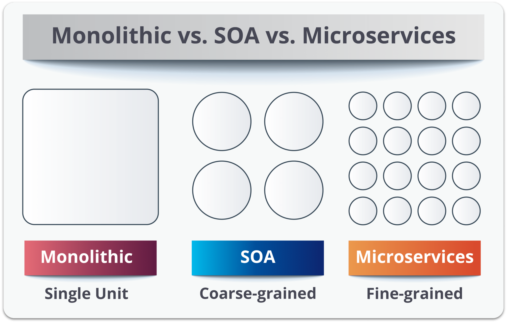

**Монолит:** вся система — это единый неделимый блок; все компоненты жёстко связаны.

**Микросервисы:** логика разбита на максимально мелкие, независимые единицы, каждая отвечает за одну узкую задачу.

**SOA:** занимает место «посередине» — мы разделяем систему на крупные логические модули (бизнес-сервисы), часто объединённые общей шиной данных (ESB).

### Основные принципы SOA

Не существует единого стандарта, но выделяют ключевые принципы манифеста SOA:

**1. Абстрагирование (Service Abstraction)**
Сервис — это «чёрный ящик». Потребителю не нужно знать, как он устроен внутри, на каком языке написан (Java, Python, C#) и какая у него база данных. Важен только контракт взаимодействия.

**2. Слабая связность (Loose Coupling)**
Сервисы должны иметь минимум зависимостей друг от друга. Изменение внутри одного сервиса не должно ломать работу других.

**3. Отсутствие состояния (Statelessness)**
Сервисы не должны хранить информацию о сессии или предыдущих запросах. Каждый запрос должен содержать всю необходимую информацию.

**4. Стандартизация контрактов (Standardized Contracts)**
Каждый сервис имеет описание (контракт), определяющее его функциональность и способ взаимодействия (например, WSDL для SOAP или OpenAPI для REST). Это гарантирует совместимость.


### Компоненты архитектуры

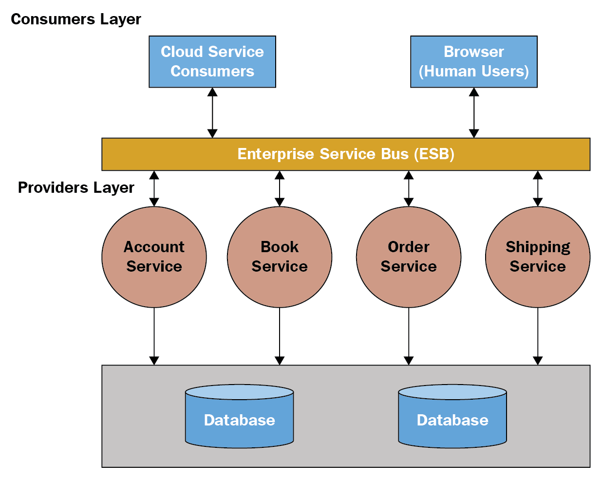

Классическая SOA состоит из трёх основных ролей и связующего элемента:

**Поставщик сервиса (Service Provider)**
Создаёт, поддерживает и предоставляет сервис. Публикует описание сервиса в реестре.

**Потребитель сервиса (Service Consumer)**
Система или приложение, которое использует функционал. Ищет сервис в реестре и отправляет запрос поставщику.

**Реестр сервисов (Service Registry)**
Справочник («телефонная книга»), где хранятся адреса и описания доступных сервисов. Позволяет потребителям находить поставщиков.

**Enterprise Service Bus (ESB)**
Часто используется «Сервисная Шина Предприятия» — прослойка, управляющая передачей сообщений между сервисами, маршрутизацией и преобразованием форматов данных.

### Краткая версия (для собеседования, 40–60 сек)

- **SOA** — подход, при котором приложение собирается из независимых бизнес-сервисов, взаимодействующих по сети.
- **Отличие от микросервисов:** В SOA сервисы более крупные (бизнес-функции) и используют общую шину данных (ESB), тогда как микросервисы максимально децентрализованы.
- **Принципы:** слабая связность, абстракция, повторное использование, стандартизированные контракты.
- **Компоненты:** Поставщик (создаёт), Потребитель (использует), Реестр (хранит адреса) и ESB (маршрутизирует).

**PL:**

## Architektura zorientowana na usługi (SOA)

**Service-Oriented Architecture (SOA)** — to styl architektoniczny, w którym aplikacja budowana jest z zestawu dyskretnych i słabo powiązanych komponentów, zwanych **usługami**.

Każda usługa realizuje określoną logikę biznesową i może komunikować się z innymi usługami przez sieć. Głównym celem SOA jest **ponowne użycie kodu** i **łatwa integracja** różnych systemów.

### Porównanie architektur

Na poniższym obrazie przedstawiono różnice w dekompozycji między trzema podejściami:


**Monolity:** cały system to jeden niepodzielny blok; wszystkie komponenty są ściśle powiązane.

**Mikroserwisy:** logika podzielona na maksymalnie małe, niezależne jednostki, każda odpowiada za jedno wąskie zadanie.

**SOA:** zajmuje miejsce „pośrodku" — dzielimy system na duże moduły logiczne (usługi biznesowe), często połączone wspólną szyną danych (ESB).

### Główne zasady SOA

Nie ma jednego standardu, ale wyróżnia się kluczowe zasady manifestu SOA:

**1. Abstrakcja (Service Abstraction)**
Usługa to «czarna skrzynka». Konsument nie musi wiedzieć, jak jest zbudowana, w jakim języku (Java, Python, C#) czy jaką ma bazę danych. Ważny jest tylko kontrakt interakcji.

**2. Luźne powiązanie (Loose Coupling)**
Usługi powinny mieć minimum zależności od siebie. Zmiana wewnątrz jednej usługi nie powinna psować pracy innych.

**3. Brak stanu (Statelessness)**
Usługi nie powinny przechowywać informacji o sesji lub poprzednich żądaniach. Każde żądanie musi zawierać wszystkie niezbędne informacje.

**4. Standaryzacja kontraktów (Standardized Contracts)**
Każda usługa ma opis (kontrakt), określający jej funkcjonalność i sposób komunikacji (np. WSDL dla SOAP lub OpenAPI dla REST). Gwarantuje to kompatybilność.

### Komponenty architektury


Klasyczna SOA składa się z trzech głównych ról i elementu łączącego:

**Dostawca usługi (Service Provider)**
Tworzy, utrzymuje i udostępnia usługę. Publikuje opis usługi w rejestrze.

**Konsument usługi (Service Consumer)**
System lub aplikacja, która wykorzystuje funkcjonalność. Szuka usługi w rejestrze i wysyła żądanie dostawcy.

**Rejestr usług (Service Registry)**
Katalog («księga adresowa»), gdzie przechowywane są adresy i opisy dostępnych usług. Umożliwia konsumentom znalezienie dostawców.

**Enterprise Service Bus (ESB)**
Często używana «Magistrala Usług Przedsiębiorstwa» — warstwa, która zarządza transmisją wiadomości między usługami, routingiem i transformacją formatów danych.

### Krótka wersja (do nauki, 40–60 s)

- **SOA** — podejście, w którym aplikacja składa się z niezależnych usług biznesowych komunikujących się przez sieć.
- **Różnica od mikroserwisów:** W SOA usługi są większe (funkcje biznesowe) i używają wspólnej magistrali danych (ESB), podczas gdy mikroserwisy są maksymalnie zdecentralizowane.
- **Zasady:** luźne powiązanie, abstrakcja, ponowne użycie, standaryzowane kontrakty.
- **Komponenty:** Dostawca (tworzy), Konsument (używa), Rejestr (przechowuje adresy) i ESB (routuje).

---

## Питання 31 / Pytanie 31

**RU:** Функциональные интерфейсы и лямблда выражения в языке Java. Оговори и подай пример.

**PL:** Interfejsy funkcyjne i wyrażenia lambda w języku Java. Omów i podaj przykłady.

### Обьяснение / Wyjaśление

**RU:**

## Функциональные интерфейсы и Лямбда-выражения (Java 8)

С выходом Java 8 язык сделал большой шаг в сторону функционального программирования. Это позволило писать код короче и выразительнее, передавая поведение как аргументы.

### 1. Функциональный интерфейс

Это интерфейс, который содержит **ровно один абстрактный метод** (при этом может содержать любое количество методов `default` или `static`).

**Аннотация @FunctionalInterface:** помечает интерфейс. Она не обязательна, но полезна — компилятор выдаст ошибку, если вы добавите второй абстрактный метод, нарушив правило.

**Примеры встроенных функциональных интерфейсов:**
- `Runnable` — без параметров, нет возврата
- `Callable<V>` — без параметров, возвращает V
- `Comparator<T>` — сравнение двух объектов
- Из пакета `java.util.function`: `Predicate<T>`, `Consumer<T>`, `Function<T, R>`, `Supplier<T>`

### 2. Лямбда-выражения (Lambda Expressions)

Лямбда — это компактная запись анонимной функции (реализации функционального интерфейса). Она позволяет избежать громоздкого синтаксиса анонимных классов.

**Структура лямбды состоит из трех частей:**

1. **Аргументы:** `(x, y)` — параметры метода
2. **Оператор стрелка:** `->` — разделяет параметры и тело функции
3. **Тело:** выражение или блок кода, который выполняется

### Синтаксис и правила

Лямбды записываются по-разному в зависимости от сложности логики:

**А) Однострочное выражение (Expression style)**

Если действие занимает одну строку, фигурные скобки и `return` не требуются — Java автоматически вернет результат.

```java
(a) -> a > 0   // Возвращает true, если a > 0
```

**Б) Блок кода (Block style)**

Для сложной логики требуются фигурные скобки и явный `return`.

```java
(a) -> {
    System.out.println("Checking...");
    return a > 0;
}
```

**В) Упрощение аргументов**

При одном аргументе скобки можно опустить; при нескольких или при их отсутствии — скобки обязательны.

```java
a -> a * 2        // Один аргумент
() -> "Hello"     // Нет аргументов
(x, y) -> x + y   // Несколько аргументов
```

### Пример: Эволюция кода

**До Java 8 (Анонимный класс):**

```java
// Сортировка списка строк по длине
Collections.sort(names, new Comparator<String>() {
    @Override
    public int compare(String a, String b) {
        return a.length() - b.length();
    }
});
```

**С Java 8 (Лямбда):**

```java
// То же самое — одна строка
Collections.sort(names, (a, b) -> a.length() - b.length());
```

##### Краткая версия (для собеседования, 40–60 сек)

- **Функциональный интерфейс** - это интерфейс, который имеет только один абстрактный метод. Может помечаться аннотацией @FunctionalInterface для контроля компилятором.
- **Лямбда-выражение** - это краткая реализация такого интерфейса (анонимная функция). Позволяет писать код в функциональном стиле.
- **Синтаксис** - Состоит из трех частей: аргументы (), стрелка -> и тело метода.
- **Особенность** - Если тело состоит из одной строки, return и фигурные скобки {} не нужны (это называется expression body). Если строк несколько — скобки и return обязательны.

**PL:**

## Interfejsy funkcyjne i wyrażenia lambda (Java 8)

Z pojawieniam się Java 8 język zrobił duży krok w kierunku programowania funkcjonalnego. To pozwoliło na pisanie kodu bardziej zwięzłego i wyrażającego, przekazując zachowanie jako argumenty.

### 1. Interfejs funkcyjny

To interfejs, który zawiera **dokładnie jedną metodę abstrakcyjną** (może zawierać dowolną liczbę metod `default` lub `static`).

**Adnotacja @FunctionalInterface:** oznacza interfejs. Nie jest obowiązkowa, ale jest przydatna — kompilator wyda błąd, jeśli dodasz drugą metodę abstrakcyjną, naruszając zasadę.

**Przykłady wbudowanych interfejsów funkcyjnych:**
- `Runnable` — bez parametrów, brak zwrotu
- `Callable<V>` — bez parametrów, zwraca V
- `Comparator<T>` — porównanie dwóch obiektów
- Z pakietu `java.util.function`: `Predicate<T>`, `Consumer<T>`, `Function<T, R>`, `Supplier<T>`

### 2. Wyrażenia lambda (Lambda Expressions)

Lambda to kompaktowy zapis funkcji anonimowej (implementacji interfejsu funkcyjnego). Pozwala uniknąć skomplikowanej składni klas anonimowych.

**Struktura lambdy składa się z trzech części:**

1. **Argumenty:** `(x, y)` — parametry metody
2. **Operator strzałka:** `->` — oddziela parametry od ciała funkcji
3. **Ciało:** wyrażenie lub blok kodu, który się wykonuje

### Składnia i reguły

Lambdy zapisuje się na różne sposoby w zależności od złożoności logiki:

**A) Jednowierszowe wyrażenie (Expression style)**

Jeśli działanie zajmuje jeden wiersz, nawiasy klamrowe i `return` nie są wymagane — Java automatycznie zwróci wynik.

```java
(a) -> a > 0   // Zwraca true, jeśli a > 0
```

**B) Blok kodu (Block style)**

Dla złożonej logiki wymagane są nawiasy klamrowe i jawny `return`.

```java
(a) -> {
    System.out.println("Checking...");
    return a > 0;
}
```

**C) Uproszczenie argumentów**

Przy jednym argumencie nawiasy można opuścić; przy kilku lub braku argumentów — nawiasy są obowiązkowe.

```java
a -> a * 2        // Jeden argument
() -> "Hello"     // Brak argumentów
(x, y) -> x + y   // Kilka argumentów
```

### Przykład: Ewolucja kodu

**Przed Java 8 (Klasa anonimowa):**

```java
// Sortowanie listy ciągów znaków po długości
Collections.sort(names, new Comparator<String>() {
    @Override
    public int compare(String a, String b) {
        return a.length() - b.length();
    }
});
```

**Z Java 8 (Lambda):**

```java
// To samo — jeden wiersz
Collections.sort(names, (a, b) -> a.length() - b.length());
```

##### Krótka wersja (do nauki, 40–60 s)

- **Interfejs funkcyjny** — to interfejs z dokładnie jedną metodą abstrakcyjną. Może być oznaczony adnotacją @FunctionalInterface dla kontroli kompilatora.
- **Wyrażenie lambda** — to zwięzła implementacja takiego interfejsu (funkcja anonimowa). Pozwala pisać kod w stylu funkcjonalnym.
- **Składnia** — składa się z trzech części: argumenty (), strzałka -> i ciało metody.
- **Szczególność** — jeśli ciało zawiera jeden wiersz, `return` i nawiasy klamrowe {} nie są potrzebne (zwane expression body). Jeśli wierszy jest więcej — nawiasy i return są obowiązkowe.

---

## Питання 32 / Pytanie 32

**RU:** На выбранном примере оговорить проблему (?) Stream API в языке Java.

**PL:** Na wybranym przykładzie omów zagadnienie strumieni w języku Java.

### Пояснення / Wyjaśление

**RU:**
**Stream API** появилось в Java 8 и кардинально изменило подход к написанию кода. Это ознаменовало переход от **императивного стиля** (циклы for, if) к **функциональному**.

Основная идея: мы больше не пишем, *как* итерировать коллекцию, мы пишем, *что* мы хотим с ней сделать.

**Диаграмма:**
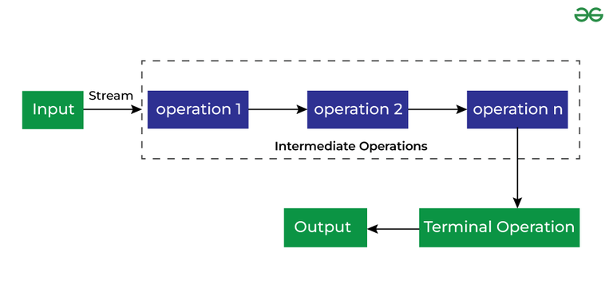

**Как это работает**

Работу со стримами можно представить как конвейер. Обычно процесс состоит из трех этапов:

1. **Создание (Input)**
    * Входная точка. Чаще всего создается из коллекции: `list.stream()`.

2. **Обработка (Intermediate Operations)**
    * Настройка конвейера (фильтрация, преобразование).

3. **Завершение (Terminal Operation)**
    * Запуск конвейера и получение результата.

**Важные особенности**

* **Одноразовость**: Стрим (Поток) можно использовать только один раз. После вызова терминальной операции он закрывается. Если попытаться вызвать метод повторно — упадет исключение.

* **Ленивость (Lazy Evaluation)**: Промежуточные операции не выполняются, пока не будет вызвана терминальная операция. Стрим просто «запоминает» набор команд, но данные не текут, пока не потребуют результат.

**Типы операций**

1. **Промежуточные (Intermediate)**
    * Возвращают новый Stream. Их можно объединять в цепочки.
    * `.filter(Predicate)` — фильтрует поток, оставляя только элементы, соответствующие условию (возвращающие true).
    * `.map(Function)` — преобразует каждый элемент в другой объект (например, из User достает String name).
    * `.sorted()` — сортирует элементы.
    * `.distinct()` — убирает дубликаты.

2. **Терминальные (Terminal)**
    * Запускают выполнение потока и возвращают результат (или void), но не Stream. После этого стрим умирает.
    * `.collect(Collectors.toList())` — собрать результат обратно в List/Set/Map.
    * `.forEach(Consumer)` — выполнить действие для каждого элемента (например, вывод в консоль).
    * `.count()` — вернуть количество элементов.
    * `.findFirst()` — вернуть первый элемент (обернутый в Optional).

##### Краткая версия (для собеседования, 40–60 сек)

- **Stream API** (Java 8) — инструмент для обработки данных в функциональном стиле.
- **Суть**: Говорим четкие инструкции что сделать.
- **Жизненный цикл**: Создание (collection.stream()) → промежуточные операции (filter, map, sorted, distinct) → терминальная операция (collect, forEach, count).
- **Ключевые свойства**: Ленивость (промежуточные операции не выполняются до вызова терминальной); одноразовость (стрим умирает после терминальной операции).

---

**PL:**
**Stream API** pojawiło się w Java 8 i zasadniczo zmieniło podejście do pisania kodu. Oznaczało to przejście od **stylu imperatywnego** (pętle for, if) do **funkcjonalnego**.

Podstawowa idea: zamiast pisać, *jak* iterować kolekcję, piszemy, *co* chcemy z nią zrobić.

**Diagram:**


**Jak to działa (Pipeline)**

Pracę ze strumieniami można przedstawić jako konwejor. Proces zwykle obejmuje trzy etapy:

1. **Tworzenie (Source)**
    * Punkt wejścia. Najczęściej tworzone z kolekcji: `list.stream()`.

2. **Przetwarzanie (Intermediate Operations)**
    * Konfiguracja konwejera (filtrowanie, transformacja).

3. **Zakończenie (Terminal Operation)**
    * Uruchomienie konwejera i uzyskanie wyniku.

**Ważne cechy**

* **Jednorazowość**: Strumień można użyć tylko raz. Po wywołaniu operacji terminalnej strumień zostaje zamknięty. Próba ponownego wywołania metody spowoduje wyjątek.

* **Leniwość (Lazy Evaluation)**: Operacje pośrednie nie są wykonywane, dopóki nie zostanie wywołana operacja terminalna. Strumień po prostu „zapamiętuje" zestaw poleceń, ale dane nie płyną, dopóki nie żądasz wyniku.

**Typy operacji**

1. **Pośrednie (Intermediate)**
    * Zwracają nowy Stream. Można je łączyć w łańcuchy.
    * `.filter(Predicate)` — filtruje strumień, pozostawiając tylko elementy spełniające warunek (zwracające true).
    * `.map(Function)` — transformuje każdy element na inny obiekt (np. z User wyciąga String name).
    * `.sorted()` — sortuje elementy.
    * `.distinct()` — usuwa duplikaty.

2. **Terminalne (Terminal)**
    * Uruchamiają wykonanie strumienia i zwracają wynik (lub void), ale nie Stream. Potem strumień umiera.
    * `.collect(Collectors.toList())` — zbierz wynik z powrotem w List/Set/Map.
    * `.forEach(Consumer)` — wykonaj akcję dla każdego elementu (np. wydruk na konsolę).
    * `.count()` — zwróć liczbę elementów.
    * `.findFirst()` — zwróć pierwszy element (owinięty w Optional).

##### Wersja krótka (do nauki, 40–60 s)

- **Stream API** (Java 8) — narzędzie do przetwarzania danych w stylu funkcjonalnym.
- **Istota**: Pozwala pisać kod deklaratywny (opisujemy «co», a nie «jak»).
- **Cykl życia**: Tworzenie (collection.stream()) → operacje pośrednie (filter, map, sorted, distinct) → operacja terminalna (collect, forEach, count).
- **Kluczowe właściwości**: Leniwość (operacje pośrednie nie wykonują się do wywołania operacji terminalnej); jednorazowość (strumień umiera po operacji terminalnej).

---

## Питання 33 / Pytanie 33

**RU:** Коллекции в Java. Оговори и подай пример их использования.

**PL:** Kolekcje w języku Java. Omów i podaj przykłady ich zastosowania.
### Пояснення / Wyjaśnienie

**RU:**
**Java Collection Framework** — это единая архитектура для представления и манипулирования коллекциями объектов. Она предоставляет стандартные интерфейсы и их реализации.

Глобально в Java есть две отдельные ветки иерархии:
- **Collection** (наследники Iterable) — работа с одиночными элементами
- **Map** — работа с парами «Ключ-Значение»

Начнем с ветки Collection:

1. **Iterable и Collection**
    * **Iterable**: Корневой интерфейс. Гарантирует, что объект можно перебрать в цикле for-each.
    * **Collection**: Основной интерфейс для всех коллекций (кроме Map). Методы: `add()`, `remove()`, `size()`, `contains()`.

2. **List** (Списки)
    * Суть: Упорядоченная коллекция, допускающая дубликаты. Каждый элемент имеет индекс (как в массиве).
    * **ArrayList**
        - Динамический массив с автоматическим расширением.
        - Плюсы: Быстрый доступ по индексу ($O(1)$).
        - Минусы: Медленная вставка/удаление в середину (требуется сдвиг элементов).
        - Когда использовать: В 90% случаев для простого хранения и чтения.
    * **LinkedList**
        - Двусвязный список. Каждый элемент хранит ссылку на предыдущий и следующий.
        - Плюсы: Быстрая вставка/удаление в начало или середину ($O(1)$ при наличии итератора).
        - Минусы: Медленный доступ по индексу ($O(n)$) — нужно перебирать элементы.
        - Когда использовать: Если коллекция часто модифицируется в середине, но редко читается по индексу.

3. **Queue и Deque** (Очереди)
    * Суть: Коллекции для хранения элементов в порядке обработки (обычно FIFO — First In, First Out).
    * **Queue**
        - `PriorityQueue`: Упорядоченная очередь. Элементы выходят согласно приоритету, а не порядку вставки.
    * **Deque** (Double Ended Queue)
        - Двусторонняя очередь. Можно добавлять и забирать элементы с обоих концов.
        - `ArrayDeque`: Более быстрая альтернатива классу Stack.

4. **Set** (Множества)
    * Суть: Коллекция уникальных элементов. Дубликаты не сохраняются.
    * **HashSet**
        - Самая популярная реализация. Использует HashMap внутри.
        - Порядок элементов не гарантируется.
        - Очень быстрые операции добавления и поиска ($O(1)$) благодаря хешированию.
    * **LinkedHashSet**
        - Запоминает порядок добавления элементов.
        - Чуть медленнее, чем HashSet.
    * **TreeSet**
        - Хранит элементы в отсортированном виде (Red-Black Tree).
        - Вставка медленнее ($O(\log n)$), но идеально для упорядоченных уникальных данных.

5. **Map** (Словари)
    * Суть: Хранит пары Ключ → Значение. Работает отдельно от интерфейса Collection.
    * Ключи должны быть уникальны.
    * **HashMap**
        - Самое популярное решение.
        - Вычисляет `hashCode` ключа, определяет "корзину" (bucket) и кладет туда значение.
        - **Важно**: Критически зависит от правильной реализации `equals()` и `hashCode()` у объекта-ключа. Плохая хеш-функция снижает производительность до уровня связного списка.
        - Плюсы: Мгновенный доступ по ключу при отсутствии коллизий.
    * **TreeMap**
        - Ключи хранятся в отсортированном порядке.
    * **LinkedHashMap**
        - Хранит порядок добавления ключей.

**Диаграмма:**
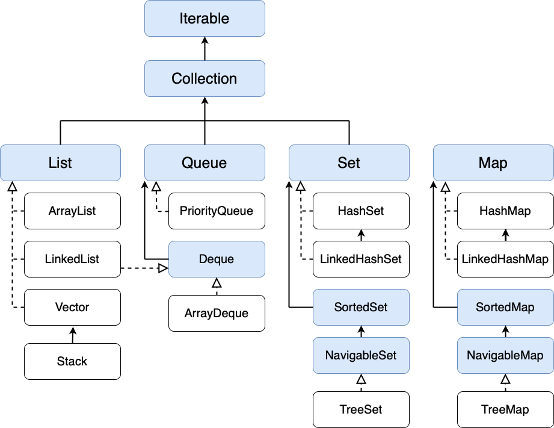

##### Краткая версия

- **Две основные ветки**: Collection (одиночные элементы) и Map (пары Ключ-Значение).
- **List**: Упорядоченные списки. ArrayList — массив (быстрое чтение по индексу $O(1)$), LinkedList — связный список (быстрая вставка/удаление).
- **Set**: Уникальные элементы. HashSet — самый быстрый ($O(1)$), но без гарантии порядка; TreeSet — хранит отсортированными ($O(\log n)$).
- **Queue/Deque**: Очереди (FIFO/LIFO). PriorityQueue выдает элементы по приоритету; ArrayDeque — быстрая двусторонняя очередь.
- **Map**: HashMap — стандартное решение на хешировании (критичны `equals()` и `hashCode()`); TreeMap — для отсортированных ключей.

---

**PL:**
**Java Collection Framework** — to zunifikowana architektura do reprezentacji i manipulacji kolekcjami obiektów. Dostarcza standardowych interfejsów i ich implementacji.

Globalnie w Java istnieją dwie oddzielne gałęzie hierarchii:
- **Collection** (dziedziczące Iterable) — praca z poszczególnymi elementami
- **Map** — praca z parami „Klucz-Wartość"

Zaczniemy od gałęzi Collection:

1. **Iterable i Collection**
    * **Iterable**: Główny interfejs. Gwarancja, że obiekt można iterować w pętli for-each.
    * **Collection**: Podstawowy interfejs dla wszystkich kolekcji (oprócz Map). Metody: `add()`, `remove()`, `size()`, `contains()`.

2. **List** (Listy)
    * Istota: Uporządkowana kolekcja, dopuszczająca duplikaty. Każdy element ma indeks (jak w tablicy).
    * **ArrayList**
        - Dynamiczna tablica z automatycznym rozszerzaniem.
        - Plusy: Szybki dostęp po indeksie ($O(1)$).
        - Minusy: Wolna wstawka/usunięcie w środek (wymagane przesunięcie elementów).
        - Kiedy używać: W 90% przypadków dla zwykłego przechowywania i czytania.
    * **LinkedList**
        - Dwukierunkowa lista powiązana. Każdy element przechowuje referencję do poprzedniego i następnego.
        - Plusy: Szybka wstawka/usunięcie na początek lub środek ($O(1)$ przy iteratorze).
        - Minusy: Wolny dostęp po indeksie ($O(n)$) — trzeba iterować elementy.
        - Kiedy używać: Jeśli kolekcja jest często modyfikowana w środku, ale rzadko czytana po indeksie.

3. **Queue i Deque** (Kolejki)
    * Istota: Kolekcje do przechowywania elementów w porządku przetwarzania (zwykle FIFO — First In, First Out).
    * **Queue**
        - `PriorityQueue`: Uporządkowana kolejka. Elementy wychodzą zgodnie z priorytetem, a nie kolejnością wstawienia.
    * **Deque** (Double Ended Queue)
        - Dwukierunkowa kolejka. Można dodawać i zabierać elementy z obu końców.
        - `ArrayDeque`: Szybsza alternatywa dla klasy Stack.

4. **Set** (Zbiory)
    * Istota: Kolekcja unikalnych elementów. Duplikaty nie są przechowywane.
    * **HashSet**
        - Najpopularniejsza implementacja. Używa HashMap wewnętrznie.
        - Porządek elementów nie jest gwarantowany.
        - Bardzo szybkie operacje dodania i wyszukania ($O(1)$) dzięki haszowaniu.
    * **LinkedHashSet**
        - Pamięta porządek dodania elementów.
        - Nieco wolniejszy niż HashSet.
    * **TreeSet**
        - Przechowuje elementy w posortowanej kolejności (Red-Black Tree).
        - Wstawka wolniejsza ($O(\log n)$), ale idealna dla posortowanych unikalnych danych.

5. **Map** (Słowniki)
    * Istota: Przechowuje pary Klucz → Wartość. Działa niezależnie od interfejsu Collection.
    * Klucze muszą być unikalne.
    * **HashMap**
        - Najpopularniejsze rozwiązanie.
        - Oblicza `hashCode` klucza, określa „koszyk" (bucket) i umieszcza tam wartość.
        - **Ważne**: Krytycznie zależy od prawidłowej implementacji `equals()` i `hashCode()` w obiekcie klucza. Zła funkcja haszująca obniża wydajność do poziomu listy powiązanej.
        - Plusy: Natychmiastowy dostęp po kluczu przy braku kolizji.
    * **TreeMap**
        - Klucze przechowywane w posortowanej kolejności.
    * **LinkedHashMap**
        - Przechowuje porządek dodania kluczy.

**Diagram:**


##### Wersja krótka (do nauki, 40–60 s)

- **Dwie główne gałęzie**: Collection (poszczególne elementy) i Map (pary Klucz-Wartość).
- **List**: Uporządkowane listy. ArrayList — tablica (szybkie czytanie po indeksie $O(1)$), LinkedList — lista powiązana (szybka wstawka/usunięcie).
- **Set**: Unikalne elementy. HashSet — najszybszy ($O(1)$), ale bez gwarancji porządku; TreeSet — przechowuje posortowane ($O(\log n)$).
- **Queue/Deque**: Kolejki (FIFO/LIFO). PriorityQueue zwraca elementy po priorytecie; ArrayDeque — szybka dwukierunkowa kolejka.
- **Map**: HashMap — standardowe rozwiązanie na haszowaniu (krytyczne `equals()` i `hashCode()`); TreeMap — dla posortowanych kluczy.